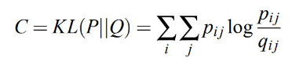

# Distances and Dimensionality

---

## 1. Distances
We have many functions that represents distances:
- max
- min
- sum
- Euclidean
- cosine
- overlap
- ...

We call these distance metrics. 
A distance metric d(.,.) should satisfy the metric properties:
- Non-negativity: d(A,B) >= 0 (distance should never be negative)
- Identity: distance is only 0 between identical objects
- Symmetry: direction does not matter (d(A,B) = d(B,A))
- Triangle inequality: taking a detour through a third point is never shorter

### 1) Distances between Sets

#### Jaccard similarity
- 
- 3/8 in the above example
- The Jaccard distance is 1 - Jaccard similarity
- Applications
  - Plagiarism
  - Google filtering duplicate results
  - Finding similar pieces of malware

### 2) Distances between Vectors
#### Euclidean

When used on maps, it is the lower bound of the actual distance

When to use Euclidean distance:
- Continuous data
- Not too many columns
- Magnitude matters

When to avoid Euclidean distance:
- High dimensional data
  - Curse of dimensionality
- Sparse data
  - Zero values are treated as any other
- Magnitudes matter
  - It is not scale invariant
  - dist(a,b) != dist(a*c, b*c) for constant c
- Discrete data

Euclidean properties:
- Euclidean is a metric
- invariant to translation
- dependent on scale
- sensitive to outliers, dimensionality, sparsity

### L_p-norm
Generalised Minkowski distance
- L_0 = Non-zeros
- L_1 = Manhattan distance
- L_2 = Euclidean distance
- L_inf = Maximum distance

- Manhattan distance
  - d(x,y) = Σ(i=1 to n)(|xi - yi|)
  - Use cases
    - when outliers are a problem
    - when features are incomparable
    - when you have many dimensions
  - When used on maps it is an upper bound on the actual distance
- Maximum (Chebyshev) distance
  - d(x,y) = max_i |xi - yi|
  - Use cases
    - not so clear when to use, so use when it makes sense
    - when features are incomparable
  - When not to use
    - outliers are clearly a problem
  - When used on maps it is an (extreme) lower bound on the actual distance

#### Cosine
Measures the angle between two vectors

Use cases:
- Comparing bag-of-word vectors of documents

Cosine properties:
- It is scale invariant, but it is not translation invariant.
- It is not a metric

#### Hamming
Compare two bit sequences (counts the number of dissimilar bits)

#### ISOMAP
- Compute kNN for each data point
- Construct weighted graph: weights = distance
- ISOMAP distance(p,q) = weight of the shortest path from p to q

Basically, only computes distance through where there is a path.

An "improvement" of any existing distance, cannot cross parts of the space without data (roads)

Issues:
- Expensive
- Disconnected components
- Very sensitive to noise

### 3) Distances between Distributions
On Friday

### 4) Distances between Sequences
On Friday

## 2. Dimensionality reduction
For computational reasons, we may want to extract and work with only the most informative features on the dataset

### Principal Component Analysis (PCA)
What does it do?
- Finds orthogonal directions in the data with maximum variance, in decreasing order. (Principal components)
- Performs an orthogonal, linear transformation to a new coordinate system, the component space.

Algorithm
1. Shift the mean of each column to zero, i.e. each feature has zero mean over the samples
2. Compute the covariance matrix cov(X, X) of the data matrix X.
3. Compute the eigenvectors of the covariance matrix and the corresponding eigenvalues
4. Order the eigenvectors by the size of their eigenvalues, in descending order, to construct a transformation matrix K.
5. Use the transformation matrix K to project the data points to component space, i.e. K.T X.T

Assumptions
- the relationships between the features are linear.
- the direction with largest variance is the most informative
- the principal components are orthogonal, i.e. linearly independent and uncorrelated

Pros and Cons
- Advantages
  - Fast
  - Easy to interpret
  - Linear correlation assumption works well in many practical cases
- Disadvantages
  - Strict assumptions
  - cannot capture nonlinear correlations between features (does not work very well for more complex problems)

### t-Distributed Stochastic Neighbour Embedding (t-SNE)
What does it do?
- Based on SNE which has fundamental problems, such as
  - Cost function is difficult to optimise
  - Crowding problem
- t-SNE was suggested to solve these problems
  - Cost function much easier to optimise
  - Aims to both "pull together" neighbouring points as much as possible, and "push apart" distant points as much as possible

Algorithm 

Cost function
- 
- Optimisation: done by using gradient descent
  - Gradient: 

Pros and Cons
- Advantages
  - can capture nonlinear relationships in data
  - preserves local and global structures well for data visualisation
  - effective in practice
  - solves optimisation and crowding problems of SNE
- Disadvantages
  - Only recommended to use for visualisation
  - Model and optimisation parameters (e.g. σ and learning rate) need to be set by hand
  - computational complexity O(n^2) so relatively slow for large datasets.

### Uniform Manifold Approximation and Projection (UMAP)
What does it do?
- Build a graph based representation of the data in high-d space: the graph is based on user-specified k nearest neighbors within a certain distance
- Find a similar graph in lower dimensions

Assumptions
- There exists a manifold on which the data would be uniformly distributed
- The underlying manifold of interest is locally connected (each data point has at least one nearest neighbour)
- Preserving the topological structure of this manifold is the primary goal.

Value of k
- Larger k -> preserves more global structure
- Smaller k -> preserves more local structure

Pros and Cons
- Advantages
  - Provides well separated clusters
  - Much faster than t-SNE
  - Offers control over local vs global information preservation
- Disadvantages
  - Need to hand pick the free parameters for each data set
  - Global positions of clusters may be better preserved that t-SNE, but sizes of and distances between each cluster is still non-informative
  - Like t-SNE, provides a manifold estimation using non-convex optimisation. Therefore, is a stochastic algorithm.

## Overview
Exam contents

- Concepts
  - All distances functions
  - metrics
  - scale/translation invariance
  - the curse of dimensionality
  - manifolds, overcrowded problem
  - PCA, tSNE, UMAP
- Skills
  - Selecting a distance function for a data set
  - Understand the effects of transformations on distances