# Lecture 4. Distances and Clustering

---

## 1. Distances Continued

### Statistical distances
#### Kullback-Leibler divergence
This is actually not a distance measure.
- It measures "surprise" when using Q instead of P
- The expected value of the loglikelihood ratio between P and Q
- The number of extra bits needed to represent samples from P using Q
- Information gain or relative entropy

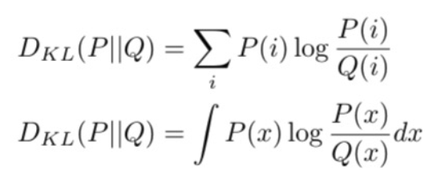

KL(P||Q) != KL(Q||P) (KL is not symmetric)

#### Jean-Shannon divergence
A symmetrised, smoothed version of KL divergence
- JS(P||Q) = 1/2 * KL(P||M) + 1/2 * KL(Q||M)
- with M = (P+Q)/2

Unlike KL-divergence, it is a metric. Moreover, it will not be infinite when P or Q becomes 0.

   
Statistical distance in practice
- Computing statistical distance can be hard, so we often:
  - sample data X
  - compute P(X) and Q(X)
  - normalise these to sum to 1
  - compute KL divergence
- To avoid 0-probabilities, and thus infinite distances, often some type of smoothing is applied
  - e.g., adding a small probability to all outcomes before normalisation, or adding 1 to every count
  - as a consequence, statistical distances can depend more on the used normalisation than on the learning algorithm.

### Sequential distances
Shapes are often a good visualisation of data. In order to compare shapes, we need to scale the series: 
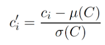
- for every data point ci, where μ is the mean and σ is the standard deviation of the series
- after normalisation, we can compute distances between sliding windows

#### Dynamic Time Warping (or sequence alignment)
- Sometimes the shapes of two series can be similar, but out of phase
- In order to compare the distance of these two series, we align time-series non-linearly in time to find the best match
- 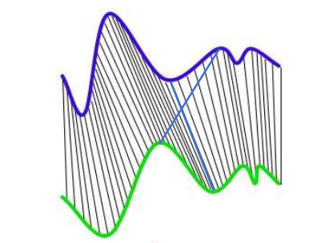
- Lines are not allowed to cross, keeping shape intact

Computing Time-warping distance 
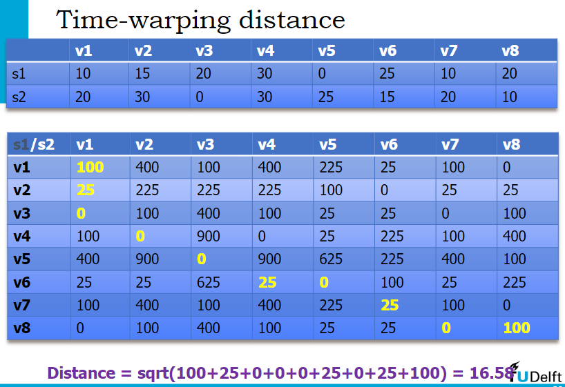

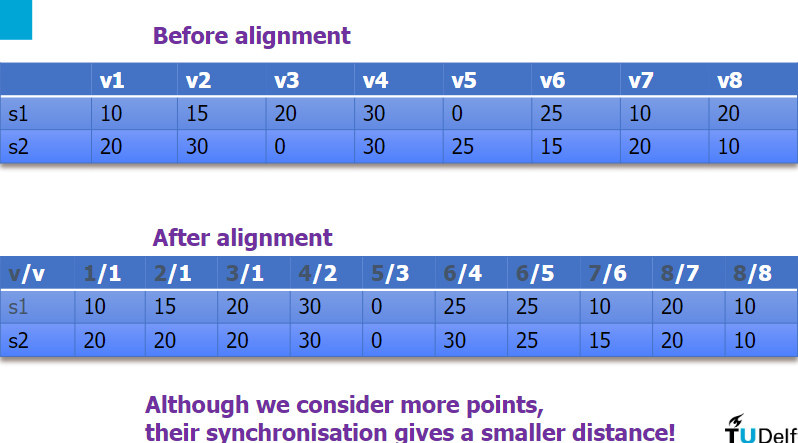

Applications
- Speech recognition
- Gesture recognition
- Handwriting recognition
- Clustering malware behaviour

#### Sequence alignment
- Discrete variant of time-warping
- Build matrix using dynamic programming:
  - 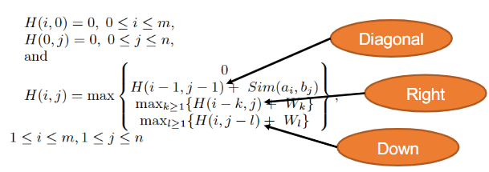
  - W is a gap penalty

Applications
- Bioinformatics
- System call traces

#### Edit distance
Counts the number of operations to go from A to B:
- Substitution of characters
- Insertion of characters
- Deletion of characters

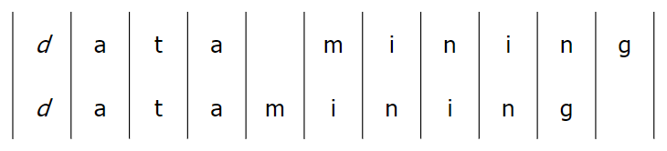 
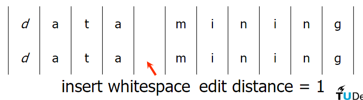 
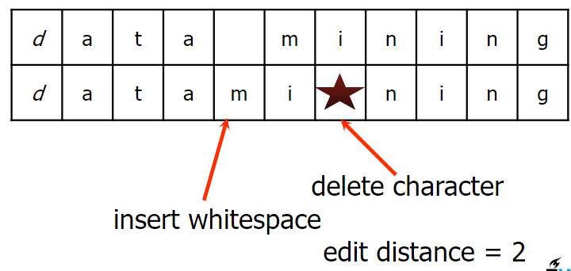

DTW is not a distance metric because a distance metric has to follow the metric properties: 
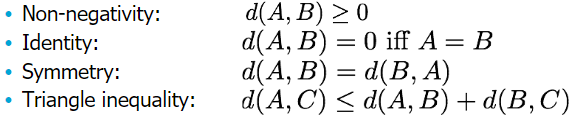

But DTW does not satisfy Triangle inequality
 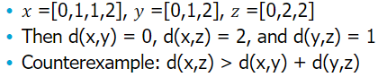

Edit distance is a distance metric, but there exist versions that do not

### Distance Overview
- Concepts
  - KL-divergence
  - Edit-distance
  - Time series shape
  - Alignment
- Algorithm
  - DTW
- Skills
  - Know which distances are (non-)metric, use to decide on which algorithm to run

## 2. Clustering

### K-means clustering
Group points based on distance to average cluster point (centroid)

Algorithm
1. Randomly assign a number, from 1 to K, to each of the observations
2. Iterate until the cluster assignments stop changing
   - for each of the K clusters, compute the cluster centroid.
   - assign each observation to the cluster with center closest to the observation (defined using Euclidean distance)

Within-cluster variation (WCV)
- A good clustering is one for which the WCV is as small as possible
- The WCV for cluster k: measure the amount by which the observations within a cluster differ from each other.

Row Normalisation
- In practice, we can normalise every data row and simply apply standard k-means

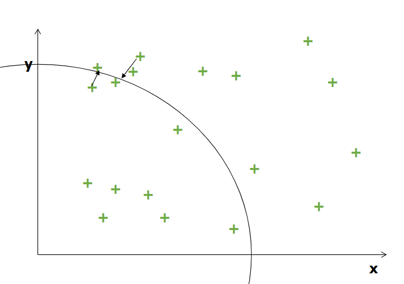 
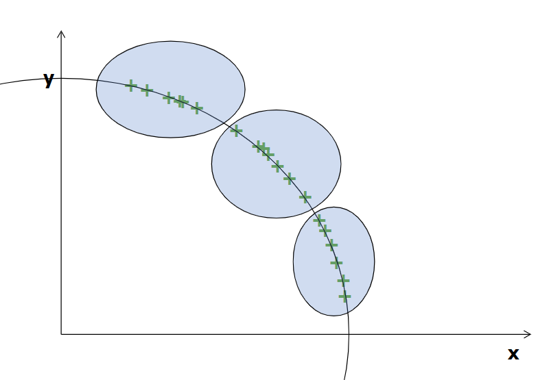

K-means is an example of EM learning approach:
- Expectation: compute the assignment given the current solution
- Maximisation: compute the new solution given the current assignment
- Iterate
- Gradient descent is a type of EM approach

How to determine k
- Based on the elbow criterion
- Sum of squares within the clusters (WCV) for a solution / number of clusters
- 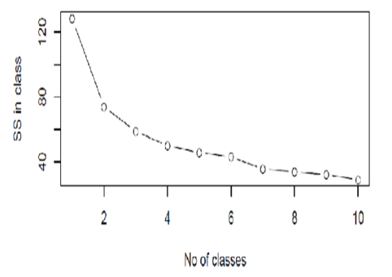

But it might be hard to determine k in practice, so we can also choose...

### Hierarchical clustering
Group points based on distances between subgroups

There are two ways to build the clusters: top-down or bottom-up

Bottom up: algorithm:
- Begin with n observation
- Identify the closest two clusters and merge them
- Repeat
- Ends when all points are in a single cluster

Cluster distance (linkage)
- Single linkage: looks at the distance of the closest points
- Complete linkage: looks at the distance of the farthest points
- Average linkage: mean distance between all points
- Ward distance: difference between the total WCV for two separate clusters and the WCV resulting from merging them.

When to stop:
- set a certain threshold, or
- when we obtain n clusters

Pros and Cons
- It is slow
- But it can handle non-centroid clusters

Does the distance need to be a metric?
- Depends on applied linking method:
  - Single, complete, and average: only requires symmetry and non-negative
  - Ward, or centroid-based: require Euclidean distance (since they minimise squared error)

### DBScan
Group points based on distance and density to neighbours

Dense elements are close together, and sparse elements are far apart. 
Density-based clustering aims for clusters with elements in similar densities

We have three types of points: Core, Border, and Noise
- Given threshold t and radius e,
  - Core if # of points in circle >= t
  - Border if # < t but has core point in circle
  - Noise if # < t and no core point in circle

DBScan algorithm
1. Determine core, border, and noise points
2. Connect core points within distance e
3. Find all connected components
4. Assign border points to the closest connected component
5. Return all components as clusters

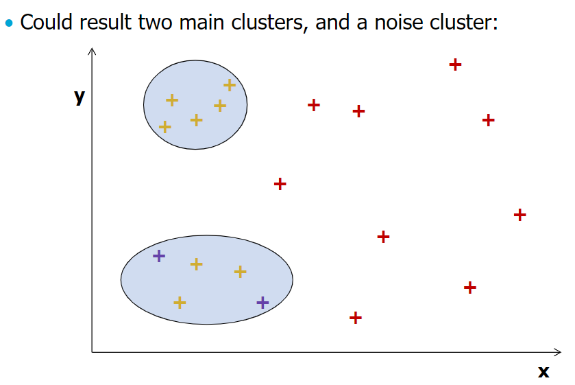

- DBScan does not require Euclidean because it does not use mean or minimised squared error
- It also doesn't require a metric; only symmetry and non-negativity

### Graph-based clustering
1. Construct neighbourhood graph G, e.g.:
   - Connect points if their distance is below threshold, or
   - Connect points if they are nearest neighbours of each other, etc
2. Set the weight on edges based on the point-wise distance
3. Find communities on G using graph mining (later lecture)
4. Return the found communities as clusters

### Clustering: Issues and Evaluations
Issues
- Should features be normalised? This influences the distance
- Which distance to use? (cluster methods use the definition of a distance between points)
- How many clusters to choose? Hard to tell because there is no ground truth

Cluster evaluation
- For k-means, look at WCV
- For other methods, it is hard to evaluate them because we do not know what or how to optimise.
- We can still se two main methods for evaluations:
  1. Compare distances inside and outside clusters
  2. External validation

#### 1. Intracluster and Intercluster (Comparing distances)
- Let P be the set of point pairs from the same cluster
- Let Q be the set of point pairs from different clusters

- Then the average intra- and intercluster distances are:
  - Intra = Σ dist(i,j) / |P|
  - Inter = Σ dist(i,j) / |Q|
- When ratio Intra/Inter is small, the clustering is considered good
  - Small intra means lower distance within the same cluster
  - Large inter means larger distance between clusters

#### 2. Silhouette coefficient (Comparing distances)
- Let C be the set of all clusters
- Let 'in' be the cluster the point i is part of
- Then
  - 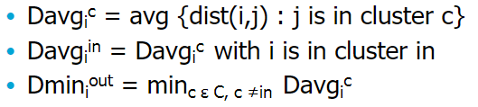
- The silhouette coefficient Si for point i is:
  - 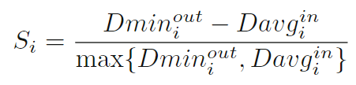
- This gives a value in (-1,1) with large positive values good clustering, and negative values somewhat mixed

#### 3. External Validation
When some class labels are available, or ground truths, we could construct a confusion matrix and see whether points from a class are all assigned to the same cluster
(not if points in class A are assigned as A.)

We then look at they Cluster purity.

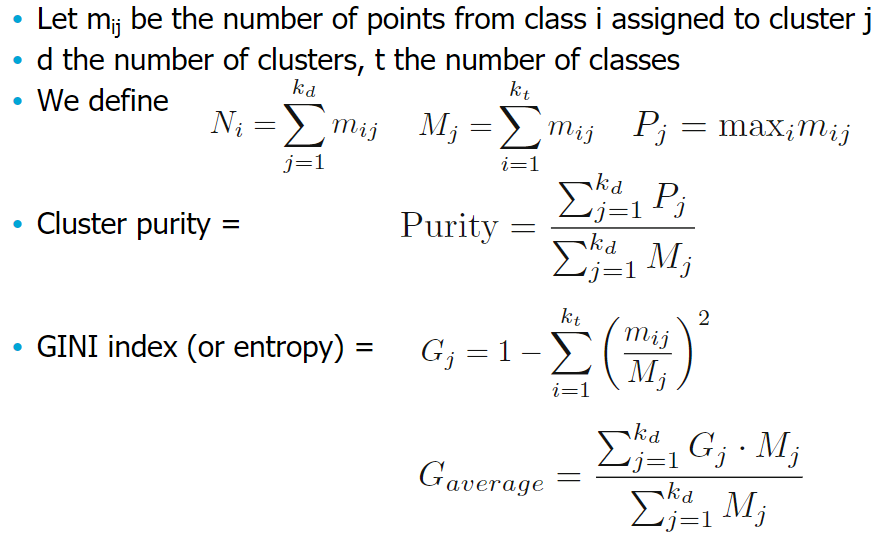

## 3. Improved clustering
The clustering methods we have looked at so far have issues.
- Centroid-based
  - Gets stuck in local minima
  - Initialising can be problematic
  - Cannot handle non-spherical clusters
- Hierarchical and Density/Graph-based
  - Have to compute all the distances

Also, above methods cannot handle streaming data (they have to be learnt in real-time)

### k-means++
Algorithm
1. Assign first centroid c to point uniformly at random
2. Add c to C
3. For each datapoint x
   - Compute d(x) = min c distance(x,c)
4. Assign next centroid c to a random point
   - with probability proportional to d(x)^2
   - e.g. P(x) = d(x)^2 / sum_y d(x)^2
5. If less than k centroids are assigned, go to 3
6. Else, proceed with standard k-means

### Minibatch k-means
EM (gradient-descent-like) methods can update using subsamples

Thus:
1. Read n rows of data D (at random)
2. Perform one update of centroids using D
3. Go to 1, repeat until convergence

### CURE
Clustering using representatives

From what we have seen so far, we learnt that non-centroid clustering is expensive (because we have to compute all the distances).  
To go around this, we can run expensive operations on a small sample only.

Algorithm
1. Pick a random sample of points that fit in main memory. Cluster sample points hierarchically to create initial clusters. We then pick representative points:
   1. For each cluster, pick k (e.g. 4) representative points, as dispersed as possible (because these best represent the cluster boundary)
   2. Move each representative point a fixed fraction toward the centroid of the cluster (e.g. 20%)
2. Now rescan the whole dataset and visit each point p in the dataset and place it in the "closest cluster".
   - Closest means a cluster with the closest representative points

### BFR
Aims to minimise time and space required by k-means

BFR assigns points to cluster one-by-one, but discards many at the same time. 
Points can be assigned to three sets:
- Discard set - assigned to a pre-existing cluster
- Compressed set - mini-clusters (a clustering of remaining points)
- Retained set - outliers, points that do not belong to any cluster

Only the retained set is stored in memory; for the other sets, we maintain sufficient statistics.
- For a cluster in BFR, we only require the following:
  - N - the number of data points in the cluster
  - SUM - a vector containing with sums of all feature values
  - SUMSQ - a vector with sums of squared feature values
- Using these we can
  - keep track of the centroid of the cluster
  - compute a threshold for cluster membership

Clustering - for each batch of points:
- If a point is in discard set, update statistics and discard
- for remaining points
  - use standard clustering to obtain miniclusters
  - compute statistics for miniclusters, discard points
  - keep unclustered points in retained set
- Merge miniclusters and retained points with older miniclusters, update their statistics

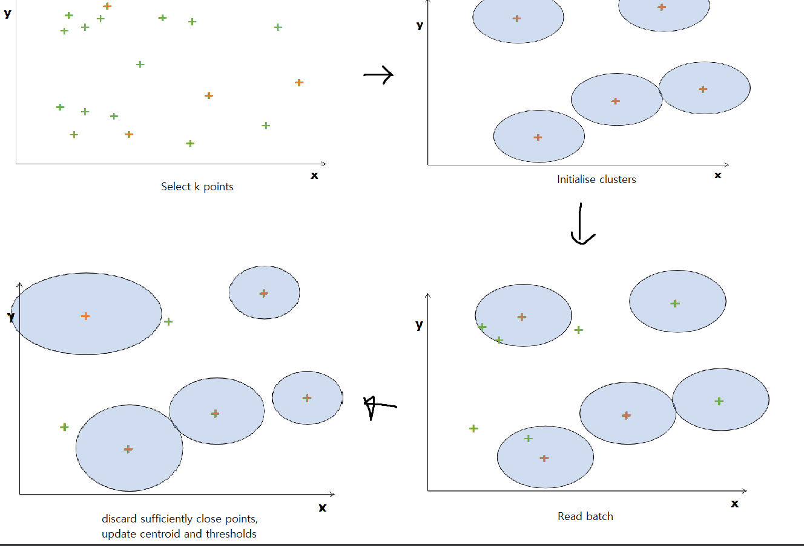

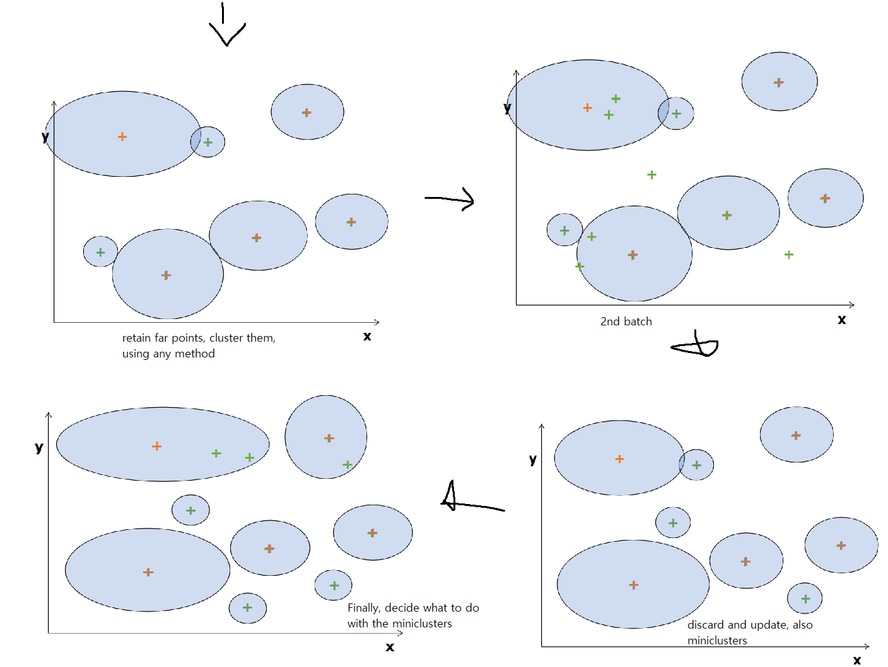

### Clustering - summary
- Clustering is a typical data mining task
  - Very dependent on distance
  - Used algorithms also matter a lot
  - Methods get into local minima
  - Tricks to improve run-time
  - No clear objective function
- Avoid using default settings
- Visualise and understand the outcome
- Apply tricks for efficiency

## Overview
- Concepts
  - centroid-based, agglomerative, density-based, graph-based
  - WCV, silhouette coefficient
  - cluster purity, intra/inter cluster ratio
- Algorithms
  - K-means, DBScan
  - K-means++, CURE, BFR
- Skills
  - How distances influence clustering
  - Select a clustering method based on desired properties
  - Tricks to improve clustering efficiently