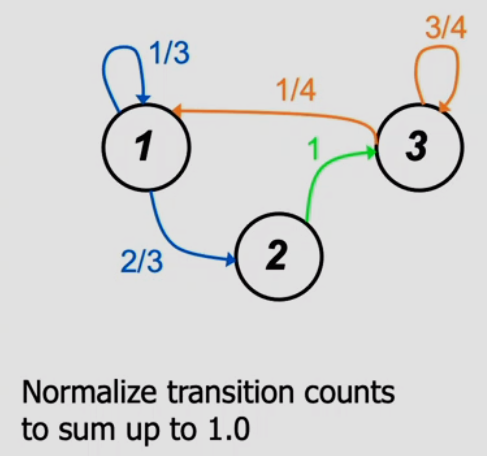

# Lecture 7 - Sketching, Sampling, and Hashing
Discrete Sequences & Data Streams

---
## Sequential processes - Markov Chains
Directly-follows-graph (Markov chain)

have states at time t

used to model the probability of state sequences and predict future states

### Markov processes
We only need to know the current state to predict the future state

From this we can estimate the future state (parameters)

 

Then we can compute the probability of sequence of events: 

This is very good for detecting anomalies in sequential data.

Zero probability problem:
- If a sequence does not appear in training time but appears in test time, what should we do?
- If we set to zero, we get a problem because if we use Kullbeck-Leibler, log0 is infinite.
- Instead, we do smoothing.

### Laplace smoothing
Add a count of 1 to every possible state transition before normalisation.

### N-grams (shingles)
Similar to Markov chains, but we use sliding windows and subsequences 
 
 
Transitions are now not transitions between states, but transitions between subsequences

This is a popular tool in natural language processing.

We can use this to build a profile to detect anomalies.

Note: Profiling requires generative models, because only generative models can generate new data for a given class (discriminative models cannot).

## Data Streams
### Counting
Let's say we want to count the items in the data stream.

We can increment the count whenever we see an item.

We can also flip the coin whenever we see an item, and increment if head. We return count * 2.

Why?
- We use one bit less. (log(n) vs log(n)-1)
- If we have 8-bit counter but we count to 9-bits, we have a problem

#### Morris counting

### Sampling
We want to find a sample from data stream. 
Sampling: selection of a subset of items from a large data set 
Goal: sample retains the properties of the whole data set.

#### Reservoir Sampling
I have a memory of size m. The items have number i.
1. Sample until i = m (now memory is full)
2. I store the next item with the probability of m/i (with random replacement)
3. The probability of storing the item that comes later gets lower and lower.

Why?
- Can get the uniform samples of the data
- 

#### Reservoir Sampling via Order Sampling
1. Whenever an item comes in, I give a number [0,1]
2. If the memory is full, I check if the new item has smaller number than any of those in memory
3. If yes, replace with the item with the largest number

Why?
- Each item has same chance of least tag, so the distribution is uniform.
- Fast to implement (using priority queue)
- Can run on multiple input streams separately, then merge

#### Frequency counter algorithms
1. Majority algorithm
   - Given a list of elements, is there an absolute majority? (an element occurring more than half of the times)
   - 
   - 
   - We are left with the majority item at the end
2. Frequent algorithm
   - Find all elements in a sequence which occurs sufficiently frequent (frequency > m/k)
   - 
   - 
   - If we see an item that we have never seen before (yellow and black), reduce all counters
   - m = 12, so all elements with more than 12/3 = 4 occurrences should be reported

## Hashing
Sketches
- Not every problem can be solved with sampling (example: counting how many distinct items in the stream)
- Other techniques take advantage that the algorithm can "see" all the data even if it can "remember" it all
- Sketch is one of them, and it is essentially a linear transformation of the input.
- Sketch uses finite memory

### Bloom filter
1. We have a set of hash functions (from h1 to hk) and a bit vector of size n
2. To add an element, we run the element through all the hash functions and set the corresponding bits to 1
3. To test whether an element is seen, compute the hashes and sum up the returned bits. Check if sum is k

### Count-min sketch

