# Lecture 8 - Locality Sensitive Hashing

---

## Contents for today - Finding similar items
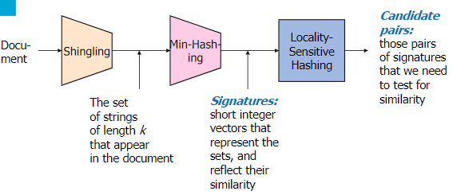

The core of LSH is finding similar items, or rather computing distances between data.
- We have a text document
- We do shingling (n-grams)
- Then min-hashing
- And finally Locality Sensitive Hashing

This gives two things:
- Signatures: short representation of a very large object
- Candidate pairs: points that are in the same bin are candidates for similar items.

## Hashing Recap
- We want to approximate queries over large data streams using limited memory
- Sampling
  - Selectively storing elements, keeping certain properties intact
- Hashing
  - Store multiple hashes of incoming elements
  - Answer queries using stored hashes
  - Hashes overlapping -> errors in query answers

## Four types of rows
- Given columns C1 and C2, rows may be classified as:
- 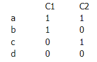
- Where 1 can be for example containing word A, and 0 not containing it.
- We can produce Jaccard Sim (Sim(C1,C2) = a / (a+b+c))

## Minhashing
- Imagine the rows permuted randomly.
- Define hash function h(C)
  - returns the row number of the first row in which column C has 1.
- We hash multiple times to create a signature
- Example:
- 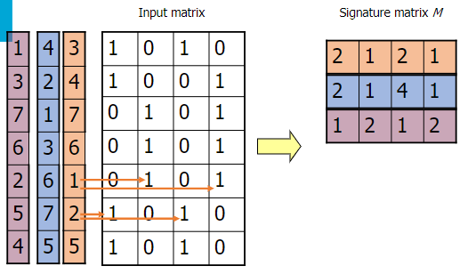
  - Rows are permuted randomly, so look for the first row that has 1 and hash it.
  - Note that columns are the different documents, and 1's and 0's are whether the document contains a word.

but why would we need this?
- Our goal is to compute distances, or look for similar items.
- If we look at the signature matrix above, we can note that columns 1 and 3 are similar, and columns 2 and 4 are similar.
- This is also the case if we look at the actual columns.

Some properties
- p(h(C1) == h(C2)) = Sim(C1,C2)
- because both are a/(a+b+c)

Hashing using Signatures
- Hash each column C to a small signature Sig(C) such that
  - Sig(C) is small enough that we can fit a signature in main memory for each column
  - Sim(C1,C2) is the same as "similarity" of Sig(C1) and Sig(C2).
- Example
- 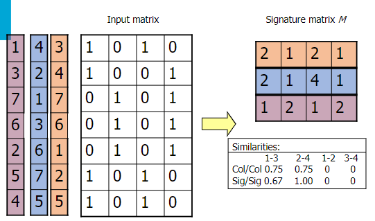
- Col/Col = count identical rows where 1s appear
- Sig/Sig = count identical signature matrix indices

Implementation
- Suppose we have 1 billion rows. Permuting all of these rows would be expensive
- So permute the rows using hash functions
  - For each column c and each hash function hi, keep a slot M(i,c)
  - So that M(i,c) will become the smallest value of hi(r) for which column c has 1 in row r.

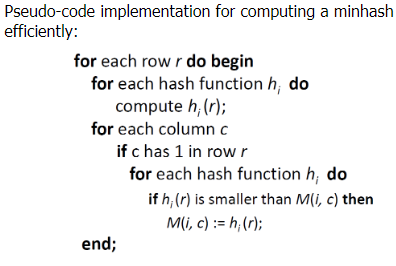

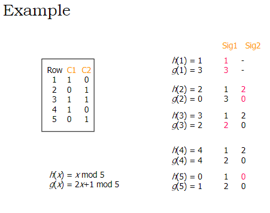
- Compute when column value of row n is 1
- Update if the computed value is smaller
- So that we keep the one that gives the smallest row number.

Creating Hash functions
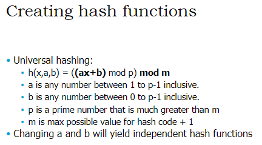

## Nearest neighbors - Locality-sensitive hashing
In many situations, we want to find the most similar object given a query
- Given a query obj q and set of obj S
- compute the distance between q and every obj in set S
- return the object S with minimal distance q

However, this is still expensive because there can be so many objects. 
So let's speed them up.

### Locality-sensitive hashing
General hashing functions maps objects uniformly. 
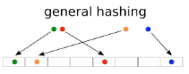 
This means that similar objects can be mapped to completely different bins.

LSH uses hashing functions that take "location" of object in consideration. 
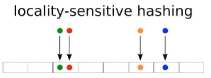 
So that the similar objects end up in the same bin.

So the biggest difference between normal hashing and LSH is:
- Normal hash functions try to minimise the probability of collision
- LSH hash functions try to maximise probability of similar items colliding.

Hashing points in space
- Example of a LSH hashing function for points in a space is a projection.
- 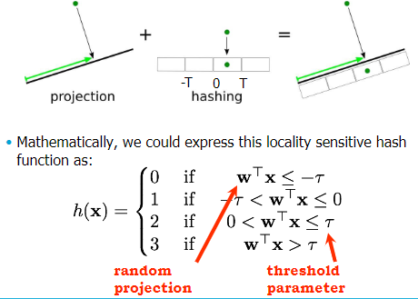
- The retrieval of nearest neighbours of a query point q using LSH works as follows:
  - hash all data points using LSH
  - compute LSH of query point
  - Compute distances to objects in the same bin (candidate points)

Unlucky LSH 
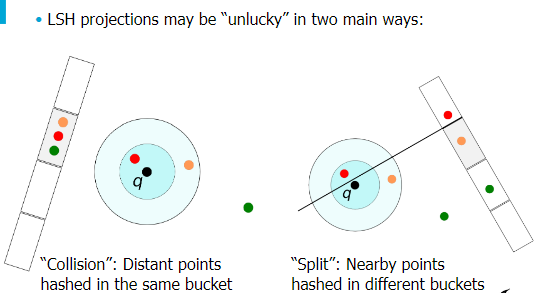
- Resolving collisions
  - points are candidates if they occur in all query bins
  - **AND-construction**
- Resolving splits
  - points are candidate neighbours if candidate in any of the hash tables
  - **OR-constructions**
- Effects of AND and OR constructions
  - 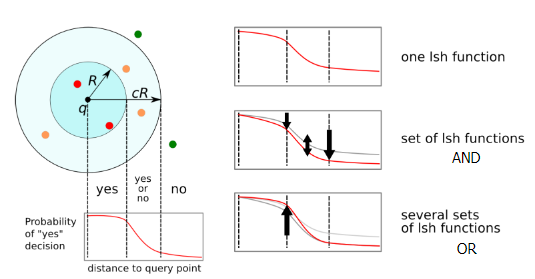
  - 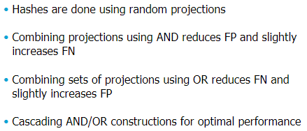

Now let's combine LSH with minhashes!

## LSH with minhashes
How to use them together:
- Divide signature matrix into b bands consisting of r rows each
- Hash each sub-signature(the rows) of length r into a hash table per band
- Two sets with at least one identical sub-signature will hash in the same bucket (at least once)
- These are the candidate column pairs for similarity
- 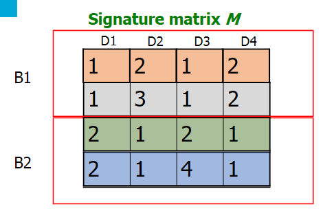
- 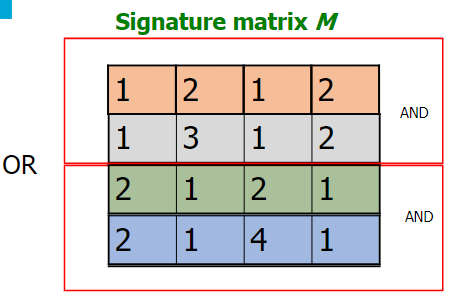
- 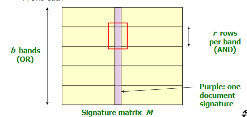

The computation
- Say we have B bands with R rows per band.
  - Columns C1 and C2 have similarity s
  - Pick any band (which has r rows)
    - Probability that all rows in band are equal = s^r
    - Probability that some row in band are not equal = 1 - s^r
  - Probability that no band is identical = (1-s^r)^b
  - Probability that at least 1 band is identical = 1 - (1-s^r)^b
    - this is what we need because these are what we take as candidates
- 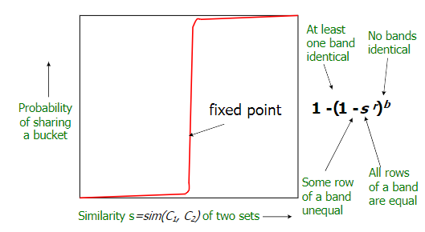
  - find the fixed point
    - This looks ideal to find columns that are 50% similar
    - Not so much for 80% similar, because we would waste time trying to compute distances for 50%~80% similar pairs.

***Remember the equation!!***
- threshold can be found with (1/b)^(1/r)

## Putting it all together
- Shingling: convert documents to sets
  - We used hashing to assign each shingle an ID
- Min-Hashing: convert large sets to short signatures, while preserving similarity
  - We used similarity preserving hashing to generate signatures with property Pr[h(C1) = h(C2)] = sim(C1,C2)
  - We used hashing to get around generating random permutations
- LSH: focus on pairs of signatures likely to be from similar documents
  - We used hashing to find candidate pairs of similarity >= threshold
  - Optimise r and b to have steep S-function at similarity (lower FN and FP)

## Summary - Sketching, Hashing, Sampling
- Sampling, hashing, and sketching ideas are at the heart of many stream mining algorithms
- A sample is a quite general representative of the data set; sketches tend to be specific to a particular purpose

