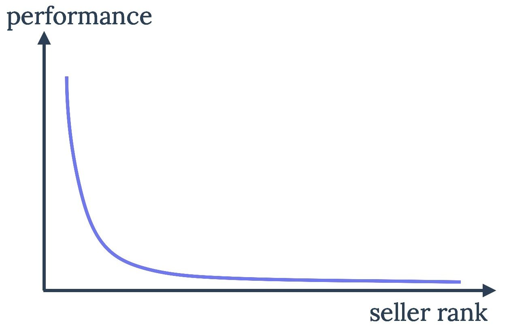

# Preprocessing

---

## Recap lecture 1
- Data mining:
  - is the practice of examining large pre-existing database in order to generate new information
  - is the development of models for data in order to extract information from that data
  - is done by humans; is not AI or neural nets

- example: China's pre-crime division identifies subversives before they strike, by developing software to collate a lot of data and score citizens on their trustworthiness

- Bonferroni's principle 
  - You will always find events in your data, even if the data is completely random. These events are to be avoided as they are false positives.
  - We correct for this using Bonferroni correction, but a simpler version of this idea is called Bonferroni's principle

## Data: important properties
- Distribution
- Size
- Dimensionality
- Size
- etc

## Distributions and transformations
- Gaussian distributed
- Power laws
  - Linear relationship between the logarithms of two variables
  - Real-world data often follows power laws
  - example diagram:
  - 
  - They have long tails that are close to zero but never actually reach zero.

To use such data we often need to lessen the effect of very large values. How can we do this?

Transform distribution
- Several ML algorithms require specific typically normal distributed data
- some patterns are obvious only after transformation, visualise
- take care: transformation changes distances

1. Box-Cox transform
  - There exist transformation between several distributions, such as
    - normal <-> lognormal
    - Pareto <-> exponential
  - Box-Cox models several transformations, depending on the value of λ
  - We have to optimise λ by trying each of them and choose the one with maximum likelihood

2. Quantile transform
   1. Compute the rank R(x) (percentile) for data point x
   2. Assume a distribution D() over a fixed range
   3. Every point in x' in the range has a rank R_D(x') under D()
   4. Map x to x' such that R(x) = R_D(x')
   - Feature range is important
     - Min-max scaling
     - Z-score scaling

3. Row normalisation
  - Even after normalising features, rows have different sizes
  - Row normalisation fixes this by ensuring every row's norm is the same (e.g. sums to 1)

- Which transformation to perform?
  - Depends on
    1. Your data
    2. Your pipeline
  - If your algorithm requires data from a normal distribution, try using a power or quantile transform to make it normal
  - keep in mind that when you compute distances any such transform can radically change them
  - also be care about the interpretation (large can actually be small)

## Features
Bag of words example
- For a given text, count the frequency of each word
- Feature vector is the frequency
- This process is called feature extraction
- Run any classifier on this data afterwards

Word Embeddings: Word2Vec
- Find similar words
- Key idea: context provides meaning
- Key idea of embedding: convert objects to vectors, based on some notion of similarity

- This can lead to large tables
  - This is a problem because of the curse of dimensionality
  - Drop useless features or perform dimensionality reduction
  - Feature selection is important

Categorical data
- How to use categorical data in continuous models?
- Use binning to make categories (making categories of all possible values would lead to too many categories)
  - Equal range (binning)
  - Equal frequency (percentile)
  - Use distances (clustering)
  - Use class labels (classification)
- Label encoding
- Target encoding (sort according to positive class probability)
- One-hot encoding (every value(label) is a new column)
- Which encoding to use depends on the classifier

Feature addition
- Adding a feature can make a dataset separable

Unbalanced data
- 99% of our data is benign, but we are looking for the fraudulent 1%
- Sampling
  - Oversampling issues
    - overfitting: the sampled exampels provide false evidence of a positive label at a very specific point, possibly an anomaly
    - ignorance: some classifiers ignore multiple copies
  - Undersampling issues
    - information loss
- Reweighting
  - Similar to sampling, but does not remove duplicates
- Adding synthetic minority instances
  - Key technique: SMOTE (Synthetic Minority Oversampling Technique)
- Tomek links
  - Some + and - are each others nearest neighbor
  - these are called Tomek links

