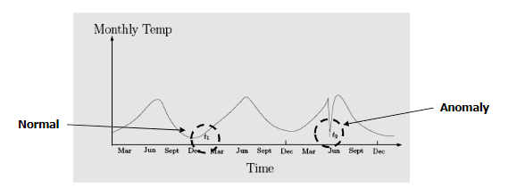
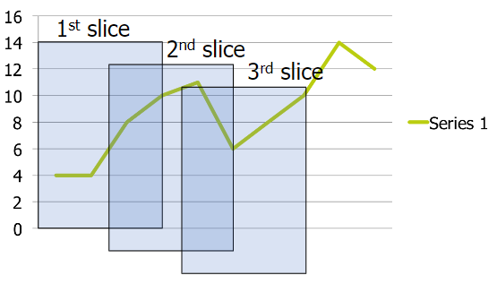
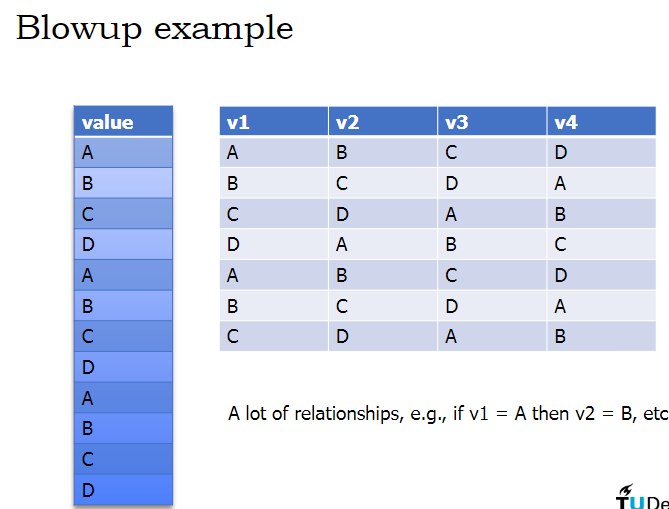
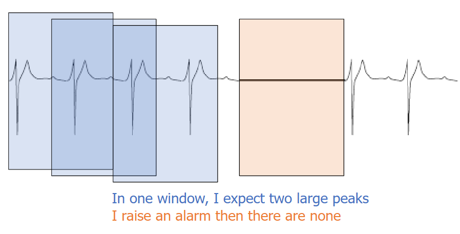
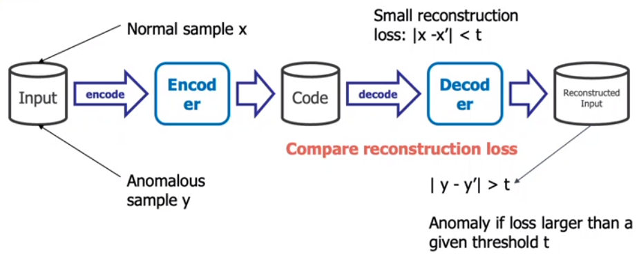
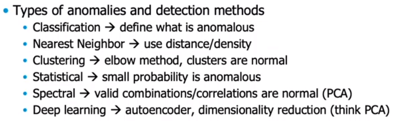

# Lecture 5. Anomaly detection

--- 

## Overview
- Types of anomalies
  - Point
  - Contextual
  - Collective
- Types of anomalies and detection methods
  - Classification
  - Nearest Neighbour
  - Clustering
  - Statistical
  - Spectral
  - Deep learning
- Modeling discrete sequences

## 1. Types of anomalies
### Point anomalies
Point(s) that are far away from other points

Whether the point is an anomaly or not depends on you. There are many techniques to determine whether a point is an anomaly or not,
which will come later

### Contextual anomalies
An individual data instance is anomalous within a context

How can we detect these anomalies? -> Sliding windows.

 

Temporal and Sequential data
- Data often contains temporal information, such as time
  - Should be treated different from other features
  - Can be used to derive sequence information

   
Sliding windows
- Slice the data dependent on the current time point
- 
- Usually applied to time-series data
- Any machine learning method can be used with:
  - standard distance measures, e.g. Euclidean
  - Special temproal distances, e.g. Dynamic Time Warping
  - Symbolic approximations
- But
  - Only takes a fixed-length history into account
  - Causes a modelling blow-up
    - 
    - ABCD is repeated, so just have windows starting at A and we have repeating windows with ABCD

Compute the residual
- Use sliding windows from training data to learn a model f for predicting the next value:
  - y_k = f(y_(k-1)) + ε
- Compute the expected next value
  - ^y_k|k-1 = f(y_(k-1))
- Evaluate the residual using the real next value
  - r_k = y_k - ^y_k|k-1
- If the residual is too large(beyond threshold) we throw an alarm

Pitfall: cross validation
- Cross-validation fails for time series
- Typically, next step prediction is used:
  1. Set t=0 
  2. t = t+1 
  3. Learn with data until time t-1 
  4. Predict time t 
  5. Goto 2
- Requires learning a very large number of models - impractical

Pitfall: predictions
- make sure that the data points are iid
- persistence

### Collective anomalies
When a collection of related data instances is anomalous, we call the set of data a collective anomaly

How can we detect collective anomalies in a time series? 
-> build profiles over multiple data points
- A model for a set of datapoints is called a profile
  - We follow someone/something for a longer period to build a model for typical behaviour
- Point anomalies:
  - simply evaluate whether an individual datapoint p is strange
- Contextual anomalies
  - use a set of data points as context C, e.g. sliding window
  - evaluate whether p is strange given C, e.g. via P(p|C)
- Collective anomalies
  - treat this set C as a datapoint, raise an alarm when C is strange

## 2. Types of anomaly detection methods
Non-sequential (point) anomalies
- *The key is the assumption of what is an anomaly*
   - Clustering
   - One-class classification
   - Nearest Neighbours
   - Statistical
   - Spectral

### Classification based methods
#### OSVM
One-class support vector machine

We want to separate positive data from remaining input space. 
The key is that we want to maximise negative(outlier) space and minimise positive(normal) space

Assumptions:
- Further away from origin is anomalous (one-class SVM)
- Close to the origin is anomalous (different OSVM)
- Close to origin is also anomalous (improved one-class SVM)
- Further from centroid is anomalous (non-linear one-class SVM)

 

#### Isolation Forest
Repeat N times:
- randomly pick a feature f
- split the f uniformly at randomly between [min, max]
- continue until all leafs contain singletons

The path length to reach a leaf is the isolation score. 
If a leaf is very deep it is more normal, and if it is high it is anomalous

 

Pros and Cons of Classification based techniques
- Advantages
  - Can be used in unsupervised setting
  - Models can be understood
  - Computationally inexpensive when testing
- Disadvantages
  - Have to make assumptions about data distribution

### Nearest Neighbour based techniques
Key assumption: normal points have close neighbours while anomalies are located far from other points

Two-step approach
1. Compute neighbourhood for each data record
2. Analyse the neighbourhood to determine whether data record is anomaly or not

Different methods:
1. Distance-based outlier detection
   - Anomaly if distance to nearest neighbour n compared to distance from n to nearest neighbour is above threshold
2. Density-based outlier detection (Local Outlier Factor (LOF))
   - Anomaly if density is substantially lower than neighbour's density or average density

 

Pros and Cons of NN based techniques
- Advantages
  - Can be used in unsupervised setting
  - Do not make any assumptions about data distribution
  - Intuitively appealing, uses distances
- Disadvantages
  - Computationally expensive (when testing)
  - Requires distances, so all disadvantages of distances apply

### Clustering based techniques
Key assumptions:
- normal data record belong to large and dense clusters
- anomalies do not belong to any cluster, or form very small clusters

Local density using clustering
- Local anomalies are distant from other points within the same cluster

We can decide on the number of clusters using the Elbow method.

Pros and Cons of Clustering based techniques
- Advantages
  - No need to be supervised
  - Easily adaptable to on-line
  - incremental mode suitable for anomaly detection from temporal data
- Disadvantages
  - Some methods computationally expensive
  - If normal points do not form clusters, the techniques may fail
  - Uses distances, so all disadvantages of distances apply

### Statistics based technique
Data points are modelled using stochastic distribution
- points are determined to be outliers depending on their relationship with this model

Two types of statistical techniques
- Parametric techniques
- Non-parametric techniques

Pros and Cons
- Advantage
  - Utilise existing statistical modelling techniques to model various type of distributions
- Challenges
  - With high dimensions, difficult to estimate distributions
  - Parametric assumptions often do not hold for real data sets

### Spectral techniques
Analysis based on Eigen decomposition of data

Key ideas:
- Find combination of attributes that capture bulk of variability
- Reduced set of attributes can explain normal data well
- But do not necessarily explain the outliers

PCA
- Orthogonal transformation to reduce dimension
- Most (linear) data patterns are captured by several principal vectors
- How can we use this for anomaly detection?
- We do PCA and compare data points to the original form - if the distance between the old and new datapoint is large, the datapoint is anomalous

Normalise the data before you do PCA.

Pros and Cons
- Advantages
  - Useful for multi-variate signals
  - Computationally efficient
- Disadvantages
  - Based on the assumption that anomalies and normal instances are distinguishable in the reduced space
  - Does not take context into account
  - PCA is sensitive to outliers

## Autoencoder for anomaly detection

Similar to PCA in a sense that we apply something and go back to the original.

 

