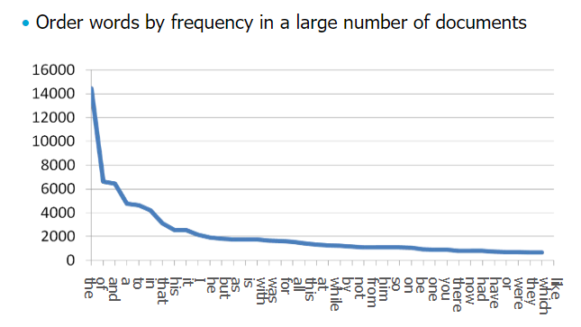
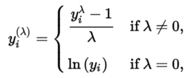
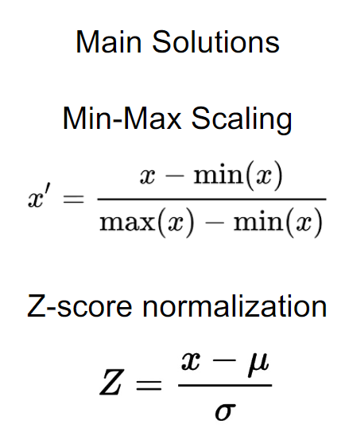
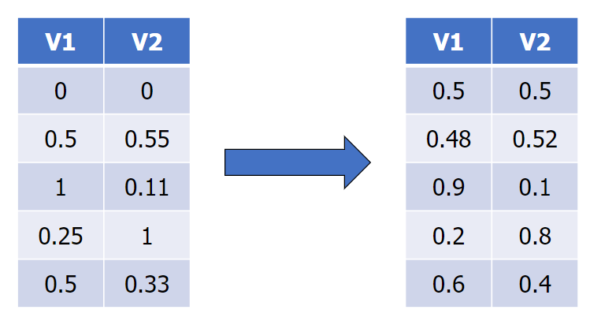
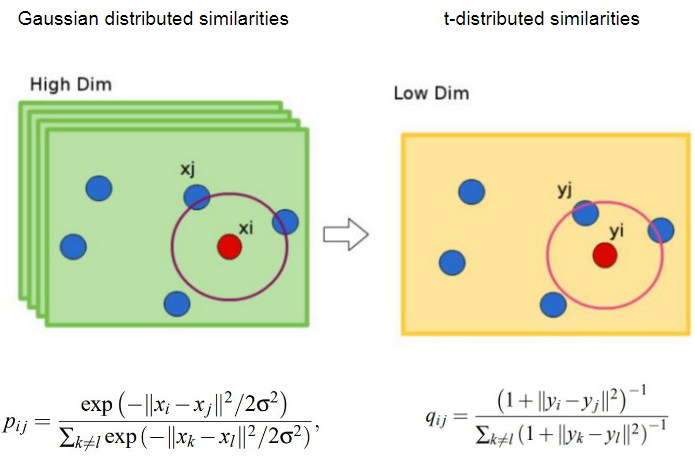
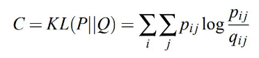
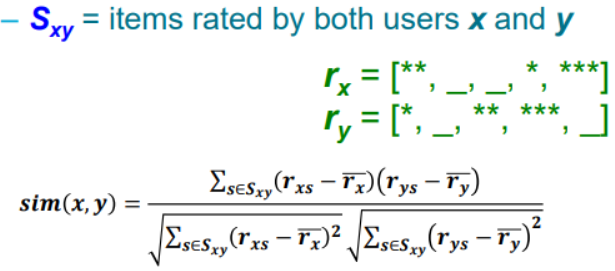
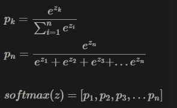
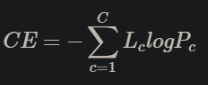

# Data Mining - The Ultimate Cheat Sheet

---

Data Mining
- Creating new information from a big database
- Creating models for data extracting
- Analysing data from different perspective to find useful information

# 1. Preprocessing
Processing data before putting them into machines so that machines can better process them.

## Processing distributions

### Power Laws
Many realistic data follow power laws, where they have a long tail. 

Our job is to transform this to normal distribution.

### Box-Cox
A method to transform a data distribution to normal distribution 

We can find lambda that maximises the log likelihood. 
for different value of lambda, we apply different transformations.

### Row/Column normalisation
Column - why?
- computing distances can be problematic
- feature weight
- sum of squares

Do column normalisation first (feature range normalisation).  

And then do row normalisation, using a norm. For example sum to 1: 

## Processing features

### Feature selection
choose features that
- correlate with the class
- explain large part of the data variance
- do not correlate with already selected ones
- lead to the best performance

can also use dimensionality reduction methods.

### Feature transformation
In order to use categorical data, we need encoding.
- Label encoding
  - Give different label for different category
  - Pro: we can distinguish the categories using only one feature
  - Con: ML algorithm can see this as weights
- Target encoding
  - Give labels in the order of positive class probability
  - We have to use test set so can be "cheating"
- One-hot encoding
  - Have columns for each category
  - Have 1 for the column of the correct category, 0 for the rest
  - Dimensionality blowup
  - New category?
- Binary encoding
  - similar to one-hot encoding but more space-efficient

We can also do binning
- binning by range
- binning by percentile (frequency)

### Feature addition
If data is not linearly separable, we can add a new feature to make it linearly separable.
  However this is hard and has to be done with high quality samples.

## Data synthesis

### Imputation
Dealing with missing data

- hot-deck imputation
  - take values from similar rows
- multiple imputation
  - average of hot-deck

### SMOTE
Synthetic Minority Oversampling Technique
1. Take minority class
2. Compute k-nn for all the minority instances
3. For each minority data points, take a random point from their k-nn
4. Create a new point between the point and its k-nn

### Tomek links
Removing data points if two points belong to different classes but are nearest neighbours of each other.

# 2. Distances

## Metric
- Non-negativity d(a,b) >= 0
- Identity d(a,b) = 0 iff (a = b)
- Symmetry d(a,b) = d(b,a)
- Triangle inequality d(a,c) <= d(a,b) + d(b,c)

## Distance between sets
### Jaccard distance
Jaccard similarity = |A n B| / |A U B|

Jaccard distance = 1 - Jaccard sim

This is a metric.

## Distance between vectors
### Euclidean
d(a,b) = sqrt(Σ_i(ai - bi)^2)

- this is a metric
- translation-invariant, scale-variant
- highly affected by outliers
- highly affected by dimensionality
- highly affected by sparsity (missing values)

Do not use Euclidean for:
- high-d data
- sparse data
- when magnitudes matter (Euclidean is scale invariant)
- discrete data

### Manhattan
d(a,b) = Σ_i|ai - bi|

- metric
- translation-invariant, scale-variant
- affected less by outliers and dimensionality

Use Manhattan when:
- outliers are a problem
- features are incomparable
- high-d data

### Maximum
d(a,b) = max_i |ai - bi|

- metric
- translation-invariant, scale-variant
- affected by outliers
- less affected by dimensionality

### Cosine
d(a,b) = 1 - cos(θ) = 1 - aTb / |a||b|

- does not care about the magnitude of the vector, only looks at the angle
- not a metric
- scale-invariant, translation-variant
- use for comparing Bag-of-Words vectors

#### Angular distance
- d(a,b) = arccos(θ)

### Hamming
count the different characters/bits for two vector/sequence

- metric
- match-based distance

### ISOMAP
Make a graph (connect knn with weighted edges). d(a,b) = shortest path from a to b

- metric
- realistic (because only goes through the existing paths)
- expensive
- very sensitive to outliers

## Distance between distributions
### Kullback-Leibler divergence
The surprise of using a new distribution Q instead of P.

D_KL(P||Q) = Σ_i P(i) * log(P(i)/Q(i)) (for discrete data) 
D_KL(P||Q) = INTEGRATE(P(x) * log(P(i)/Q(i))) dx (for continuous data)

- not a metric because D(P||Q) != D(Q||P)

## Distance between sequences
When it comes to sequences, shape is important because they are the intuitive measure of how similar two 
sequences are.

Therefore, it is also important to normalise the sequences: 
ci' = (ci - μ(C)) / σ(C) (similar to z-score normalisation)

### Sequence alignment (dynamic time warping)
1. compute Euclidean distances between all pairs of points in two sequences
2. find the shortest path (sum) from the top left to bottom right
3. get the sqrt of that value to get the distance

### Edit distance
measures how many actions need to be taken to go from A to B. Actions are:
- Insertion
- Removal
- Replacement

# 3. Dimensionality
Curse of dimensionality - increase in dimensionality does not always mean increase in information gain

Overcrowding problem - when dimensionality is reduced from manifolds, distances between points
are not always preserved.

## PCA
Take the principal components that best represent the variance of the data.
Project the data into the new space to reduce dimensionality.

1. Normalise features (to mean = 0)
2. Compose covariance matrix for data matrix X 
3. Get eigenpairs for Cov(X,X)
4. Select k eigenvectors with the highest eigenvalues and create transformation matrix K
5. Project the data by doing K^T * X^T

Pros
- fast and easy to compute
- linear correlation assumption (data are i.i.d) works most of the times

Cons
- if the data is not i.i.d we lose information

## tSNE

the cost function is the KL distance of the two distributions 

we can optimise this by gradient descent.

Pros
- we can use this for data with nonlinear relationship (unlike PCA)
- good for visualisation because it conserves the local/global structure
- can be used in many cases

Cons
- mostly used for visualisation only
- we have to manually set the optimisation parameters
- O(n^2) so computationally expensive

## UMAP
Draw a graph using kNN for the high-d data. Find a graph that is similar in the lower dimension and use that to
represent the data

Pros
- create distinct clusters
- much faster than t-SNE
- can choose to focus on either the global structure or the local structure

Cons
- we have to pick k (for kNN)
- it forms distinct clusters, but cannot explain the sizes or distances between clusters
- we have to set the optimisation parameters

# 4. Clustering

## Centroid-based (K-means)
1. Assign all points to a random cluster in the beginning
2. Compute the center of the cluster (mean)
3. Select random points and apply them to the closest centroid
4. Update centroid and repeat 3 for all data points

K is chosen by the elbow method.

We have to use Euclidean because we focus on the sum of squared differences (see WCV below).

### K-means++
1. Select one point as the centroid of the first cluster
2. Compute distances to all the other points
3. Select another point as the centroid. The probability is proportional to the square of the distance
4. Repeat above until k points are selected
5. Use K-means to assign other points to these clusters.

### BFR
Based on a strong assumption that the clusters are normally distributed about a centroid.

Supports a quicker and space-efficient computations of k-means. 
For each cluster, we compute and store only the following:
- N: number of points in the cluster
- SUM: vector that stores the sum of each feature
- SUMSQ: vector that stores the sum of square of each feature

Using these we can compute other information.
- mean = SUM/N
- var = SUMSQ/N - SUM/N
- σ = sqrt(var)

1. Select initial k points and create clusters
2. Select batch and assign them to clusters if they are close enough and discard them. If not, retain them and make them as new mini-clusters
3. Repeat for all data and decide what to do with miniclusters

## Hierarchical (Agglomerative)
Each data point is a cluster. Merge two clusters that are the closest until we have desired number of clusters.

"Closest" is defined differently for the linkages used:
- Single linkage: distance between the closest points from each clusters
- Complete linkage: d bw the furthest points
- Average linkage: average distance
- Ward distance: merge if the merged cluster have the smallest WCV

We can use different distances, as linkages do not require the distance to be metrics. 
For ward distance we have to use Euclidean because it uses WCV

### CURE
Because Hierarchical clustering is expensive, we can perform this for few points and do centroid-based for the others.

1. Choose sample points. Perform hierarchical clustering for these points
2. Choose k representative points from each of these clusters. These have to be the points that are the furthest away from each other.
3. Move these points by x% towards the centre. You choose x
4. Merge close clusters together.
5. Now assign all the other points to the clusters that have the closest representative point.

## Density-based clustering (DBScan)
Identify points as core, border, or noise, depending on their density.

1. Set threshold t and radius e
2. If a point has <= t points within e, assign it to core. If it does not but has a core point within e, assign it to border. Else assign to noise.
3. Connect core points that are closer than e to form clusters
4. Assign border points to the closest cluster

## Cluster evaluation
### WCV
Within-cluster variation

- used for k-means or other clustering techniques
- sum of square of the distances between points in the same cluster
- lower the better
- elbow method uses WCV

### Silhouette coefficient
For each point i, Silhouette coefficient Si is: 
Si = (o - t) / min(o, t)
- o = min distance to points outside this cluster
- t = avg distance to points in this cluster

This is a value between (-1,1)
- closer to 1 means good clustering
- closer to -1 means not good

### Cluster purity
(#most frequent class) / (#all points)

### Intra/inter ratio
- Intracluster distance = average distance between points in the same cluster
- Intercluster distance = average distance between points in different clusters
- if Intra/Inter is small, it is a good clustering

# 5. Anomaly detection
Three types of anomalies
- Point anomaly
- Contextual - use sliding window
- Collective - use profiles

## Classification based methods
1. OSVM (One-class support vector machine)
   - Separating positive (anomalous) data from others
   - Maximising positive space so that anomalies are recognised

2. Isolation forest
   - Repeat
     - choose one feature
     - divide the feature by a random value between (min, max)
     - form tree by separating points
     - repeat dividing until all leaves contain one datapoint
   - If a datapoint has low depth, then it is considered anomalous

Pros
- Can be used for unsupervised learning
- Easy to understand
- Computationally cheap

Cons
- Have to make assumptions about the data distribution (normal etc)

## Nearest Neighbour based methods
Based on the assumption that normal data has close neighbours and anomaly has distant neighbours
- Distance-based: if the distance to the nearest neighbour is above threshold, then the point is anomalous
- Density-based (LOF): if the density of the datapoint is clearly lower that its neighbour's, or average density, then the point is anomalous

Pros
- can be used for unsupervised learning methods
- no assumptions on the distribution
- easy to understand because it uses distance

Cons
- computationally expensive
- has all the drawbacks that distance has

## Clustering based
Based on the assumption that anomalies are not in a cluster or in a very small cluster. 
Also anomalies might be local: if the anomaly is far away from other points in the same cluster

Pros
- Unsupervised
- can be used for sequential data as well

Cons
- Computationally expensive
- If normal points do not create clusters, this method might fail
- drawbacks of distances

## Statistics based
Model the datapoints using stochastic distribution

Pros
- can utilise different modelling methods

Cons
- curse of dimensionality for high-d data

## Spectral techniques
Using dimensionality reduction such as PCA, if the new data point is far away from the original point, it is anomalous.

Pros
- good to use when the data is high-d
- Easy to compute

Cons
- based on the assumption that the normal data and anomaly can be distinguished in lower dimensions.
- sensitive to outliers
- cannot capture the contexts (assumes that features are independent)

# 6. Process mining
## DFG
### Markov chains
count the occurrences of changes between the states, normalise them to make prediction

Use Laplace smoothing to avoid zero-frequency problem

### N-grams
similar to Markov chains but the change between the states is the node

## BPMN
has AND/OR splits and joins to show concurrency, which DFG cannot show.

## Conformance checking
comparing the process and the process model. Similar to edit distance

# 7. Sketching
Techniques to deal with data streams that are continuous and almost infinite

## Counting (Morris counting)
Counting how many times items (all types) was seen.
1. set c to 0
2. if new item is seen:
   - choose a value x between (0,1)
   - if x <= 2^-c then c++
3. if c is queried return 2^c - 2

This is efficient because we can do counting with only log(log(n)) memory.

## Sampling
### Reservoir sampling
for memory = m and items with number i
1. store until i = m
2. replace item with probability of m/i. So an item that comes later has lower chance of being stored

This stores items uniformly

### Order sampling
1. give an item a value between (0,1) when seen
2. if memory is full, replace with an item that has higher value

Also uniform because all the items have equal chance of getting low value

### Majority
1. If c == 0, store this item and increment count
2. If this item is seen, increment count
3. If other item is seen, decrease count. If c==0, remove item.

When queried, return the stored item.

### Frequency
Each time an item is seen:
- If memory has space
  - store this item and set c = 1
- If memory does not have space
  - if this item is stored: increase c of that item
  - if not, decrease all c. If for any item c = 0, remove that item from memory

When queried, return all stored items

## Sketches
### Bloom filter
Have a bit vector of length n, and k hash functions that returns values between (0, n)

To add an item e:
- Get all values from all hash functions (h1(e), h2(e), ..., hk(e))
- Set the bits of these indices to 1

To check if an item is seen:
- Check if all the indices sum up to k.
- If an item is not seen, then it is not k. However sometimes it is k because of other items (false positive)
- If an item is seen, then it is guaranteed to be k.

### Count-Min sketch
Have d hash functions that returns values between (0, w) and a matrix of size w * d

To add an item e:
- If hash function h1(e) gave value 3, then increment (1,3) by 1.
- Do this for all hash functions

To check how many times item has been seen:
- Get the hash values
- return the minimum
- this is guaranteed to be equal or more than the actual occurrence(at least this value).

# 8. Locality Sensitive Hashing
## Min-hashing
Have some hash functions and columns.
- If (row,col) = 1, compute hash(row)
- If this value is smaller than the stored value, then replace.
- The final value is the signature, which can be used to compute similarities between two objects. (if Sig(A) == Sig(B), then A is similar to B)

## LSH
Project data points to a subspace. Set a threshold t and assign each points to buckets depending on the projection(wTx)
- if wTx <= -t, assign to bucket 0
- if -t < wTx <= 0, assign to bucket 1
- if 0 < wTx <= t, assign to bucket 2
- if t < wTx, assign to bucket 3

Objects in the same buckets are candidate pairs, which will be tested for similarity.

The problem is that close points might end up in different buckets(split),
and distant points might end up in the same bucket(collision). 
To fix this, we can use OR/AND constructions.
- OR
  - used for collision
  - if two points are in the same buckets for at least one projection, they are candidate pairs.
  - decreases FP but increases FN
- AND
  - used for split
  - if two points belong to the same buckets for all the projections, they are candidate pairs.
  - decreases FN but increases FP

## Banding
using LSH and minhash together

- Split the Signature matrix with b bands, each band containing r rows.
- Within the same band, if two columns have same signatures for all the rows(AND), then they are candidate pairs
- rows within the band has AND relationship, and bands have OR relationships.

The probability that my input will have at least one similar band is as below:
1 - (1 - s^r)^b
- s = similarity between my input and one band
- r = number of rows
- b = number of bands

# 9. Recommender Systems
## Content-Based Recommendation
Make profile per user and recommend items based on the items that user liked.

Pros
- Can be used with only one user
- Recommendation process is transparent
- Can recommend items that has not been recommended yet
- Can account for specific preferences

Cons
- Hard to use for one user
- Hard to recommend new item because it only depends on the user's profile
- Hard to recommend if there is no clearly related feature

## Collaborative filtering
"People who liked A also liked B"

Pros
- no need for feature selection

Cons
- needs for the other user
- if an item hasn't been rated, it may not be recommended
- hard to account for specific preferences

## Finding similar item/user
Item-Item is usually more efficient

### Jaccard
Can only check if a user gave rating or not (cannot see what the rate is)

### Cosine
Can only use for non-null data

### Pearson correlation coefficient

The result is between (-1,1)
- 1 = perfect positive correlation
- 0 = uncorrelated
- -1 = perfect negatie correlation

# 10. Interpretability / Bias
- Redlining
  - When the sensitive attribute can be inferred from other attributes

## Preferential sampling
1. Select random data from all sensitive groups
2. For discriminated groups, choose more positive-labelled data and less negative-labelled data
3. For favoured groups, do the opposite
4. Repeat until the ratio b/w positive and negative data are equal.

## Different thresholds
1. Make model P(i) which denotes the probability of sample i being classified to positive class
2. Do the following to make P(i) equal for all sensitive groups
   - for each group, classify to positive if P(i) > t
   - vary t among different groups to make the ratio similar

## Different models
Make P(i) for each group and perform different thresholds. 

# 11. Frequent Pattern Mining
## Itemsets
- Support: probability of the itemset appearing
- Frequent itemset: itemset that has support higher than threshold
- Closed itemset: set that has higher support than its immediate superset
- Maximal itemset: set that is frequent but its immediate superset is not

## Association rules
in the form of A->B  
Denotes that if A is in the itemset, then so is B.

- Confidence: P(B|A) = Support({A,B}) / Support({A})
- Lift = P(B|A) / P(B) = Confidence(A->B) / Support(B)
  - denotes if the association is in fact coincidental

## Itemset Lattice
The graph of all the possible itemsets. Starting from null, the subsets and supersets are connected.

Two properties
- Monotonicity
  - If A is a subset of B, then Support(A) >= Support(B)
- Downward closure
  - If an itemset A is frequent, then all the subsets of A are also frequent.

## Apriori
Algorithm to find frequent itemsets
- Pass 1: read baskets and count the occurrences of each individual item
  - Items that appear more than the base support are the frequent items
- Pass 2: read baskets again and count in main memory only those pairs where both algorithms are frequent

### PCY
For Apriori, the memory it requires at Pass 1 is the number of items, but at Pass 2 is the square of the number of frequent items.
 In order to use memory more frequently, PCY uses hash tables.

- Pass 1 is the same, except that we also keep the hash values of these items for the next pass
- Pass 2: search in the hash table for each itemsets and count the occurrences. If this itemset is frequent, then pass the hash value to the next iteration

## FP tree
Tree that denotes all possible association

# 12. Text Mining
There are two ways of representing text as a vector
1. Sparse representation
2. Dense representation

## Sparse representation
- a column for each word
- 1 if the word is present, 0 otherwise.
- one-hot encoding is an example of sparse representation
- cannot measure the similarities between words

## Dense representation
- example: embedding tables
- convert input vector (bag of words) with the embedded layer
  - input layer: where the input goes in
  - embedded layer: hidden, computes more calculations
  - output layer: return the dense representation of the text

## Multiclass Classification
Classifying input to the correct class using the network (input -> embedded -> output)

Use softmax to convert the output vector to class probability, and use cross entropy to compute the cost. 
Optimise the weights of the network using this cost (by performing stochastic gradient descent etc)

### Softmax function
converting output vector to class probability

### Cross Entropy
converting the probability to cost

