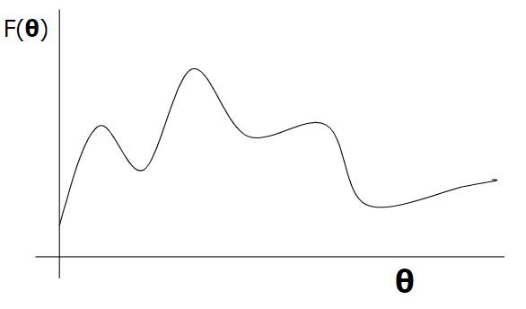
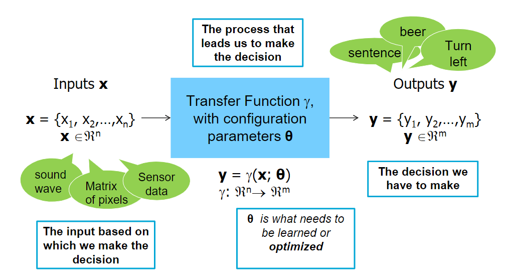

# 230215 Lecture 2

---

# 0. Learning Objective
Mathematical foundations and limitations of CI
- CI as optimisation
- Fitness functions and fitness landscapes
- Limitations

- (Different kinds of) problems and learning
- Formalisation

# 1. CI as optimisation

## Mathematical basis of CI
Today we focus on a common mathematical basis for CI techniques, specifically on the idea that we are somehow
optimising a function which corresponds to an intelligent behaviour

 
We are
- Maximising F(θ)
- Minimising -F(θ)
- Both are the same thing

So what is F?

## Fitness/error
The fitness of a candidate(F(θ)) defines:
- How "good" that state is in solving the problem
- But it does not tell us anything about the problem itself.

For example:
- for a regression problem, we can define F as the sum of squares.
- for a classification problem, we can define F as the cross-entropy.

However, in multiple dimensions, the fitness becomes more complicated. 
Fitness might relate to multiple objectives; a problem may have multiple objectives which define what is "good". 
Fitness can also change through time and context (dynamic).

Measuring and defining a fitness function can be very difficult in many contexts.
- requires domain knowledge
- conflicting view
- ethical consequences

In order to calculate if a given solution is "good", following features can be measured:
- Contextual meanings need to reduced to consistent, discrete behaviours
- There exists a true performance value to be measured
- Variations in measurements across time and contexts are measurement errors

# 2. Problems and learning
Types of problems
- Supervised
  - Regression
  - Classification
  - Binary
  - Multi-class
- Unsupervised
  - Clustering
  - Error-correction
- Iterative Supervised
  - Reinforcement Learning

Optimisation methods
- Gradient descent
- Evolutionary approaches
- Swarm Intelligence
- Ant Colony Optimisation
- Analytic/Brute force

## Problems

### Supervised Learning
y^ = γ(x;θ)
- given set of experience E (pairs on inputs(x) and outputs(y))
- finding γ parameterised by θ that maximises performance P in the given task T

### Unsupervised Learning
Building a model γ that can be used for reasoning, decision-making, predicting things, etc
  However, y is not given.

The point is that we want to explore the data to find more compact representation of latent (hidden) 
structures in that data 

### Iterative Supervised Learning
We don't have the correct x -> y, but we do have x -> y~ to approximate y over batches of learning.

- Reinforcement learning
  - if x is the current state
  - y is the action to take in that state
  - then the correct y is knowable, but not known upfront and will be approximated through exploration

## Formalisation

### The Transfer Function

### Formalising the learning problem
- We want to find the good transfer function: y = γ(x:θ) that maps x->y
- Each θ is a candidate solution
  - find a θ from a set T of possible θ's
  - T is the (high dimensional) search space
- Find a θ that induces a γ that has high fitness or low error

### High dimensional search space
Space for one dimension is the enumeration of all possible values for a dimension.

The high dimensional space is the enumeration of all possible combinations of values for all aspects of an object.
  It does not necessarily mean a "large" space (think of 13-d boolean vectors - 2^13 states, but they are just combinations of 0's and 1's)

### Finding θ with high fitness
Use optimisation processes to find a good θ. 
Generally, this is done by a guided search process through a small subset of T.

The general framework for finding θ with high fitness:
1. Build initial sample S containing one or more candidate θ
2. Decide fitness for each θ in S based on the
   - fitness function, or
   - error measure
3. Adapt S by changing, adding, and removing θ's in S based on:
   - the "fitness function's derivative", or
   - Probabilities based on the candidates' fitness
4. Goto 2 until the stopping criterion is met.

 

#### 1. Candidate sampling
State sampling in CI should be efficient and effective (unlike brute force)

A typical approach is the iterative sampling heuristic
- the mechanism used to select S for the next iteration
- the goal is to get the candidates in S converge to a (local) optimum.

#### 2. Fitness
Fitness is calculated by
- Fitness function, or
- Error measure

Fitness functions are "hand crafted" functions for goodness of solution 
They always relate to average performance of θ.

#### 3. Adapt sample
One adapts or learns by
- selecting states for the next iteration
- changing the candidate samples such that
  - only a small subset of the candidate space needs to be visited
  - we expect subsequent candidate samples to have higher fitness (though not guaranteed)

This can be done in two ways:
- Gradient-based: try to hill-climb the landscape using the "fitness function derivative"
- Probabilistic: states θ with higher fitness have higher probability being selected

#### 4. Iterate
All of the above state is repeated until
- a stopping criterion is met,
- no change in fitness,
- max number of iterations, etc