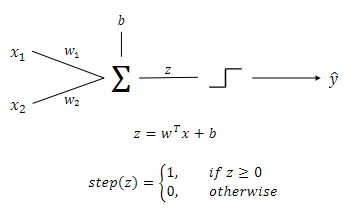
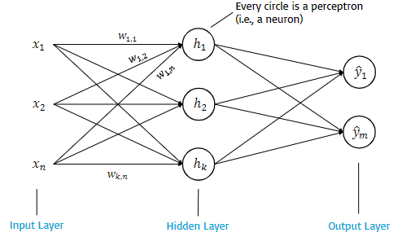
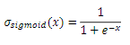
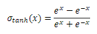
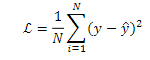
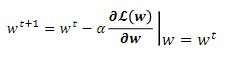

# 230220_ Artificial Neural Networks (ML recap)

---

# 0. Overview
- Brain neuron and perceptron
- How to train the perceptron
- Limitations of the perceptron
- The multiplayer perceptron (MLP)
- Feed-forward inference
- Training the MLP: intuition of backpropagation

# 1. Perceptron
## Perceptron

- w1 and w2 are the weights
- b is the bias
- step is the activation function

## Training the perceptron
1. Initialise weights, bias, and learning rate (α)
2. Perform inference
3. Compute loss
4. Update weights
   - w determines the slope of the decision boundary
   - b determines the intercept of the decision boundary

## Limitations of perceptron
Think of XOR functions. They are not linear! Therefore we cannot handle this with a single perceptron.

# 2. Multilayer perceptron

## Activation functions
- In MLP, the activation functions is referred to as σ.
- The activation functions are necessary to introduce non-linearities in the network.
- Smooth (differentiable) activation functions are suited to perform gradient descent.
- Sigmoid (logistic) and hyperbolic tangent (tanh) are common choices
  -  (between 0 and 1)
  -  (between -1 and 1)

## Forward propagation
For the input value, compute the output by feeding the input layer.

We will get an output, which we will use to compute the loss of the MLP.

## Minimising the loss function
Compute the loss using the loss function: 

Now propagate the error back to the network (backpropagation).

We can minimise the loss function using gradient descent.
- The loss function is dependent on correct outputs (y) and predicted outputs(y^)
- The predicted outputs are dependent on inputs (x) and weights (w and b)
- The only element we can control are the weights, so search for the set of weights that minimises L for all training samples.
- Finding the global minimum analytically is computationally unfeasible;
- We update the weights step by step until we find a set of weights that minimises L, using gradient descent.
  - 
