# 230222_ ANN (Backpropagation and Hyperparameters)

---

# 0. Overview
- Backpropagation equation
- Hyperparameter tuning (decisions to be taken when training a MLP)
  - Activation functions
  - Number of layers and number of neurons
  - Regularisation
  - Learning rate
  - Batch size

## 1. Backpropagation equation
## Gradient descent
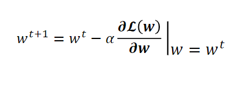

## Loss Gradient for a simple network
Let's look at an example where we have one perceptron at the last layer.

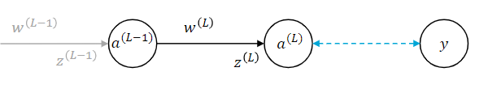 
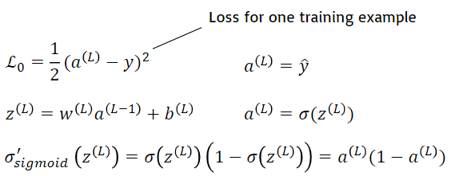

Where
- a is the output of the perceptron (y^)
- L is the number of layers
- σ' is the derivative of σ

Note that the loss L0 is denoted by the blue arrow between a^(L) and y. 
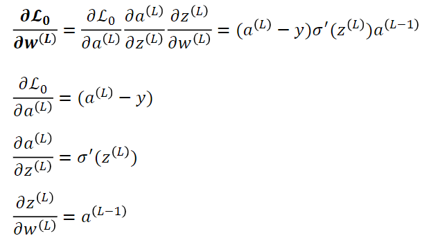
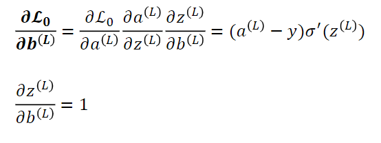

The first equation shows how much the change in weights changes the loss, 
and the second equation shows how much the change in bias changes the loss.
- 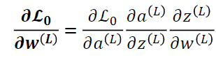
  - This means how much of the change in w(L) affect z(L), and how much of z(L) affect a(L), and how much of a(L) affect L0.

Let's now look at an example where we have two perceptrons.

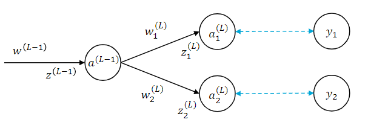 
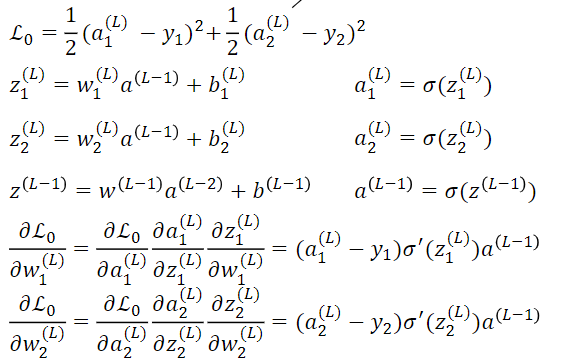

- First line denotes the loss for one training example
- Second line denotes the equation of the a1^(L) neuron
- Third line the a2^(L) neuron
- Fourth a^(L-1).
- Fifth and sixth the loss for a1^(L) and a2^(L).

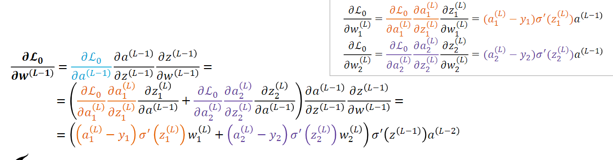
- The loss of the penultimate layer depends on the losses of the last layer; add them together!

## Gradient update general formula
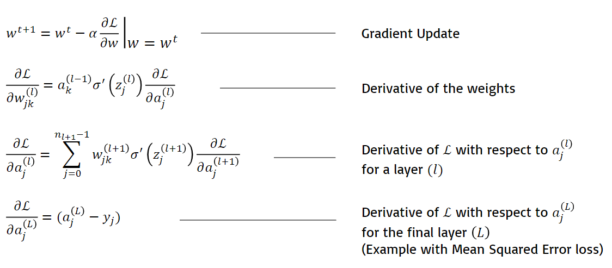

- The last equation is fed to the third equation, and
- the third equation is fed to the second equation
- until all the neurons are considered

# 2. Designing a Neural Network
Decisions to be taken when training a MLP (hyperparamters):
- Activation function and loss functions
- Number of layers and number of neurons
- Regularisation
- Learning rate 
- Batch size

## Activation functions
### Output layer
- Binary classification (K=1)
  - 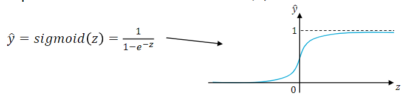

- Multiclass classification (K>1)
  - 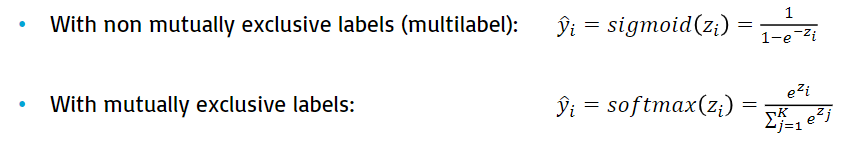
  - "Mutually exclusive" means each input yields to only one class
    - sigmoid denotes the confidence of a class. They do not have to add up to 1.
    - softmax denotes the probability of each class, adding up to 1. This is for classifying one class.

- Regression (for any K)
  - 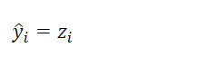
  - No activation function is used, because we are looking for a trend

### Hidden layers
The activation function σ for the hidden layers' neurons is necessary to introduce non-linearities in the network.
Multiple options are available:
- Sigmoid
  - Pro: interpretable output (probability)
  - Con: vanishing gradients: small and large values of z cause the gradients to be close to 0
- Hyperbolic tangent (tanh)
  - Pro: allows for positive and negative output
  - Con: vanishing gradients
- Rectified Linear Unit (ReLU): a = max(0,z)
  - Pro: no vanishing gradients
  - Con: derivative = 0 for negative values of z
- Leaky Rectified Linear Unit (LReLU)
  - Pro: nonlinear but piecewise linear, thus easy to differentiate. Derivative is always not 0.

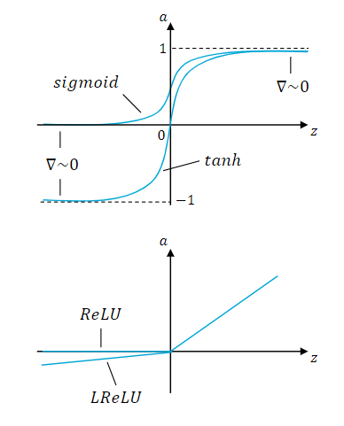

## Loss function
The loss function L depends on the output layer's activation function (and thus, on the task).
Common choices are:
- Multiclass classification (softmax activation): categorical cross-entropy
  - 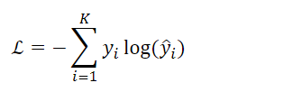
- Binary classification (sigmoid activation): binary cross-entropy
  - 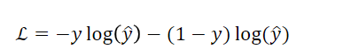
- Multiclass multilabel classification (sigmoid activation): binary cross-entropy on each output
  - 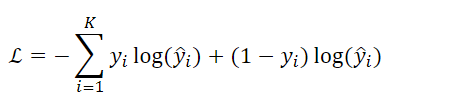
- Regression (no activation): mean squared error
  - 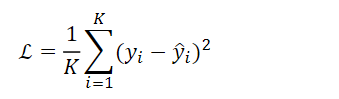

## Underfitting vs Overfitting
### Definitions
Underfitting
- happens when the network has too few parameters to be able to model the complexity of the desired input-output mapping
- the network does a poor job
- 

Overfitting
- happens when the network has too many parameters for the desired input-output mapping
- the network does an unrealistically good job, which does not generalise well to unseen examples
- 

### How to detect
- Split the dataset in training set (typically 80% of the data, used to update the weights and train the model)
- and test set (typically 20% of the data, used to test the generalisability of the model)
- At every training step, plot the training loss (the value of the loss function evaluated on the training set)
- and the test loss (the value of the loss function evaluated on the test set)

