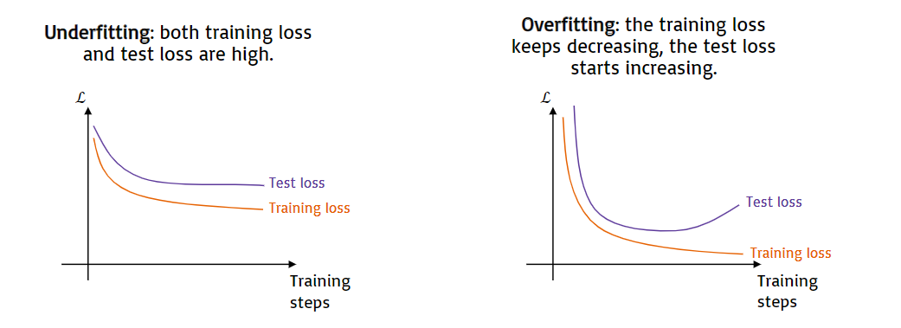

# 230227_ ANN & CNN

---

# ANN (continued)

## Underfitting vs Overfitting
### Definitions
Underfitting
- happens when the network has too few parameters to be able to model the complexity of the desired input-output mapping
- the network does a poor job
- 

Overfitting
- happens when the network has too many parameters for the desired input-output mapping
- the network does an unrealistically good job, which does not generalise well to unseen examples
- 

### How to detect
- Split the dataset in training set (typically 80% of the data, used to update the weights and train the model)
- and test set (typically 20% of the data, used to test the generalisability of the model)
- At every training step, plot the training loss (the value of the loss function evaluated on the training set)
- and the test loss (the value of the loss function evaluated on the test set)

### How to prevent
- Underfitting
  - Increase complexity of the network (increase the number of neurons and number of layers).
- Overfitting
  - Ensure that training test sets are IID
  - Gather more data
  - Augment data (e.g., crop/zoom/rotate images in the training set)
  - Decrease complexity of the network (decrease the number of neuros and number of layers)
  - Apply regularisation

## Regularisation
By constraining the weights to have a small magnitude, we prevent the model from overfitting. 
This idea comes from the fact that if the magnitude has large variance, then there will be more fluctuations in the output.

We constrain the magnitude of the weights by adding a regularisation term to the loss function: 
L = L{error} + λL{reg}
- L{error} is the error loss caused by the difference between desired output and model prediction (e.g. cross-entropy loss)
- L{reg} is the regularisation loss
- λ is the regularisation rate (determines how impactful the regularisation loss is) (0.1 is the common starting point)

Examples of regularisation loss are:
- L1 regularisation (L{reg} = Σi|wi|)
- L2 regularisation (L{reg} = Σiwi^2)

## Weight Initialisation
Biases are typically initialised to 0.

However, initialising all weights to 0 (or to the same constant value) would lead all neurons to 
learn the same features during training. Random initialisation is necessary to break the symmetry of the MLP.

Common initialisation choices for the weights are:
- A normal (Gaussian) distribution with mean 0 and variance 1
- For sigmoid and tanh, Xavier initialisation (with n referring to the number of neurons)
- For ReLU and LReLU, He initialisation (with n referring to the number of neurons)

## Learning rate
The learning rate α controls the speed in which the weights are updated.

- Higher α leads to faster convergence, but with the risk of missing the minimum and not reaching convergence.
- Lower α leads to slower convergence, with more certainty of finding a minimum, but with the risl of getting stuck in a local minimum.

## Mini-batch gradient descent
- Stochastic gradient descent
  - One training example at a time
  - Fast computation
  - High variance
- Batch gradient descent
  - All training examples at a time
  - Slow computation
  - Low variance
- Mini-batch gradient descent
  - Some training examples at a time (common batch sizes: 4, 8, 16, 32)
  - Fast computation
  - Low variance

Standard default values of α are 0.1 and 0.01.

# Convolutional Neural Networks (CNN)

When used on RGB images, the MLP:
- Scales badly 
  - increasing the dimensions of the image leads to a quadratic increase of inputs
- Ignores the spatial structure 
  - pixels in opposite parts of the image are connected in the same way as adjacent pixels
- Cannot handle translation 
  - if the network is shown a dog always in a specific corner of the image, it won't recognise it when shown in another part of the image

## The Convolution Filter

The elements of the filter is updated.

### The 3D convolution filter

Convolutional filters can be applied on 3D images (e.g., considering the RGB channels as depth of 3) 
The filter still performs element by element multiplication and sums the result to a scalar value.

 

At every layer, an array of multidimensional filters are applied, to reduce the width and height of the feature map while increasing the depth. 
After the last layer of filters, the feature map is flattened to a 1-dimensional array which is used as input to an MLP.
The output of the MLP after the training is compared wto the desired output.
