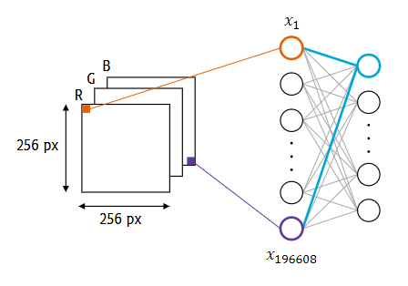
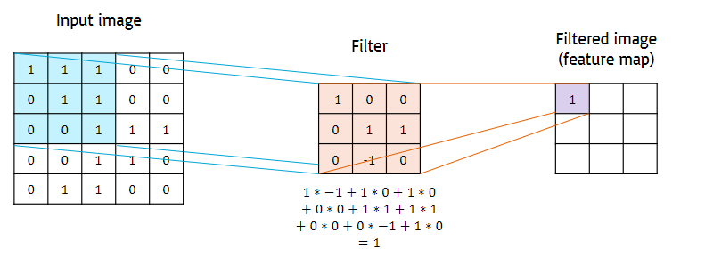
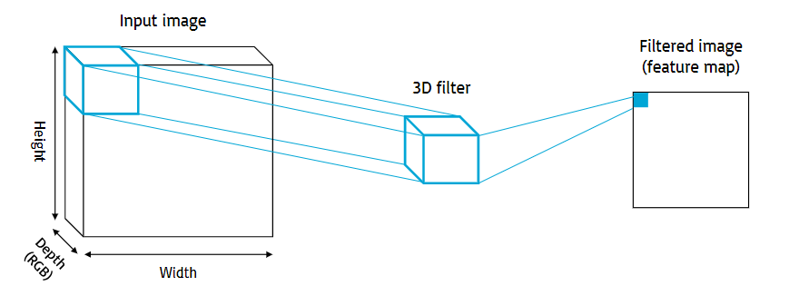
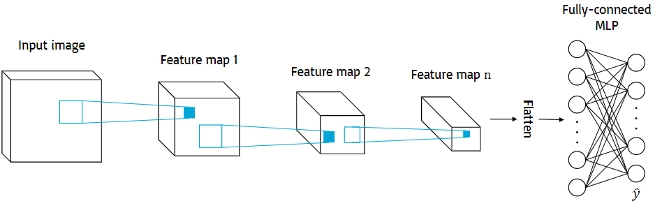
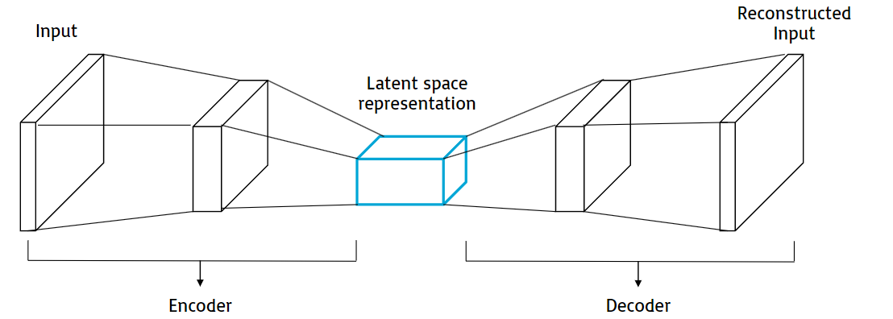
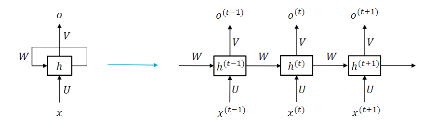
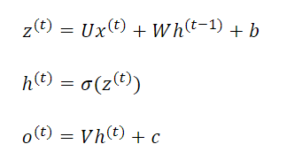
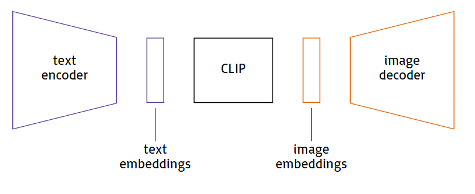

# 230301_ CNN & RNN

---

# Convolutional Neural Networks (CNN)

When used on RGB images, the MLP:
- Scales badly
    - increasing the dimensions of the image leads to a quadratic increase of inputs
- Ignores the spatial structure
    - pixels in opposite parts of the image are connected in the same way as adjacent pixels
- Cannot handle translation
    - if the network is shown a dog always in a specific corner of the image, it won't recognise it when shown in another part of the image

## The Convolution Filter

The elements of the filter is updated in the MLP training procedure.

### The 3D convolution filter

Convolutional filters can be applied on 3D images (e.g., considering the RGB channels as depth of 3) 
The filter still performs element by element multiplication and sums the result to a scalar value.

 

At every layer, an array of multidimensional filters are applied, to reduce the width and height of the feature map while increasing the depth. 
After the last layer of filters, the feature map is flattened to a 1-dimensional array which is used as input to an MLP.
The output of the MLP after the training is compared wto the desired output.

### Feature Detectors
Convolution filters are feature detectors
- Convolution filters in the first layers detect low level features (e.g. vertical and horizontal lines)
- In deeper layers, the feature maps represent higher level concepts (e.g. parts of the face)
- In the deepest layers they reconstruct the full image, highlighting the most important features for classification (e.g. a moustache)

## CNN Applications
CNN are mostly used for image processing.
- Image classification
  - indicate whether an image contains a class or not
  - used for cancer identification or quality control
- Object detection
  - find an object in an image
  - used for foot traffic analysis or inventory management
- Object segmentation
  - find the pixels corresponding to an object in an image
  - used for face recognition, automated object picking, or environment scanning in autonomous vehicles

## Encoder-Decoder Architecture
An encoder-decoder architecture, a.k.a. autoencoder, is an ANN with a symmetric structure and a bottleneck in the middle.

- trained to compress and reconstruct the input information, using the input itself as the desired output
- the bottleneck consists of a compressed (encoded) version of the input information, referred to as latent representation

### Application
A CNN autoencoder is trained with the same image as the input and the output,
so the decoder learns to reconstruct that specific type of image.
When fed with a different encoded image, the decoder will attempt to reconstruct the image as it was trained.

This is the basis of deepfakes.

# Recurrent Neural Networks (RNN)
When handling sequential data such as text or temperature, the MLP cannot be applied because:
- MLP requires a fixed input length
- MLP has no notion of time or order of the input

Recurrent Neural Networks are preferred because
- information flows from one step to the following
- parameters are shared
- internal memory is passed to the next step in the sequence

## Word embeddings
The simplest way of representing a word in a numerical way would be by vectors long as the dictionary length, with a 1 in the correct index and 0 for everywhere else.
However, this generates sparse vectors with very long length.

Word embeddings are used to create n-dimensional dense vectors.
- An autoencoder learns to map words to an n-dimensional embedding space. 
- The encoder is trained so that co-occurring words and words that appear in consistent part of the sentence are mapped closely in the embedding space.
- The nature of the labels (Words co-occurrence) makes the process self-supervised
- This generates n-dimensional dense vectors that preserve word similarity in a Euclidean space
- The embedded representation of the word is used as input to the RNN.

## RNN applications
RNN are mostly applied to Natural Language Processing (NLP).
- Text classification
  - indicate whether a piece of text contains a class or not
  - used for spam detection, sentiment analysis
- Machine translation
  - an encoder-decoder is trained with the text in the source language as input, and the translation in the target language as desired output
- Chatbot
  - the conversation is fed as input to a language generation model, which outputs a reply
  - can be trained with supervised learning or reinforcement learning

# DALL-E
DALL-E is a deep learning model that generates an image based on an arbitrary text description.

It has three components:
- a text encoder
- CLIP
  - a model that matches text embeddings to image embeddings
- image decoder

The text encoder and image decoder are independently trained as autoencoders through self-supervised learning. 
CLIP is trained with pairs of images and associated captions as inputs and desired outputs.
