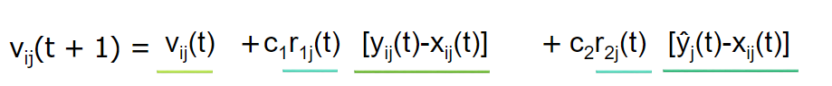

# 230306_Genetic Algorithms

---

# 0. Learning Objectives
- Explain the intuition behind evolutionary computing
- Recognise problems that can be modeled via evolutionary computing methods
- Enumerate the steps of a genetic algorithm (GA)
- Describe the key GA operations: selection, cross-over, and mutation
- Apply GA to optimisation problems

# 1. Evolutionary Computing (EC)
EC is mostly used in optimisation problems, with a given objective function and a set of constraints
- There is an objective function that we want to maximise (or minimise) (e.g. f(x, y) = 2x + y)
- There are also constraints (e.g. x + y <= 3, 5x + 2y <= 10)
- and variable bounds (e.g. x, y >= 10)

But we can do this with analytical method. Why use EC for optimisation?

## Why use EC?
EC algorithms are flexible optimisation algorithms.
- No constraints in the *type of variable*
- Works well with *non-linear objective functions*
- Insensitive to *discontinuities* or *shape*
- Can be adapted to *multi-objective optimisation* problems
- In general, **requires few assumptions about the problem**

## Applications of EC
- economics: economic models, asset pricing etc
- logistics: in scheduling and traveling salesman problem
- engineering: in identifying the optimal design of a spacecraft
- machine learning: to search optimal values of (hyper)parameters

## Evolutionary Process
This part describes the evolutionary process in the nature as an introduction to GA

### Evolution: general principles
- Heredity: there must be a process by which children receive the properties of their parents
- Variation: there must be a variety of traits present in the population or a means to introduce variation
- Selection: there must be a mechanism by which some individuals in the population have an opportunity to be parents and do not ("survival of the fittest")

### Evolutionary cycle
- Genes produce Population of organisms
- Population of organisms compete (natural selection) to become the Fittest organism
- Fittest organisms pass on their Genes
- These Genes are reproduced/mutated and produces Population of organisms, and so on

## Evolution as an Algorithm
Can we mimic evolution to find a solution (model, program, design, parameter setting, etc) that is **'the fittest to the domain'?**

Here by fitness we mean goodness of a candidate solution. 
We need some assumptions:
- Every candidate in the solution space has its "fitness"
- Similar solutions have similar fitness

Evolutionary Computing is an umbrella term used for algorithms that are inspired by evolution

## Basic concepts of EC
EC borrows concepts from evolution to solve optimisation problems
- Population: a set of candidate solutions
- Fitness: criterion for evaluating the goodness of candidates
- Selection: process through which solutions are picked for further refinement
- Reproduction: process through which new solutions are produced from existing solutions under the assumptions that
  - good solutions, when combined, will likely yield even better solutions (exploitation)
  - unexpected changes in solutions (e.g., via mutation) can yield better solutions (exploration)

# 2. Genetic Algorithm
## Overview
- Chromosome: bit-string encoded candidate solution (nowadays other encoding forms are possible)
- Gene: each bit of the solution

## Procedure
1. Encode candidate solutions into chromosomes
2. Define how the fitness of a candidate solution is measured (the fitness is computed on the decoded chromosome)
3. Randomly select an initial population of N chromosomes
4. Compute the fitness of all the chromosomes in the population
5. Pick the chromosomes for reproduction (based on their fitness ratio)
   - example: Roulette Wheel Selection (using fitness ratio as a probability to be chosen)
6. Modifications
   - Crossover
     - with (predefined) probability p, use the two selected chromosomes to generate offspring
     - pick a random cross-over point and swap the bits after that point among the two chromosomes
       - example: 0010, 1100, cross-over point 1 => 0100, 1010
   - Mutation
     - with (predefined) probability q, mutate (flip) the bits in the new chromosomes
     - q is typically small (typically between 0.001 and 0.01), otherwise leads to instability
7. Put the offspring in the new population
8. Substitute the old population with the new one
9. Repeat from step 4
10. The process stops if
    - a sufficiently good solution is found, or
    - a predefined number of iterations (generations) has been executed

## Variations of GA
We can have variations from the original GA, in:
- Coding
  - binary coding
  - gray coding (avoids Hamming cliffs)
- Selection
  - Roulette-wheel selection
  - Ranking selection
  - Tournament selection
- Cross-over
  - Single-point cross-over
  - Multi-point cross-over
  - Uniform cross-over

We also have hyperparameters in GA:
- Length of the chromosome, L
  - Depending on the precision required for the problem
- Population size, N
  - Larger the search space, larger the N should be
- Cross-over probability
  - Generally high, e.g., 0.7
- Mutation probability
  - Generally low, e.g., 1/L or 0.1/L
- Number of generations, G
  - Depends on the computational resource available

Optimal values of the hyperparameters can be chosen empirically

## Why do GA work?
Holland's schema theorem:
- The presence of
  - short,
  - low-order schema with
  - above-average fitness
- increases in successive generations of GA.

However, the schema theorem also has criticisms:
- Almost a tautology describing only the proportional selection, but not the benefits of cross-over and mutation
- Excludes the re-emergence of a schema after recombination
- Holds under the assumption of an infinitely large population
  - small populations can introduce sampling errors, resulting in convergence on schema that have no selective advantage
- Schema theorem does not imply that
  - GA finds global optima
  - GA is better than other optimisation techniques