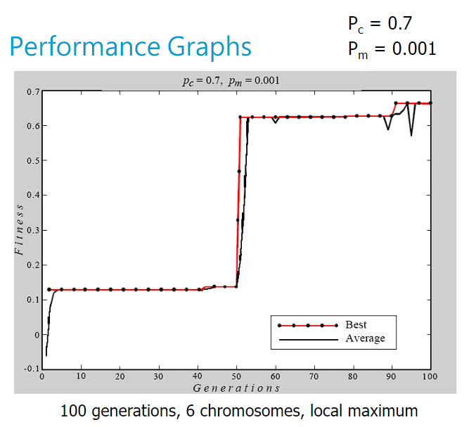
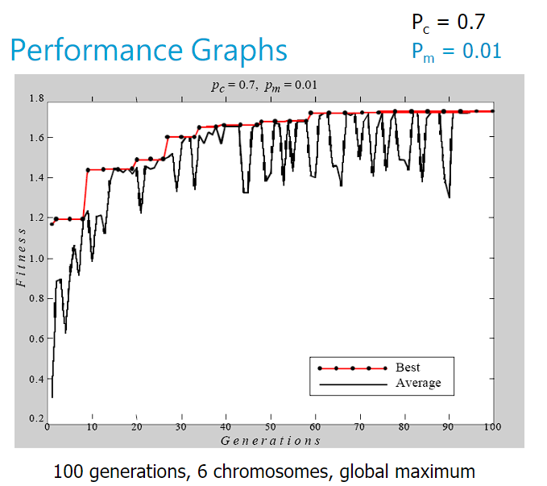
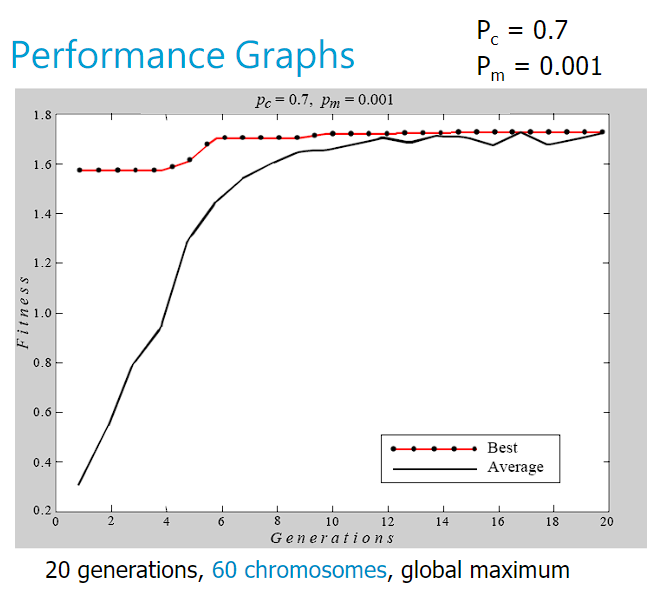
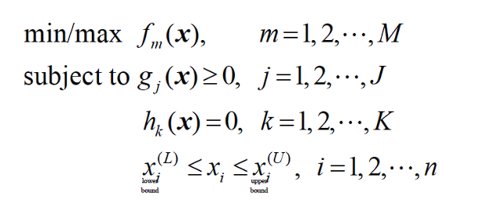
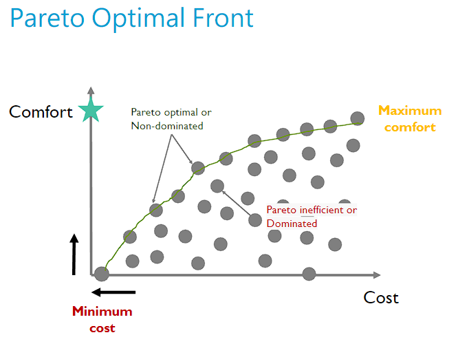

# 230308_GA and MOEA

---

# 0. Learning Objectives
- Analyse GA via performance graphs
- Apply GA to practical scheduling problem
- Recognise multi-objective optimisation problems
- Describe NSGA-II, a GA for multi-objective optimisation

# 1. Performance Graphs
How do we know whether a solution we found is good? 
=> Performance graph:
- Average fitness of the population over time
- Fitness of the fittest individual per population

Below are the examples of performance graphs

# 2. Multi-Object Optimisation with GA
A multi-objective problem consists of two or more objectives that conflict with each other.
- Decisions: alternative strategies that decision makers want to explore
- Objectives: measures to rank the desirability of a certain decision
- Constraints: condition that needs to be satisfied; often non-negotiable

## General form of a multi-objective optimisation problem

- m objective functions
- several constraints and variable bounds

Single objective problems are about finding a solution that optimises the given objective,  
whereas multi-objective problems are about finding the set of solutions that define the best possible tradeoffs
between competing objectives.

## Pareto Optimality
> A solution is Pareto optimal when there exists no other solution that improves at least one objective
> without degrading the performance in any another objective

Pareto optimality can be used to rank alternatives in multi-objective problems.

Notice that Pareto optimality applies to more than two objectives as well (we have a Pareto optimal surface in this case)

Some terminologies:
- An ideal point is where we have the maximum fitness for all the objectives.
- We say an alternative dominates another if it performs better than the another for all the objectives.

## Why use GA for Multi-Objective Optimisation?
- Non-commensurable, non-linear objective functions
- Insensitive to discontinuities or shape of the Pareto front
- Flexible, can find solutions to problems for which we have little knowledge
- The Pareto set is generated in a single run

# 3. NSGA II
Non-dominated Sorting Genetic Algorithm

1. Generate an initial population of candidate solution (they are vectors)
2. For each solution, check:
   - Which points it dominate (D)
   - How many points it is dominated by (n)
3. Rank the solutions:
   - The point(s) with the lowest n gets Pareto rank 1 and keep it
   - For all the points, lower their n accordingly (# of kept points)
   - The point(s) (excluding the kept points) with the lowest n gets Pareto rank 2... and so on
4. Now we have fronts with same fitness across themselves
5. Use Crowding Distance (CD) to choose which points to eliminate
   - Points with larger crowding distance is preferred to preserve diversity