# 230313_ Swarm Intelligence

---

# Learning Objectives
By the end of this week:
- Understand swarm intelligence as a form of distributed optimisation
- Explain the Ant Colony Optimisation (ACO) algorithm
- Apply ACO to the Traveling Salesman Problem (TSP)
- Explain the Particle Swarm Optimisation (PSO) algorithm
- Apply PSO to an optimisation problem

# Swarm Intelligence
"The whole is more important than the sum of the parts."

Computational swarm intelligence:
- Algorithms that define simple individual behaviour modulated by simple interactions between individuals
- Emergent group behaviour

Focus on the individual actors, not on the whole system (which might be too complex to model)

We will focus on two methods:
- Ant Colony Optimisation (ACO)
  - Usually used for combinatorial optimisation
  - such as routing
- Particle Swarm Optimisation (PSO)
  - Usually used for continuous optimisation
  - such as control

# Ant Colony Optimisation
Artificial ants solve optimisation problems, inspired by how real ants communicate (indirectly) via pheromone

Consider finding the shortest path to a goal.

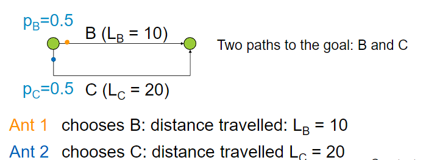

We start with all the links having the equal probabilities to be chosen. 
The shorter the distance, the more pheromone is released on the link.

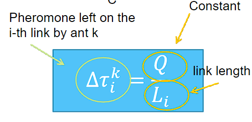

Assuming Q = 100,

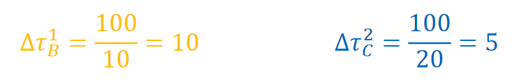

Then the probabilities to choose the path are updated according to the amount of pheromone.

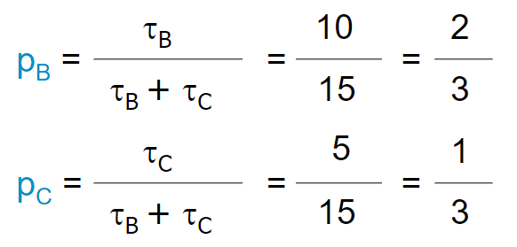

The probabilities get updated with more iterations (as more ants travel through them and leave more pheromones).

## TSP problem using ACO
Employ artificial ants to solve TSP

We have the following assumptions:
- ants have some memory and remember which cities are visited already
- ants know which path leads to which city
- time is discrete
- starting points are randomly assigned

### Algorithm
1. The initial graph is drawn with the time taken for each path and the initial amount of pheromone on each of the edges (represented by the blue 1's).
   - 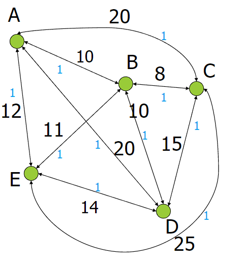
2. Ants travel through the edges, visiting each city once and coming back to the initial city. The total time (or length) of travel is calculated.
   - 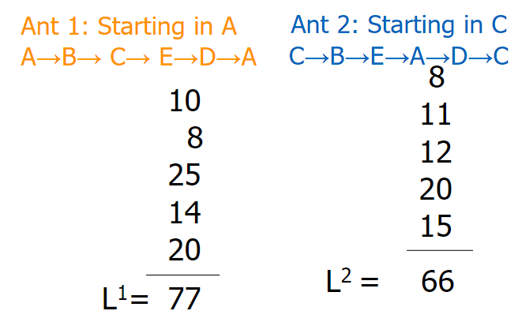
3. Shorter route gets more pheromone
   - 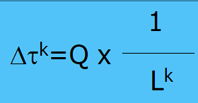
4. Add this value (can be rounded) to each of the edges that are taken for this travel instance.
   - 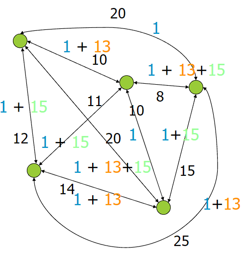
   - Problems:
     - What if many routes use a link which is not part of a shorter tour?
     - What if a short route contains a very long link that initially is less likely to be used?
5. Use evaporation constant
   - 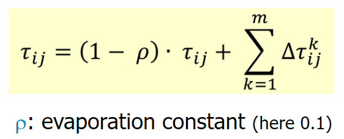
   - The amount of pheromone currently on path ij corresponds to the amount of pheromone existing on it, decreased by a quantity proportional to the evaporation constant, plus the sum of all the pheromone released on that link by all the ants that passed by it this round.
   - 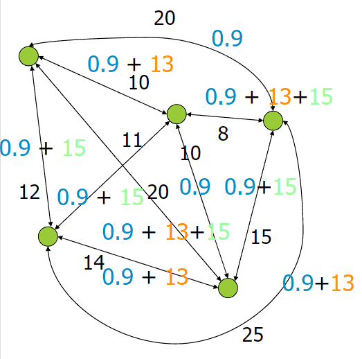
6. The probability of choosing for a (previously unseen) path is proportional to the amount of pheromone and inversely proportional to the length of the path
   - 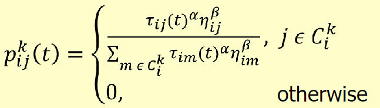
     - α, β = predefined hyperparameters (trail x visibility)
     - τij(t) = pheromone on path ij
     - ηij = heuristic, e.g. Euclidean distance
       - 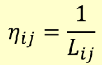
     - Σ(m ε c_i^k) τim(t) * ηim = sum of (the product between [pheromone on all paths departing from city i] and [the heuristic])
   - Assuming α = 1, β = 0.5:  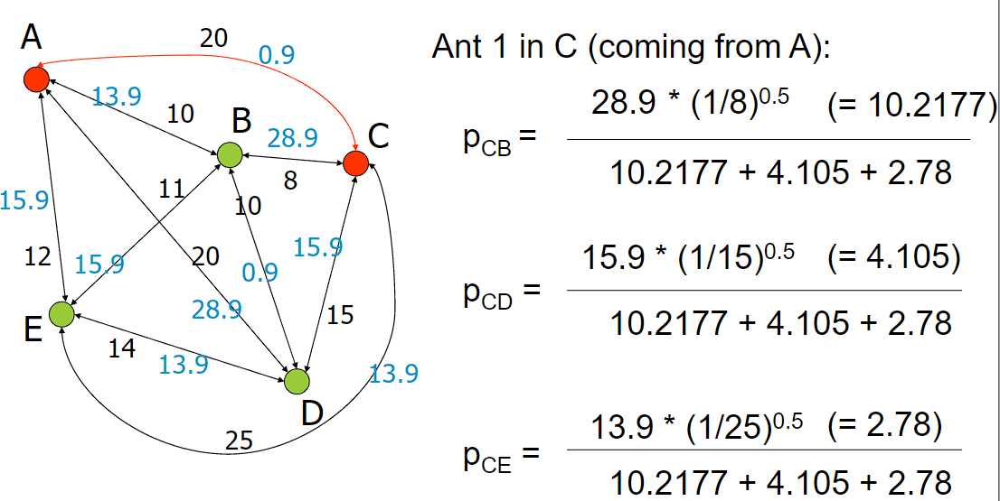
   - 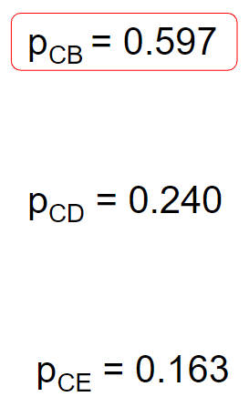
7. Update the pheromones
   - 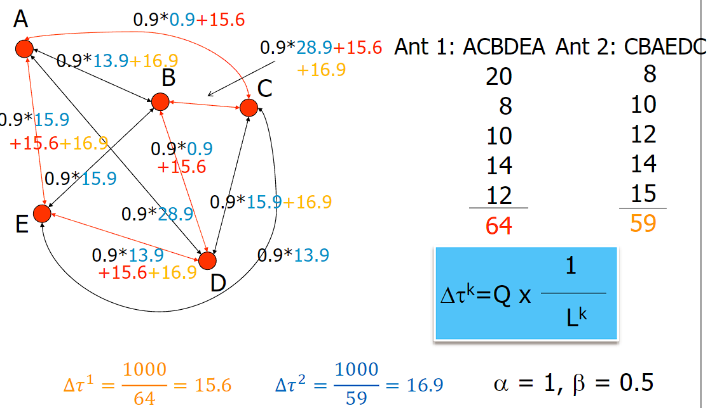

With more iterations, shorter routes are found. 
Even if a long link (which is not good for a short routes) is very popular, at the end it will be neglected because of evaporation.
Same for long links that are part of a short route

This algorithm finds a short path, but not necessarily the shortest.

### Parameters
Parameters must be tuned to the specific problem
- Number of ants
  - typically same as the number of cities
- Initial distribution of ants over cities
- Q value
  - large enough to not lose precision during updates
- α and β values
- Evaporation rate

### Summary
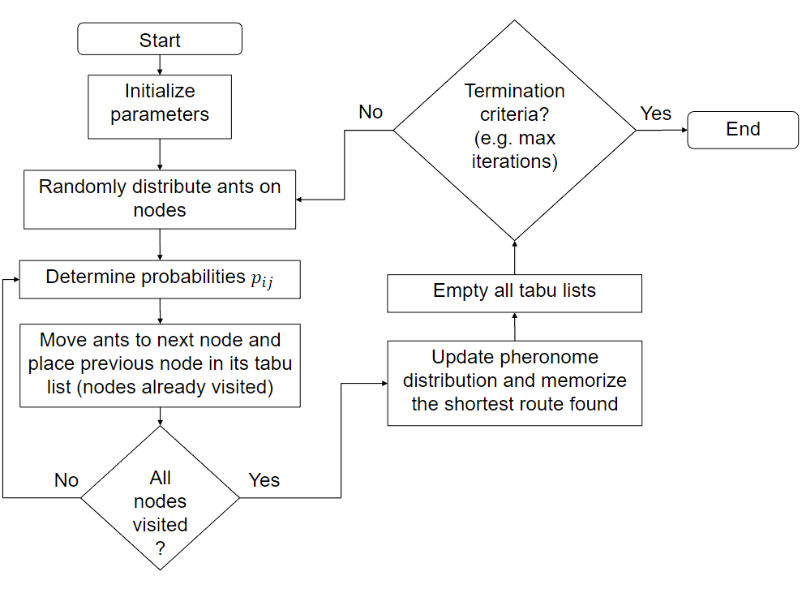

## ACO - other applications
- Scheduling
  - Assembly lines
  - Airline crew scheduling
- Routing
  - Vehicle routing
  - Circuit boards
- Image processing
  - Edge detection and edge linking
- Network design
  - Energy, gas, internet
- Biology
  - Protein folding

## Comparison between ACO and other algorithms
Dijkstra usually requires less computational power

ACO is usually better suited than Dijkstra for:
- Scenarios where you have a dynamic cost function (such as traffic in a city)
- Very large scenarios

## ACO summary
- A big advantage of ACO is its inherent flexibility
- Environment and conditions might be unknown and/or dynamic (changing over time)
  - Internet: nodes break down
  - Highway: closed for accident
- Ant keep exploring: they adapt fast
- Pheromone gives backup options
  - If a link is closed, the second shortest route is easy to reconstruct

