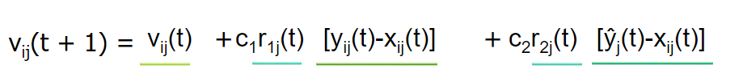
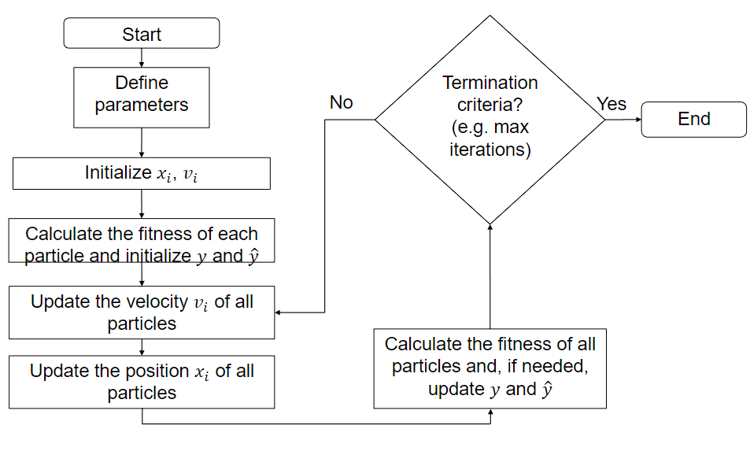
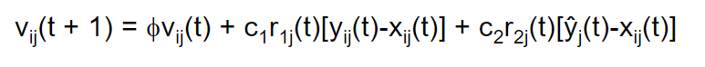

# 230315_ Particle Swarm Optimisation

---

# Particle Swarm Optimisation
PSO is an optimisation algorithm inspired by the behaviour of flocking.
Birds tend to steer to:
- avoid crowding
- align themselves
- move towards the average position

In PSO, each particle is a vector of numbers. We can assess the "fitness" or quality of each particle
based on its position.
- A swarm of particles "files" over a hyper-dimensional solution space
- Their movement is synchronised (discrete)
- Particles change their positions according to the results they achieved and the results their companions achieved
- Near-optimal solutions can be found

## Particles
Particles are potential solutions (vectors of real values), of e.g.:
- weights of an ANN
- distances, degrees of freedom, angles of joints to move a robot
- dispatch of energy generators
- other applications with fitness functions

Each particle has its own position and velocity.
- x_i(t): position (vector) of particle i at timestep t
- v_i(t+1): velocity (vector) that drives the particle from t to t+1
- At time t+1, the position of x_i changes according to:
  - x_i(t+1) = x_i(t) + v_i(t+1)
- x_i(0), the initial position of a particle, is randomly chosen from (x_min, x_max) following a uniform distribution.

## Fitness
The fitness function, f(x_i(t)), indicates how good the solution represented by a particle is

## Velocity Update
We use four strategies combined:
1. Using previous velocity
2. Cognitive component (individual/local best)
3. Social component (global best)
4. Random scale factors: "free will" of the particle

### Individual-best solution
y_i(t) yields the best solution (position) found by particle i after t steps.

For example, for maximisation:
- y_i(t+1) = y_i(t)
  - if f(x_i(t+1)) < f(y_i(t))
- y_i(t+1) = x_i(t+1)
  - if f(x_i(t+1)) >= f(y_i(t))
  - i.e. new individual-best

### Global-best solution
y^(t) (y hat t) yields the best position found by the whole swarm after t steps

- y^(t) = arg max{f(y_0(t)), f(y_1(t)), ..., f(y_n(t))} (best so far), or
- y^(t) = arg max{f(x_0(t)), f(x_1(t)), ..., f(x_n(t))} (best in this moment -> less often used)

### Components of the Velocity
Velocity of particle i in dimension j is given by: 

- c1, c2: acceleration constants ( > 0)
- r1, r2: random values in [0,1]

- v_ij(t): previous velocity
  - prevents sudden changes
- [ y_ij(t) - x_ij(t) ]: cognitive component
  - "nostalgia" for previous success
  - leads back to the best-so-far solution found by particle i
- [ y^_ij(t) - x_ij(t) ]: social component
  - follow the mass
  - takes into account the global best solution so far and moves towards it
- c_1 r_1j(t), c2 r_2j(t): random scale factors
  - stimulate the "free will" of the particle (r1 and r2)
  - and control relative importance of cognitive and social components (c1 and c2)

### Convergence
What if the particles converge to a (local) optimum?
- Particles could "fly away" from the current global best, because of the three other components
- This is not necessarily a bad thing; they might actually find something better
- This helps in exploring the neighbourhood of the best-so-far solution 

### Acceleration coefficients
Acceleration constants regulate self-confidence and trust in neighbours. 
Typically, c1 and c2 are similar and are in the range [0,4]
- If c1 = c2 = 0
  - Particles keep flying at their current speed until they hit a boundary of the search space
- If c1 >> c2
  - Particles perform a local search
- If c1 << c2
  - The entire swarm is attracted to y^_j(t)
  - Increased risk of particles converging to local optima

## Initialisation
- Positions are initialised randomly using uniform distribution.
- Velocities usually start with 0.
- Initial local best solution is y_i(0) = x_i(0)

## Number of particles
More particles means:
- Higher diversity
- Less iterations
- Higher computational cost
- Parallel random search algorithm

The number of particles commonly used is between 10 and 30, depending on the search space

## Termination
Stopping criterion could be one (or combination) of the following:
- max number of iteration
- good enough solution has been found
- no further changes in positions
- velocities are close to 0

## Flowchart

## Variations of PSO
### Maximum Velocity
- If particles are far away from the best-so-far solution, their velocity may increase quickly
- This can introduce the risk of flying over the optimum
- Maximum velocity
  - high = better exploration, but particles might never find the optimum (keep flying away)
  - low = local improvements, but can be stuck in local optima

### Inertia
- Inertia weight controls the influence of the previous velocity
  - 
  - high = cognitive and social components are less relevant
  - low = particle explores better in the space where the best-so-far optimum has been found
- Inertia weight can change over time: start high, later decrease

### Interaction with the neighbours

### Binary PSO

## PSO vs Genetic Algorithms
- Similarities
  - Stochastic
  - Based on populations of individual
  - Aim at optimising a fitness function
  - Swarm = Population
  - Particle = Chromosome
- Differences
  - Particles are not independent, while chromosomes usually are
  - No generations or selections in PSO
  - Particles have memory or previous velocity, but chromosomes do not have memory of previous generation

