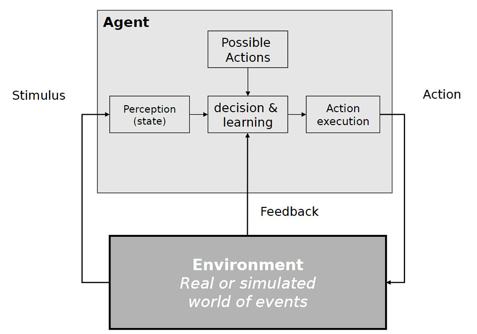
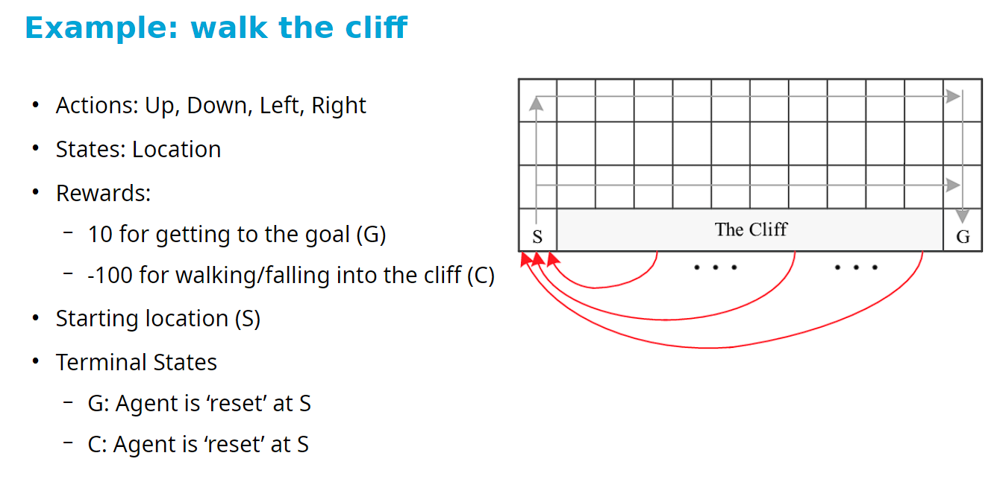
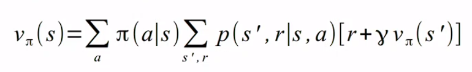
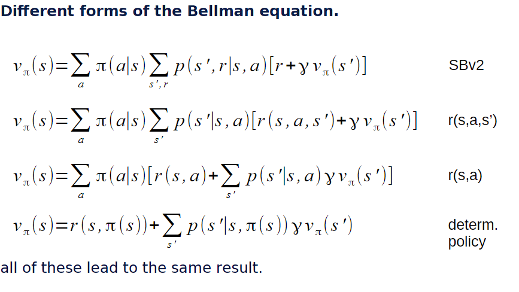
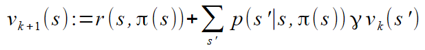
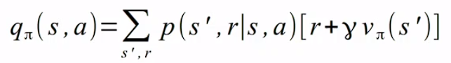

# 230320_ Reinforcement Learning part 1

---

# Overview
- Intro to sequential decision making (SDM) & reinforcement learning (RL)
- Part 1
  - A formal description of RL: Markov Decision Processes (MDPs)
  - Using MDPs: planning
- Part 2
  - Unknown MDPs: reinforcement learning
  - Challenges/Issues that limit RL applicability

## Learning Objectives:
- Explain when sequential decision making is applicable/required for a robot/agent
- Explain the temporal credit assignment problem
- Given a certain problem, define an MDP that represents it in terms of:
  - states, actions, transitions, rewards, discount
- Explain concepts:
  - Markov property
  - Absorbing states
  - Value function, etc
- Apply policy iteration and value iteration to compute a solution to an MDP

# Conditioning
Classical conditioning
- involuntary behaviour
- pairing of stimuli with biologically significant events
- reflexes: automatically elicited by the appropriate stimuli
- example: sight of sweets may cause a child to salivate - not voluntarily "chosen"
- Pavlov's dog

Operator conditioning
- voluntary behaviour
- reinforced by reward/punishment
- example: a child may learn to open a box to get the sweets inside
- Skinner (mouse)

"Reinforcement" means both reward and punishment

# Sequential Decision Making

Agents and environment interact over time

Temporal credit assignment problems
- Which action at what time step was responsible for the rewards?
- Any problem that:
  - needs sequential action selection to be solved
  - has state transitions triggered by agent actions
  - involves delayed rewards defining task success/failure
- Examples:
  - Robot navigation
  - Car driving
  - Board games
  - Mountain car

# Markov Decision Process
> M = <S,A,T,R>

An MDP is a 4-tuple
- M = <S,A,T,R>
- S = set of world states s
- A = set of actions a
- T = transition function
  - specifies p(s'|s,a)
  - enables: outcome uncertainty
- R = reward function
  - task encoded by rewards R(s,a,s')
  - also R(s,a) or R(s')
  - agent wants to optimise sum of rewards

## Reward function R(s,a,s')
The definition of good/bad for all actions in all states.

In many problems reward is delayed and/or sparse:
- delayed: only once you get to the goal/win a match, etc
- sparse: many R(s,a,s') = 0

Notation: R(s,a,s') = r

## State transition function T(s,a,s')
Defines the world's reactions to the agent's actions

Markov assumption
- effect of actions depends only on current state
- P(s_t|s_(t-1) a_(t-1) s_(t-2) a_(t-2) ...) = P(s_t|s_(t-1) a_(t-1))
- this is a very strong assumption that states have enough information to predict the future
  - everything I need to know can be observed
  - do not need to remember anything

## Episodic vs Continuing Tasks
- Cliff waling has a goal: naturally splits in episodes - episodic
- Smart traffic light should continue forever - continuing

In episodic tasks, next episode is independent of how previous ended

# Using MDP: Planning
Using a given MDP to compute a policy

## Goal
- Goal: optimise long-term (sum of) rewards
- Formally "optimise sum of reward in an episode" called return: G_t = R_(t+1) + R_(t+2) + ... + R_T
- For continuing tasks, return is infinite
  - fix using discount factor γ in [0,1)
  - discounted return: G_t = R_(t+1) + γ R_(t+2) + γ^2 R_(t+3) ... 
- The world can be stochastic (difficult to know what the sequence of the outcome will be)
  - need to optimise expected (discounted) return when acting according to policy π
  - v_π(s) = E_π[ G_t | S_t=s ]
    - What is the expected return at time t and state s?
  - v_π(s) is called the value function of π

## Policies
- Policy is a mapping from state to action: π(s) = a
- A policy is a feedback plan rather than open-loop plan

Feedback plan vs Open loop plan
- Feedback plan
  - a control strategy that continuously adjusts its actions based on the current state or observation of the system
  - incorporates real-time information to make decisions, which makes it more adaptive to changes or disturbance in the system
- Open loop plan
  - a control strategy that does noty rely on the current state or observation of the system
  - instead it follows a predetermined sequence of actions, regardless of any changes or disturbances that may occur during the execution of the plan
- Comparisons
  - In a simple, predictable system, open loop might work better and achieve higher value (because no disturbances)
  - In more complex and uncertain environments, feedback plans are generally more effective
  - Feedback plans are generally more difficult to compute than open-loop plans
    - feedback plans require the continuous processing of real-time information and may involve more complex algorithms for decision making
    - open loops are based on predetermined actions and do not need to process real-time data
  - Feedback plans are more useful when the measurements (i.e., observations) are sufficiently informative
    - feedback plans rely on accurate and informative observations to make effective decisions

## Computing the optimal policy
- Generally 2 steps:
  - policy evaluation
    - compute v_π(s)
  - policy improvement
    - update π -> π'
- By alternating these, converge to optimal policy π*

### Policy evaluation
The value function satisfies the Bellman equation
- 
  - 

Computation of these value functions
- Iterative Policy Evaluation (IPE)
  1. Fix the policy π to evaluate
  2. Take the Bellman equation (the variant that is most convenient) and turn it into an update equation
     - 
  3. Initialise, v_0(s) = 0, for all s
  4. Apply the update equation, in iterations, to all states

### Policy improvement
Use the computed value function to improve the policy

Action-value function
- 
- expected value when selecting a at s, and following π afterwards

Given q_π(s,a), improve the policy using greedy algorithm:
- for all s, π'(s) <- max_a q_π(s,a)

Then repeat:
- policy evaluation
- policy improvement

# Conclusions
- Sequential decision making (and when it is applicable)
- An SDM problem can be defined using the MDP framework:
  - States (and how they are represented by the agent)
  - Actions (and their effect inters of state transitions)
  - Reward function (payoff for certain actions in certain states)
  - Transition function
- Task concepts:
  - Markov property, episodes, absorbing states
- Planning vs reinforcement learning
  - When we do know all the information about the M=<S,A,T,R>, we can use MDP planning
  - If we don't, we use reinforcement learning (next lecture)
- Planning concepts:
  - policy, value function, state-action value function
  - different notations/formulations of them
- Planning methods: policy iteration, value iteration
