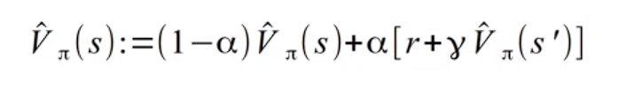
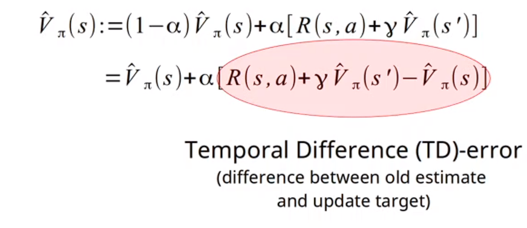
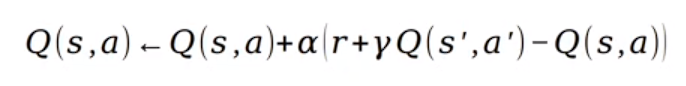
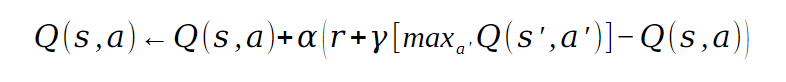
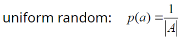
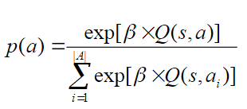

# 230322_ Reinforcement Learning part 2

---

# Learning objectives
- Explain difference between RL and planning
- Types of RL methods:
  - policy evaluation vs control
  - model-based RL vs model-free RL
  - on-policy learning vs off-policy learning
  - on-line learning vs off-line learning
- Explain the exploration/exploitation trade-off
- Apply TD learning, SARSA and Q-learning
- Understand the basics of and challenges for deep RL

# Reinforcement learning
Planning requires access to the model (transition, rewards). In many cases, however, we do not have this.

Reinforcement learning: learn optimal policy from (interaction) data
- act using an 'exploration policy' π
- collect the generated transitions: { (s, a, s', r) }
- then improve the policy

Two main approaches:
- Model-based RL
  - learn a model, then plan
- Model-free RL
  - try to learn q* directly

## Model-based RL
Given model, use planning

Model example: estimate P(s'|s,a) = N(s,a,s')/N(s,a)

## Model-free RL
Estimate the value function, q-value function, or policy directly, without first learning a model

### Model-free Policy Evaluation: Temporal Difference (TD) learning
Take the Bellman equation and turn it into an update equation that uses sampled experience.

Specifically, when following π, after observing (s,a,r,s'), we update: 

- α = learning rate
- [r + γ V_π(s')] = update target

This is usually re-written as:  

Overall procedure:
1. fix policy π, learning rate α, value estimates V(s) = 0
2. start executing in the environment:
   - For each episode
     - s = initial state
     - for each step (while s != terminal)
       - a = π(s)
       - s',r = execute(a)
       - V(s) := V(s) + α [r + γ V(s') - V(s)]
       - s = s'

### Model-free Control (Improvement): SARSA
If we want to learn how to take actions, learn Q(s,a) instead

Updates based on sampled transitions. Every step:
- receive last transition <s,a,r,s'>
- determine action a' ~ π_exploration(.|s')
- now we have <s,a,r,s',a'>
- update:
  - 

# On-policy and Off-policy
Different approaches for learning and updating the agent's policy

## On-policy
Aim to evaluate and improve the policy that the agent is currently following
- Learn the value function of the current policy that selects the actions
- i.e., we learn about the exploration policy
  - behaviour generation is coupled to learning V or Q
- Example: SARSA
  - it learns about the action actually selected
  - converges to v_π for a fixed π
  - so to converge to π*, we need to gradually improve π
  - typically: act by being greedy w.r.t current estimate of Q

## Off policy
Learn a target policy independently of the current behaviour policy
- Convergence of value function is not influenced by actions selected
- Behaviour generation is decoupled from learning V or Q
- Allows to learn from a wide range of experiences, including those generated by other agents or by following different policies
- Example: Q-learning

### Q-learning
- Q-learning is an off policy method
- every step:
  - receive last transition <s,a,s',r>
  - update:
    - 
  - update of value function is not influenced by actually selected action a' at this step

# Exploration vs Exploitation
Exploration and Exploitation are two different approaches to learning from an environment.
- Exploration
  - gathering new information to maximise the reward
  - when to use something new for action selection
- Exploitation
  - making the best use of current knowledge to maximise the reward
  - when to use V(s) or Q(s,a) for action selection

- When learning is offline (before deployment)
  - e.g., we have a simulator to do this
  - we could try
    - purely random behaviour to learn Q(s,a)
    - Then use Q(s,a) to perform
- When learning is online (in the actual environment)
  - too costly

## Balancing exploration and exploitation
- Randomisation
  - 
- Based on Q(s,a) values
  - Greedy: argmax_a Q(s,a)
  - Epsilon greedy:
    - do uniform random with ε probability
    - do greedy with (1-ε)
  - Boltzmann exploration
    - 

# Limitation/Assumptions
- Non-stationary environments
  - The transition function changes over time
  - The reward function changes over time
- Markov assumption
  - what if the last state is not the only info needed to predict what happens after action a is executed?
  - what if the world is partially observable? (non-markovian)

# Conclusions
- What is sequential decision making and when is it applicable?
- An RL problem can be defined using the MDP framework:
  - states, actions, transitions, and rewards (M = <S,A,T,R>)
- Planning vs Reinforcement learning
  - Planning methods (policy iteration, value iteration)
  - RL methods (TD-leaning, SARSA, Q-learning, ...)
- Challenges
  - Scalability: also for planning - often tackled with RL
  - RL limitations

