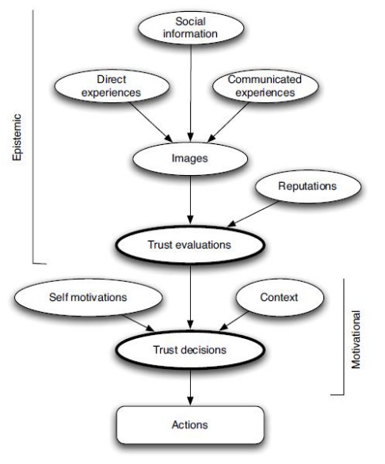
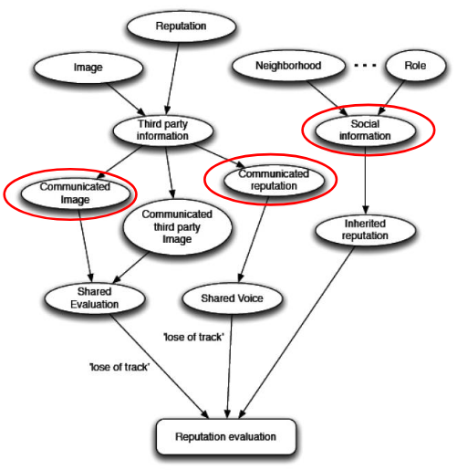

# Trust (Part 2)

Contents
- Multi-agent system perspective
- Representing Trust
- Willingness & Competence
- Trust process
    - Trust evaluation
    - Aggregation
    - Trust decision
- Reputation
    - Reputation process
    - Centralisation
    - Using reputation

## 1. Multi-agent systems
> Decentralised AI

Systems of many agents which have:
- a common environment
- communication channels
- coordination mechanisms

## 2. Representing Trust
> Expressiveness & Simplicity

Representing trust can be done in many ways, but there are a lot of **uncertainty** and **vagueness**

Adding these in the representations, we have two options:
- Probability distributions
- Fuzzy sets

### Probability distributions
Reasons about the uncertainty

Probability distribution over sorted discrete sets

Examples:
- 0.75p of very bad, 0.25p of bad
- 0.5p of very bad, 0.5p of very good

Pros:
- Good at representing uncertainty
- Usable with integer or label representation
- Easy to interpret

Cons:
- More complex than other options
- How do you establish uncertainty?

### Fuzzy sets
Reasons about the vagueness

Often used to reason with vague terms such as 'very', 'high', 'somewhat'

Looks like {(X1, Y1), (X2, Y2), ...}, where:
- X = member
- Y = membership level (between 0 and 1)
    - Describes how much of a 'high' or 'somewhat' the member is

Examples:
- Set of highly trusted agents:
    - HT = {(A, 0.5), (B, 0.3), (C, 0.9)}
- Set of somewhat trusted agents
    - ST = {(A, 0.8), (B, 0.9), (C, 0.2)}

Pros:
- Good at representing vagueness
- Can capture language use

Cons:
- Difficult to understand for many
- How do you establish truth values?

## 3. Trust Processes in MAS

Consists of two main parts:
- Trust evaluation
    - Trust as an expectation
    - "I beilieve you will do X"
- Trust decision
    - Trust as an action
    - "I will rely on you to do X"

### Trust evaluation
Image: "an evaluative belief; it tells whether the target is good or bad with respect to a given behaviour"
- Direct experiences
    - Information about interactions between trustor and trustee
- Communicated experiences
    - Information about interaction between trustee and other agent
- Social information
    - What is the social position of the trustee?

Reputation
- what a social entity says about a target regarding his or her behaviour

### Trust decision
Self motivations
- Stakes
- Risk tolerance

Context
- The current context is different from 'normal'
    - e.g. Good car mechanic, but right now I see a long cue

Trust evaluation leads to trust decision
- If trust evaluation > x, decide a, otherwise b

## 4. Reputation
> What a social entity says about a target(trustee) regarding their behaviour

### Reputation process

Basic components:
- Communicated image
- Communicated reputation
- Social information

### (De-)Centralised Reputation
Centralised reputation
- A central service collects the raw information and aggregates into a reputation
- Pros:
    - The whole community contributes
    - Less impact of a few outliers
    - Newcomers benefit
- Cons: 
    - Trust in the central service is crucial
    - Personal biases and preferences are ignored
    - Central service is a bottleneck (vulnerability)
- Examples: eBay reputation, Internet review sites

Decentralised reputation
- Relies on individual information that each agent can obtain
- Pros:
    - No external entity (central service) to trust
    - Scalable
    - Different agents can follow different reputation functions
- Cons:
    - Takes time to collect enough informations
    - Requires more complex agents (calculation is complex)

### Using Reputation
- Reputation as source of trust
- Reputation for social order (structures and rules)

Pitfalls
- Unfair ratings
- Ballot stuffing
    - Sending more information than is warranted (e.g. 4 messages about 1 interaction)
- Dynamic personality
    - Agents taking advantages of high reputations
- Whitewashing
- Collusion
    - Unfair cooperation (groups giving inflated scores)
- Sybil attacks
    - Create 'fake' identities
- Reputation lag
    - Take advantage of delay between bad action and bad reputation

### Reliability
- Number of opinions it is based on
- Variance of opinions it is based on
- Credibility of the agents behind the opinions

## 5. Willingness & Competence
First, x has a goal g x tries to achieve by using y: this is what x would like to "delegate to" y, its "task"

Then x has some specific beliefs:
1. Competence belief:
    - a positive evaluation of y is necessary, x should believe that y is useful for this goal of its
2. Disposition belief:
    - moreover, x should think that y not only is able and can do that action/task, but y actually will do what x needs
    - With cognitive agents, this will be a belief relative to their willingness: this makes them predictable