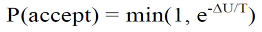

# Automated Negotiation

Contents
- Negotiation protocols
    - Bilateral
    - Multi-lateral
- Negotiation strategies
    - BOA framework
    - An overview of important strategies
- Analysis of Negotiation Dynamics
- Using the BOA framework

## 1. Automated Negotiation
Because negotiation is difficult for humans, intelligent software agents negotiate on behalf of their users.
- Evaluating bids
    - Reasoning on its user's preferences
- Employing a negotiation strategy
    - Which action the agent will take
    - How the agent will generate its offer
    - When the agent will accept the opponent's counter offer
- Communicating with other agents based on predefined rules (negotiation protocol)

### Normalisation
Evaluation functions need to be normalised in order to analyse negotiation strategies
- Pick the max value and map it to 1
- Map other items in proportion

To determine the normalised utility of a bid:
- Multiply the normalised evaluation of the issue wrt. the bid with the weight of that issue
- Get the sum of this for all issues

## 2. Negotiation Protocols
A negotiation protocol governs the interaction between negotiating parties by determining
- how the parties interact/exchange information
    - "who can say what and when they can say it"
- when the negotiation ends

Bilateral negotiation & Multiparty negotation

### Bilateral Negotiation
Alternating Offers Protocol
1. One of the agent initiates negotiation with an offer
2. The agent receiving an offer can
    - accept the offer
    - make a counteroffer
    - end negotiation
3. This process continues until having a consensus or reaching a termination condition such as a deadline

### Multiparty Negotiation
Mediated Single Text Negotiation Protocol
1. Mediator generates an offer and asks negotiating agents for their votes either to accept or to reject it
2. Negotiating agents send their votes for the current bid according to their acceptance strategy
3. If all negotiating agents vote "accept", the bid is labeled as the most recently accepted
4. Mediator modifies the most recently accepted bid by exchanging one value arbitrary and asks negotiating agents' votes again
5. It updates the most recently accepted bid accordingly
6. This process continues iteratively until reaching a predefined number of bids

- The role of the mediator is to propose new ideas that are acceptable to all
- These can be found as trusted mediator might know all profiles (partially)
- If the mediator does not know the profiles, then:
    - Mediated Hill-Climber Agent
    - Mediated Annealer Agent

#### Hill-Climber Agent
Accept a bid if its utility is higher than the utility of the most recently accepted bid

If the utility of initial bid is quite high for one of the agents, that agent may not accept other bids even though those bids might be better for the majority

#### Annealer Agent
Calculates the probability of acceptance for the current bid:

where:
- U: utility
- T: virtual temperature (gradually declines over time)

When the utility difference is small and the virtual temperature is high, ther is a higher chance of getting accepted

This agent tends to accept individually worse bids earlier so the agents find win-win bids later

## 3. Negotiation Strategies
Determines:
- which action the agent will take
- how the agent will generate its offers
- how the agent decide whether the opponent's counteroffer is acceptable

### 3.1. Bidding Strategies
### Random Walker
Generates an offer randomly as follows:
1. Selects values of issues randomly
2. Proposes only those bids whose own utility greater than its reservation utility (RU = 0.6)

### Time-Dependent Concession Strategy
Each agent has a deadline and the agent's behaviour changes with respect to time

An offer which is not acceptable at the beginning, may become acceptable over time

A function determines how much the agent will concede
- Remaining negotiation time
- Parameter related to concession speed (β)
    - Conceder Tactic:
        - β > 1 concedes fast and goes to its reservation value quickly
    - Boulware Tactic:
        - β < 1 hardly concedes until the deadline

### Trade-Off Strategy
Not only considers its own utility but also takes its opponent's utility into account
- The importance of the issues may be different for the negotiating agents
- The agent may demand more on some issues while concdes on other issues without changing its overall utility as if possible

Implementation
- Select a subset of bids havin the same utility with its previous offer
    - If not possible, it makes minimal concession such as 0.05
- Among those bids, choose the bids which miht be more preferred by its opponent
    - Heuristic: the most similar one to opponent's last bid

### Behaviour Dependent Strategies
The agent imitates its opponent's behaviour

The degree of imitation may vary
- Absolute Tit-For-Tat:
    - If the opponent increases the price by n, then the aent will decrease the price by n
- Relative (proportionally) Tit-For-Tat:
    - Taking into account the changes of its opponent's behaviour in a number of previous steps
- Averaged Tit-For-Tat
    - Taking into account the average changes within a window of size of its opponent history

### 3.2. Opponent Modelling Strateies
Why?
- Exploit the opponent
- Maximising chance of reaching an agreement
- Increase the efficiency of a negotiated areement
- Avoid unfortunate moves (which is worse for both agents)
- Make trade-offs and maximise social welfare
- Reach agreements early

What?
- Learning which issues are important for the opponent
    - Issue weights
- Learning opponent's preferences
    - Evaluation on issue values
    - Preference ordering of issue values
- Learning about opponent's strategy
    - Predicting the utility of its next offer
- Learning what kind of offers are not acceptable
    - Reservation value
    - Constraints

### 3.3. Acceptance Conditions
> Why and when should we accept?

Accepting too early may result in suboptimal agreements, but accepting to late may result in a breakoff

We have to find a balance:
- Total average utility = Agreement percentage x Average utility of agreements

### AC_const(α)
Accept when the opponent's bid is better than α

### AC_next
Accept when the opponent's bid is better than our upcoming bid

### AC_time(T)
Accept when time T ε [0,1] has passed

### AC_combi(T,α)
Combining acceptance conditions

Example:
AC_combi(T,α) = AC_next ∨ AC_time(T) ∧ AC_const(α)
- AC_combi(T,α) splits the negotiation time into two phases: [0,T) and [T,1]

We can also choose non-constant values for α such as average utility so far (AVG), or maximum utilty (MAX)

### Conclusion
- AC_next is often used, but does not always give the best results
- AC_const(α) performs worst of all AC's, as a good value for α is highly domain-dependent
- AC_time(T) always reaches an agreement, but of relatively low utility
- We need combinations of different approaches

## 4. Analysis of Negotiation Dynamics
What kind of bids to make: Process analysis
- Step analysis
- Dynamic properties

What kind of bids to accept: Outcome analysis
- Nash product
- Kalai-Smorodinsky
- Pareto-optimal

### Step Analysis
Utility, negotiation steps, and traces

Classification of negotiation steps

- Concession step: ΔS(s) < 0, ΔO(s) ≥ 0
- Unfortunate step: ΔS(s) ≤ 0, ΔO(s) < 0
- Fortunate step: ΔS(s) > 0, ΔO(s) > 0
- Selfish step: ΔS(s) > 0, ΔO(s) ≤ 0
- Silent step: ΔS(s) = 0, ΔO(s) = 0
- Nice step: ΔS(s) = 0, ΔO(s) > 0

### Outcome Analysis
