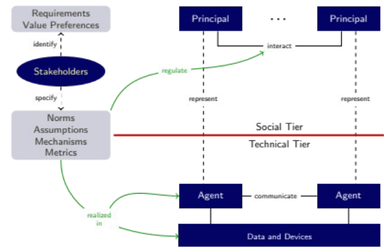

# Introduction

---

## 1. What is Collaborative AI?
### AI
- AI is the study and design of **intelligent agents**
  - Intelligent agents:
    - Have own thread of control, continually executing
    - Are autonomous
    - Exhibit proactive, reactive, and social behaviour
    - Can be physical or virtual, embodied or software-only

### Centralised AI Systems vs. Collaborative AI Systems
- Centralised AI System = Single-Agent System
  - One autonomous agent (control) 
  - This includes AI systems that have distributed computation but centralised (shared) control
- Collaborative AI System = Multi-Agent System
  - Decentralised computation AND control
  - CAI is the study of **SocioTechnical** system
    - 

## 2. Why Collaborative AI?
- No single agent has all information of capabilities for solving a problem
  - Data is decentralised 
  - Computation is decentralised (and asynchronous)
- There is no system for global control
- Humans are the central part of the system
- Hybrid (Human-AI) intelligence is the future of AI
  - Humans assisting machines
    - Training, explaining, sustaining
  - Machines assisting humans
    - Ampllifying, interacting, embodying

## 3. Course Learning Objectives
After completing this course, you should be able to:
- Compare centralised and collaborative AI paradigms;
- Apply co-active design to solve a collaborative AI problem;
- Describe the conceptual underpinnings of agent coordination mechanisms;
- Describe the conceptual underpinnings of agent interaction protocols;
- Describe the principles of automated negotation, facilitating cooperation;
- Create an automated negotiating agent in the GeniousWeb platform