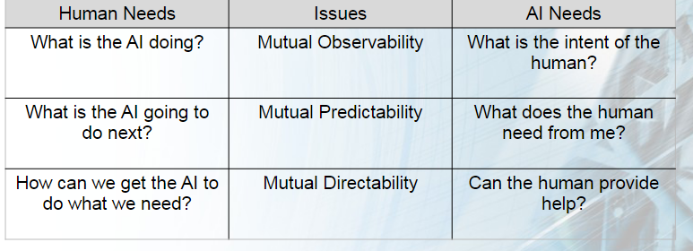
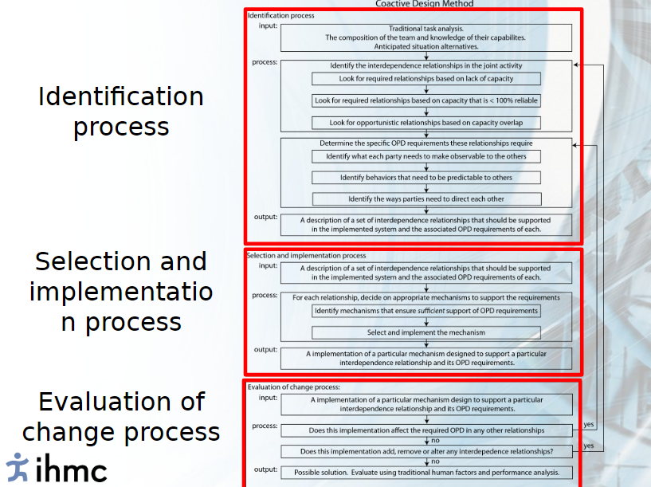
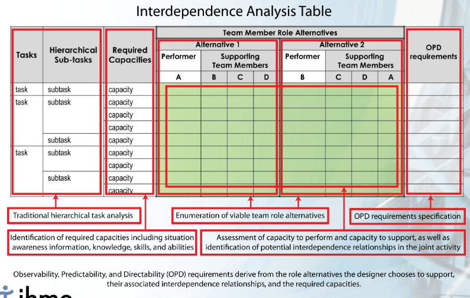

# Coactive Design

---

L.O
- Shakeup your views on autonomy
- Presenting the coactive design method (designing for interdependence) to enable autonomy to reach its potential.

## 1. Autonomy
Autonomous systems are NOT autonomous
- Autonomous systems require interdependency with humans to reach practical goals
  - UAV's (unmanned aerial vehicle)
  - Robot arms in production lines
  - Unmanned spaceships

Points about autonomy
- Autonomy != replacement
- It is not just about task allocation but also about system integration
- The goal should not be working independently but interdependently
- Interdependence has important implications that permeate all design elements (including algorithms and interfaces)

## 2. Interdependence
> Interdependence describes the set of *complementary relationships* that
> two or more parties rely on to manage required or opportunisitic dependencies in joint activity

Interdependence is not limited to compensating for some missing ability or hard constraints,  
but also involves normal supportive behaviour associated with teamwork or soft constraints

## 3. Coactive design
> Coactive design is about designing human-AI systems that support interdependence.  
> Designing for interdependence enables autonomy to reach its potential.

- Supporting interdependence
- 

- Coactive design method
- 

## Interdependence analysis (IA)

