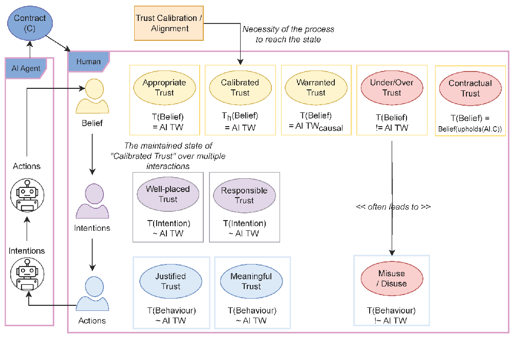
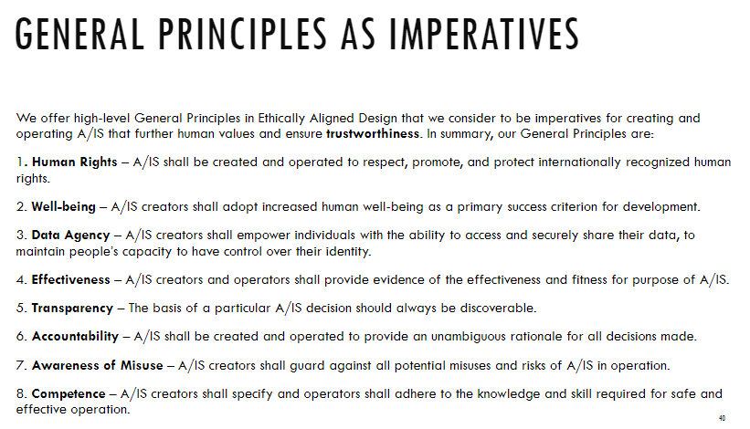
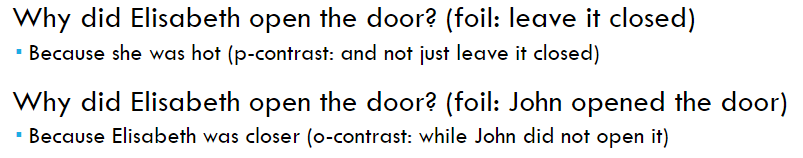

# Trust (Part 1)

Contents
- Trust
- Trust as a contract
- Warranted & Appropriate trust
- Dimensions of trust
    - ABI Model
- Evaluating trust
    - Behaviour
    - Questionnaires
- Trustworthy AI
- XAI
    - Explanations
        - Processes
        - Causality
        - Counterfactuals
        - Selecting explanations

L.O.
- What is trust, and why is it relevant for this course
- Identify dimensions of trust
- Understand how we can evaluate trust
- Know what trustworthy AI is
- Understand the basic principles of explainability

 

- This lecture: trust concepts - how can we understand trust?
- Next lecture: trust modelling - how can we make an artificial agent understand trust?

## 1. Trust
> If A believes that B will act in A's best interest, and accepts vulnerability to B's actions, then A trusts B

### When do we need trust?
You need trust any time you rely on someone, and there is a risk (vulnerability) to doing so

Trust can be seen as a **contract**: it is specific about what actions we anticipate and when

## 2. Appropriate trust
Trustworthiness

Appropriate trust
- Trust is appropriate given trustworthiness

### Trust calibration
- The process of calibrating trust to match trustworthiness
- If successful: leading to appropriate trust

Warranted/Unwarranted trust
- Unwarranted trust/distrust
    - Trust is not caused by actual trustworthiness
    - Can lead to inappropriate trust:
        - distrust in a trustworthy system
        - trust in an untrustworthy system
- Warranted trust/distrust
    - Trust is caused by actual trustworthiness
    - Expected to lead to appropriate trust:
        - trust in a trustworthy system
        - distrust in an untrustworthy system

Under/Over trust & Misuse/Disuse
- Inappropriate trust - overturst = Misuse (overreliance)
    - Monitoring failures
    - Commission errors
    - Reduced situation awareness

- Inappropriate distrust - undertrust = Disuse
    - Missed signals
    - Missed opportunity

## 3. Dimensions of Trust
ABI model
- Ability
    - is the trustee capable to meet the requirement?
- Benevolence
    - does the trustee want to do good to the trustor?
- Integrity
    - is the trustee honest, fair, principled, etc?

## 4. Evaluating Trust
Can use questionaires on trust to evaluate trust in multiple dimensions

Trustworthy AI

## 5. Explanable AI
One of explanainable AI (XAI)'s main objective is to promote trust, becuase:
- we need appropriate trust in human-AI systems
- for appropriate trust, we need to understand trustworthiness
- to understand trustworthiness, we need to understnad if AI systems will stick to the trust contract
- so we need to understand the AI

XAI agents should be able to reason about their own causal model

### Explanation process
Cognitive process
- Figure out the cause
- Get the information
- Product: explanation

Social process
- Transfer the information to the other
- Product: understanding

### Casuality & Counterfactuals
Regularity theory
- There is a cuase between event type A and event type B if:
    - events of type A are always followed by events of type B

Classical counterfactual model of causality
- Event type C causes an event type D if:
    - under the hypothetical case that C did not occur, D also wouldn't have occurred

Probabilistic theories:
- Event type E causes and event type F iff:
    - the occurence of an event type E increases the probability of F occurring

### Contrastive
The agent giving the explanation should understand the counterfactual case
- because agents are asked for explanations when unexpecteld or abnormality is detected, and the counterfactual case of these is the expected/normal

Four types of explanatory questions:
- Plain fact: why is A = P?
- P-contrast: why is A = P, not A = Q?
- O-contrast: why is A = P, when b = Q?
- T-contrast: why is A = P at time t, but A = Q at time t'?

 

- Examples
    - Why did you come to the lecture today? = plain fact
    - Why did you come to the lecture today, and not yesterday? = T-contrast
    - Why did you come to the lecture today, while your friend didn't? = O-contrast
    - Why did you come to the lecture today, rather than staying home? = P-contrast

### Fact & Foil
> Fact = what happened  
> Foil = the counterfactual case

### Selecting Explanation
- Causal chains
    - To give an explanation, one needs some causes for what needs to be explained
- Fact and foil
    - To select a cause, people look at the difference between fact and foil
- Intentional vs. unintentional
    - Causes will be traced through a more recent abnormal condition if there is a less recent intentional event
- Necessity & sufficiency
    - Necessary causes are preferred to sufficient causes
- Responsibility
    - An event considered more responsible for an outcome is likely to be judged as a better explanation than other causes