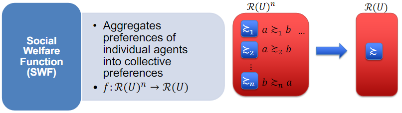
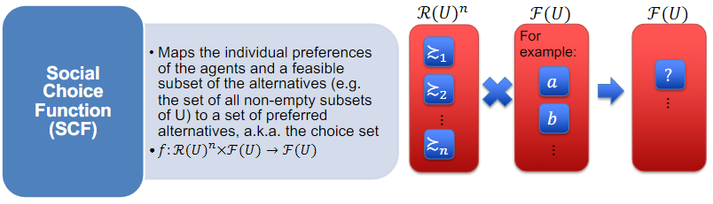
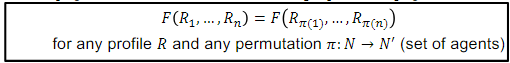
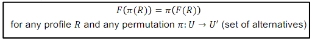
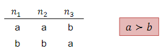
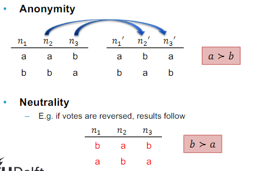
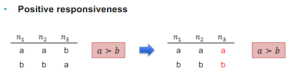
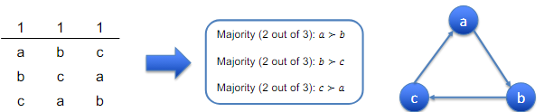
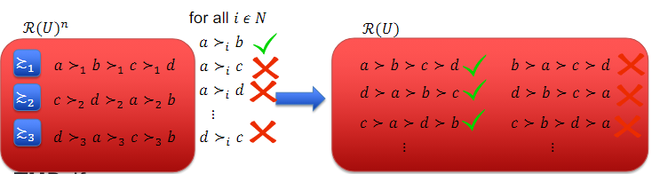

# Computational Social Choice 
Part 1: Introduction and Preference Aggregation

---

Contents:
- What is (computational) social choice theory?
- Preference aggregation
- Social Welfare Functions
- Axioms
- Arrow's theorem

## 1. Social Choice Theory
> Methods for aggregating the preferences of multiple agents

Easily put: deciding on an option when different people have different preferences

### Computational Social Choice
Adds an algorithmic perspective to the formal approach of social choice theory

Multiagent system as a "society" of agents
- Recommender systems
    - on the basis of choices made by other users in the past
- Metasearch engine
    - combines results of several internet search engines
- Collaborative large-scale peer grading
- Ethical decision making
    - Aggregate people's (moral) preferences

### Fundamentals
#### Cardinal vs Ordinal Utility
Cardinal utility: utility that can be expressed numerically

Ordinal utility: preference (A or B?)

How can we compare ordinal utility?

#### Expressing Preference Profiles
Consider a finite set N = {1, ..., n} of at least 2 agents (voters)

and a finite universe U = {a, ..., z} of at least 2 alternatives (candidates)

Each agent i has preferences over the alternatives in U, which are represented by a transitive and complete preference relation ≥i
- Transitivity
    - if a ≥i b and b ≥i c, then a ≥i c
- Completeness
    - requires any pair of alternatives a, b ε U to be comparable
- Antisymmetry (usually assumed)
    - if a ≥i b and b ≥i a, then a = b
    - if a ≥i b but not b ≥i a, then a >i b

A preference profile is denoted as R = (≥1, ..., ≥n)

## 2. Preference Aggregation
> Aggregation of several agents' preference rankings of two or more alternatives into a single, collective preference ranking (or choice) over these alternatives 
> Can be seen as a Social Welfare Function or a Social Choice Function

There are a variety of SWFs and SCFs.  However, they do not always work as they are expected to
 This is why we sometimes rely on **axioms**
- An axiom is a statement that is assumed to be true in order to help provide a foundation from which other statements can be proved

Not every SWF or SCF will satisfy every axiom.

In this lecture, we will consider axioms for SWFs, but similar axioms can be applied for SCFs

## 3. Axioms
### Anonymous SWF
> A SWF *F* is anonymous if agents are treated symmetrically

If alternative a wins with n1 and n2 for and n3 against, then a should also win with n2, n3 for and n1 against.

### Neutral SWF
> A SWF *F* is neutral if alternatives are treated symmetrically

If we swap alternatives a and b in a ballot, the outcome should be the same

### Positive Responsiveness
- If the group decision is indifferent or favourable to a,
- and if individual preferences remain the same except a single agent changes their ranking in favour of a,
- then the group decision should favour a

### May's Theorem
> For two alternatives and an odd number of agents, majority rule is the unique SWF that satisfies:
> - anonymity
> - neutrality
> - positive responsiveness

Majority rule:
- given two alternatives, a should be preferred over b, iff there are more agents who prefer a to b, than b to a
    - U = {a, b}
    - N = {n1, n2, n3}

For another example, consider a situation with more than two alternatives

The majority rule does not satisfy anonymity, neutrality, and positive responsiveness for |U| ≥ 3

These cyclic relations are called Condorcet paradox

### Pareto condition
An SWF satisfies the Pareto condition if, whenever all individuals rank a above b, then so does society

a >i b for all i ε N implies that a > b

### Independence of Irrelevant Alternative (IIA)
An SWF satisfies IIA if the social preferences between any pair of alternatives only depends on the individual preference profiles restricted to these two alternatives:
- If a is socially preferred to b, then this should not change when i changes its ranking of c
- Let R and R' be two preferences profile and a and b be two alternatives such that R|{a,b} = R'|{a,b}, i.e. the pairwise comparisons between a and b are identical in both profiles

Then, IIA requires that a and b are also ranked identically:
- ≥|{a,b} = ≥'|{a,b}

### Non-Dictatorial
An SWF is non-dictatorial if there is no agent who can dictate a strict ranking no matter which preferences the other agents have
- There is no agent i such that for all preference profiles R and all alternatives a, b: a >i b implies that a > b

### Why Do We Need Axioms?
With a formal definition of these desriable properties one can establish:
- Characteristic theorems
    - show that a particular (class of) mechanism(s) is the only one satisfying a given set of axioms
- Impossibility theorems
    - show that there exists no aggregation mechanism satisfying a given set of axioms

## 4. Arrow's Theorem
> There exists no SWF that simultaneously satisfies IIA, Pareto optimality, and non-dictatorship whenever |U| ≥ 3

