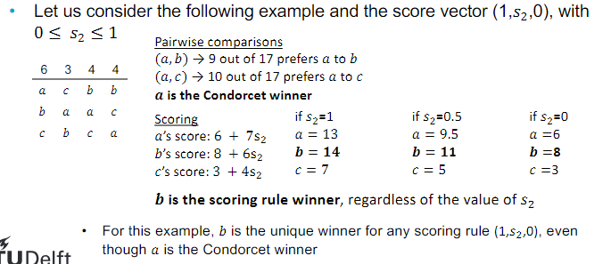

# Computational Social Choice 
Part 2: voting methods

---

Recap
- Preference aggregation
    - SWF: f:R(U)^n -> R(U)
    - SCF: f:R(U)^n x F(U) -> F(U)
- Axioms
    - Anonymity, Neutrality, Positive responsiveness
    - Pareto condition, IIA, Non-dictatorial
- Arrows theorem:
    - There exists no SWF that simultaneously satisfies IIA, Pareto optimality, and non-dictatorship whenever |U| ≥ 3

Contents
- Voting rules
- Scoring rules
- Condorcet extensions
- Strategic manipulation

## 1. Voting Rules
A voting rule is a function f:R(U)^n -> F(U), and also a SCF

Voting rules require following properties:
- Resoluteness
    - they should always yield a unique winner
- Anonymity
    - symmetry w.r.t. agents
- Neutrality
    - symmetry w.r.t. alternatives

However, even these simple properties can often not be satisfied
- example: two agents and two alternatives

### Plurality Rule
Only considers how often each alternative is ranked in the first place

## 2. Scoring Rules
A common objection to rules such as plurality rule is that voters that didn't come first are treated equally, even if they come second for example.

Under a scoring rule, each time an alternative is ranked i-th by some voter, it gets a particular score s_i
- For a fixed number of alternatives m, we define a score vector s = {s1, ..., s_m} such that s1 ≥ ... ≥ s_m and s1 > s_m

### Plurality Rule
Plurality rule can also be defined as a scoring rule.

Score vector = (1, 0, ..., 0)

### Anti-plurality Rule
a.k.a veto rule

Chooses alternatives that are least-preferred by the lowest number of votes

Score vector = (1, ..., 1, 0)
- or sometimes (0, ..., 0, -1)

### Borda's rule
Alternative a gets k points from voter i, if i prefers a to k other alternatives

Chooses alternatives with the highest average rank in individual rankings

Score vector = (|U|-1, |U|-2, ..., 0)

## 3. Condorcet extensions
Scoring rules have been criticised for failing to select the Condorcet winner for some preference profiles
- Condorcet winner is an alternative that beats every other alternatives in pairwise majority comparisons
- Some preference profiles do not admit a Condorcet winner (Condorcet paradox from last lecture)

Condorcet extensions are rules that try to satisfy Condorcet's criterion
- These rules will elect the Condorcet winner if there is one
- They might also elect a winner when there is no Condorcet winner (different Condorcet extensions may elect different winners in the case of a cycle)
- Condorcet extensions differ on which other properties they satisfy

### Copeland's Rule
An alternative gets a point for every pairwise majority win, and some fixed number of points between 0 and 1 for every pairwise tie

The winners are alternatives with the greatest number of points

### Maximin
a.k.a Simpson-Kramer method

Considers the magnitude of pairwise election results (by how many voters one alternative was preferred to the other)
- Evaluate every alternative by its worst pairwise defeat by another alternative

The winners are those who lose by the lowest margin in their worst pairwise defeats
- If there are alternatives with no pairwise defeats, they win

### Nanson's rule
Series of Borda elections with two variants:
- Schwartz variant
    - For each Borda election, exclude the alternatives which have less than the average Borda score
    - Repeat this process until all alternatives have identical Borda score
    - The last remaining are winners

- Fishburn variant

## 4. Other rules
There are many other rules that are neither scoring rules, nor Condorcet extensions

### Single Transferable Vote (STV)
Looks for alternatives that are ranked in first place the least often, removes them from all voter's ballot, and repeats

The alternatives removed in the last round win

## 5. Strategic Manipulation
So far, we assumed that the true preferences of all agents are known

However, we only have access to their reported preferences and agents might misrepresent their preferences to exploit the voting rules

### The Gibbard-Satterthwaite Impossibility Theorem
> Every non-imposing, strategyproof, resolute voting rule is dictatorial when |U| ≥ 3

- Non-imposing: for every alterntaive, there exist a preference profile that would make that alternative win
- Strategyproof: it is not maipulable
