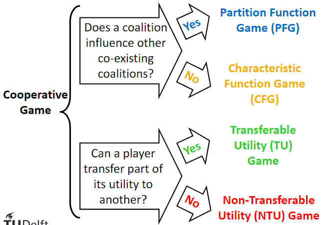
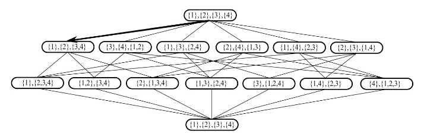
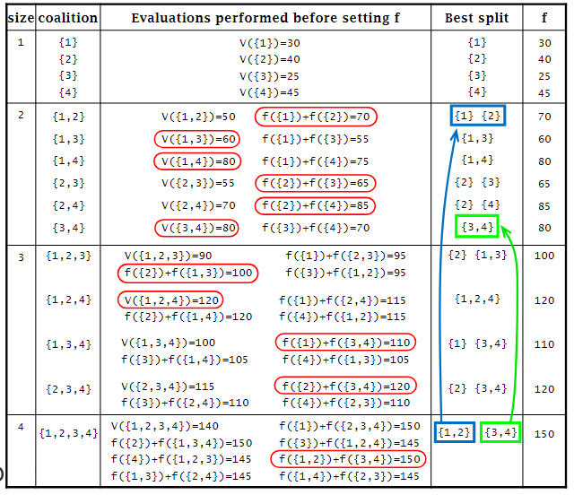
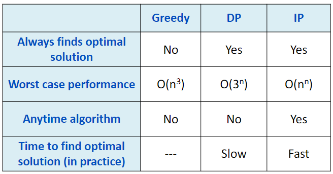

# Computational Coalition Formation

Collaborative AI: L.O.
- Compare centralised and collaborative AI paradigms
- Describe the principles of negotiation for agent cooperation
    - Describe the conceptual underpinnings of agent interaction protocols
    - Create an automated negotiating agent in the Genius Web platform
- Describe the conceptual underpinnings of agent coordination
    - Trust, computational social choice, and coalition formation
- Apply co-active design for a collaborative AI problem

Today's L.O.
- Describe the compuatational coalition formation problems and its subproblems
- Solve the coalition structure generation problem using:
    - A greedy algorithm
    - A dynamic programming algorithm (DP/IDP)
    - An integer programming algorithm (IP)

## 1. Agent and Game Theory
### Agent
An agent:
- is an intelligent entity
- is situated in an environment
- can perceive the environment
- has goals
- has a list of available actions
- acts autonomously to satisfy their goals
- **is social**

### Game Theory
> Game thoery studies interactions between agents in situations known as games

Non-cooperative games: players cannot make binding agreements

Cooperative games:
- binding agreements are possible
- agents can benefit by cooperating

## 2. Coalition
### Coalition Game Theory
> Coalition game theory is studied in a field of game theory, **called cooperative game theory**

In a cooperative game, agents benefit from cooperation (whether shelfish or working towards a common goal)

### Agent Coalitions
Main characteristics:
- Coalitions in general are goal-directed and short-lived
- No coordination among members of different coalitions
- The organisational structure within each coalition is flat

### Coalition Formation Games

CFG and TU are the focus of this lecture

#### Transferable Utility Games
A transferable utility game is a pair (A, v), where:
- A = {a1, ..., an} is the set of players (or agents)
- v: 2^A -> R is the characteristic function
    - for each C ⊆ A, v(C) is the value of C
    - value = the payoff that members of C can attain by working together
- Usually, it is assumed that
    - v(Ø) = 0
    - v(C) ≥ 0 for any C ⊆ A
    - v(C) ≤ v(D) for any C, D such that C ⊆ D

The biggest possible coalition (the one containing all agents) is called the *grand coalition*

Outcome
- An outcome of a TU game G = (A, v) is a pair (CS, x_) where:
    - CS = (C1, ..., Ck) is a coalition structure, i.e., a partition of A into coalitions:
        - C1 U ... U Ck = A
        - Ci ∩ Cj = Ø for i != j
    - x_ = (x1, ..., xn) is a payoff vector, which specifies the payoff of each agent:
        - xi ≥ 0 for all ai ε A
        - Σ_(i: ai ε C) xi = v(C) for all C ε CS

## 3. Coalition Structure Generation
1. Identify the set of agents
2. Identify the list of possible coalitions
3. Identify the list of coalition structures
4. Identify the coalition structure in which the sum of values is maximised

Complexity is O(n^n)

Coalition Structure Generation Algorithms (CSG)
- Greedy algorithm
- Dynamic programming algorithm (DP/IDP)
- Integer partitioning algorithm (IP)

### Greedy Algorithms for CSG
Explore the CS graph greedily

Top-down approach starting from single-agent coalition structure in the CS graph

1. At each level in the graph, find the **gain** by merging two coalitions
    - Gain(Ci, Cj) = v(Ci U Cj) - v(Ci) - v(Cj)
2. Stop when there is no more gain in merging

Evaluation:
- Pros:
    - Efficient: O(n^3)
- Cons:
    - Does not guarantee optimal solution

### Dynamic Programming Algorithm
To find the optimal partition of a set of agents, it is sufficient to:
- Try the possible ways to split the set into two sets, and
- For every half, find the optimal partition of that half

Evaluation:
- Pros:
    - Guarateed to find an optimal 
    solution
- Cons:
    - Efficiency: O(3^n)
        - DP is better than brute-force but worse than greedy algorithm

### Integer Partitioning Algorithm

Evaluation:
- Pros:
    - Guaranteed to find an optimal solution
    - Anytime algorithm
    - Works fast in practice
- Cons:
    - Efficiency: O(n^n)
    - In the worst case, IP may have to search the entire space

