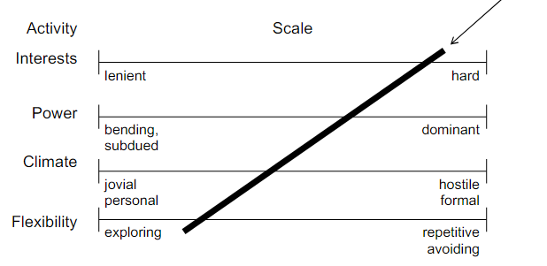
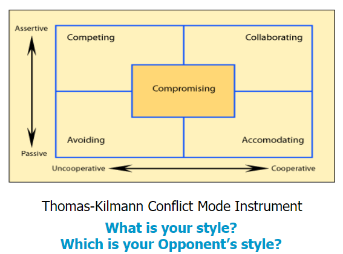
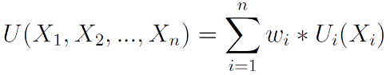
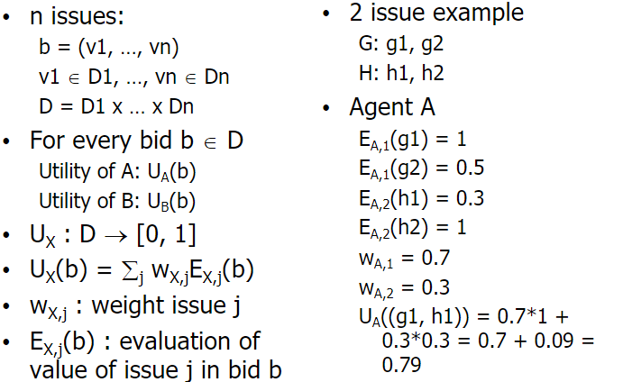
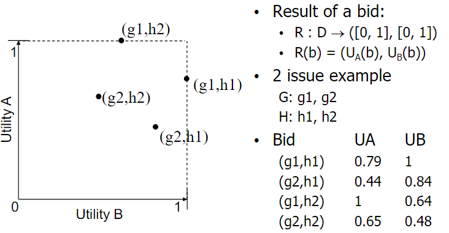

# Negotiation

Contents
- Why negotiate?
- What kinds of negotiations exist?
- Guidelines for negotations
- Phases of negotiation
- Negotation analysis

## 0. Definitions
- Party/Stakeholder
    - someone that has a stake in the outcome of the negotiation
- Mediator 
    - someone that has no stake in the outcome of the negotation
    - guards the negotiation process and aims for a fair outcome for all parties
- Issue
    - something that the parties need to agree on for a successful negotation
- Open, closed, or in between
    - Open: all parties provide full insight in their preferences and interests
    - Closed: only bids are exchanged

 

- Position
    - the first demand of a party
    - often vocal and self-centered
- Interest
    - the deeper motivations underlying a party's position
- Preference profile
    - the preferences an agent has regarding the possible outcomes of the negotiation
    - Refers to the importance of issues, but also to the values per issue
    - Can be qualitative or quantitative
- Bid
    - for a set of issues of the negotiation attach a proposed value
    - Partial bid: not all issues are assigned a value
    - Complete bid: all issues are assigned a value
- Utility function 
    - a quantitative representation of a preference profile
    - maps bids to utility values (often [0, 1])
    - typically only defined for complete bids
- Reservation value
    - utility value below which bids are unacceptable (lowest margin)
- BATNA
    - Best Alternative To No Agreement
    - If the negotiation fails, this is what the party falls back on
    - The better the BATNA, the higher the party can set their reservation value
    - The better the BATNA, the more relaxed the party will be and the eaisier they will be creative

## 1. Why Negotiate?
Negotation can happen in both positive (collaborative) and negative (opposing) situations:
- Positive
    - Win-win opportunities
    - Long/Short term relations
- Negative
    - Power play (or war) will not lead to a solution
    - All parties need a solution
    - All parties need to at least pretend to be willing

## 2. Types of Negotations

### 2.1. Bilateral Negotation
> Negotiation between two parties

Example: a buyer and a seller negotating for a price

### 2.2. Multiple Bilateral Negotation
> One party has many different negotiating parties

The negotation with one party may have an influence on the negotiation with another party

Example: one service consumer and many service providers

### 2.3. Multilateral Negotation
> Negotation among more than two parties

All parties mutually agree on the final decision

Example: three friends agree on a holiday destination

## 3. Principles for Good Negotiations
Positional Bargaining
- Holding a fixed position of what you want regardless of any underlying interest

1. Build trust through mutual understanding and meaningful communication
    - Ensure that all parties are identified and represented
    - Develop understanding through active listening
    - Understand the different perceptions
2. Focus on revealing underlying interests rather than positions
    - Adopt consensual negotiation style, not a positional
    - Identify peoples underlying concerns, fears, motivations, values etc
    - Create room to explore a wide range of options
3. Widen the options for finding a solution
    - Use creativity to engage in joint problem solving
    - Apply brainstorming techniques
    - Assess the uncertainty and risks arising from the proposed solution
4. Reach agreement that satisfies interests and adds value for all parties

## 4. Phases of Negotation
1. Private preparation
    - Domain modelling
    - User modelling
    - Opponent modelling
    - Alternatives
2. Joint exploration
    - Domain modelling
    - User preferences
    - Opponent modelling
    - Relationships
3. Bidding
    - Strategy determination
    - Bid evaluation
    - Next bid determination
    - Bidding analysis
4. Closing
    - Contract
    - Relationships
    - Reflection

## 5. Styles of Negotiaton
### 5.1. Being Open or Closed
- Being open
    - sharing all information
    - outcome can be checked for fairness
    - danger of exploitation by other party
- Not being open
    - not sharing any information
    - outcome cannot be judged for fairness
    - cannot reach win-win outcome

Share information if other reciprocates

### 5.2. Negotiation Styles

What is your style? 
Which style does your opponent adopt?

### 5.3. Conflict Handling Styles

## 6. Analysis of Negotiation Results
Rate a bid
- Balance between what you give and take
- Utility: grade between 0 and 1

### Utility
Determine the value of a bid

Utility is like a grade, determined as a weighted sum of the evaluation vallues of each issue

### Result Space

### Definitions

- Pareto Optimal Frontier
    - The set of bids, such that there is no other bid that is better for at least one party, without making things worse for the other parties

- Nash Product
    - The bid(s) that maximises the product of utilities of the parties, under the assumption that all utility values are positive (if not, utility values have to be transposed to positive values)

- Equal Proportion of Potential Line (EPP)
    - The line from (0,0) to (1,1)

- Kalai-Smorodinsky
    - Maximises the minimum of the utilities of the parties
    - To be found at the intersection of POF and EPP, i.e., the bid(s) closest to that intersection