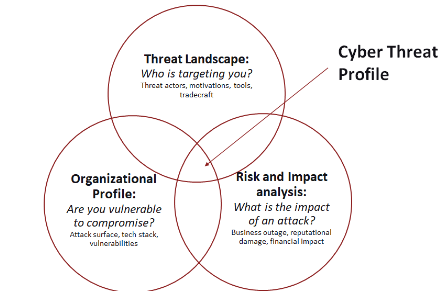
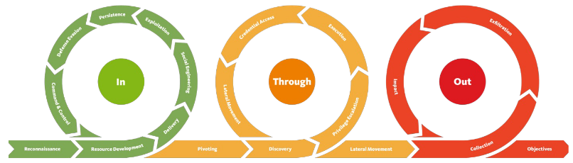

# Introduction to Computer Security

---

## 1. Security and Computer security
What is security?
- Security is the degree of resistance to, or protection from, harm.
- It applies to any vulnerable and valuable asset, such as a person, dwelling, community, nation, or organisation.

What is computer security?
- Computer security deals with protecting data, programs, and system against intelligent adversaries.
- We become increasingly interconnected, and digitalisation is increasing, making the consequences of security failures catastrophic.
- Safety vs Security:
  - Safety means being secure against unintended threats.
  - Security is the protection against deliberate threats.

Why is security hard?
- Security is hard to test for
- Building secure applications requires deep understanding of all technologies involved in the design and implementation of the system.
  - On vulnerability can cripple the system.
  - Not all dependencies are known.
- It is not all technical, users play a role too.
- There is asymmetry between attackers and defenders.

## 2. Security Principles: CIA triad
Availability / Integrity / Confidentiality

Three essential goals in Cybersecurity

### Confidentiality
> Data should not be accessed by unauthorised persons

Tools for Confidentiality
- Encryption
  - Ensure that data cannot be read when someone gets their hands on it
- Access control systems
  - Make it hard to get the data when the user is unauthorised
- Policies and governance
  - Mandate secure data practices

### Integrity
> Users should be able to trust (verify) that the data is correct

Tools for Integrity
- Data validation
  - Validate data at various stages to ensure that it is still intact
  - Tools include Checksums, Digital signatures, Error detection and correction codes
- Change management and version control
  - Control and document changes to data to ensure transparency and accountability

### Availability
> Systems must be available to users

Tools for Availability
- Redundancy and failover
  - Design system with backup mechanisms to mitigate single points of failure
- Load balancing
  - Distribute traffic across various resources
- Monitoring and alerting
  - Monitor for early signs of problems to identify system failures before they become a large issue

## Computer security threat
### Threat
What is threat?
- Potential violations of security posed by attackers
- When evaluating the security of a program or website, it's essential to consider the context: who is the attacker and what are you defending against?

Context is crucial
- Computer security is context-dependent and revolves around a specific attacker or threat model
- There is no universal solution that can defend against all types of threats

Attackers have different profiles and motives
- You need to consider the context (who is the potential attacker and what are you defending against)

Principles to defend against computer security threat
- No One-Size-Fits-All
  - Security measures should be tailored to specific threats and scenarios
- Continuous Evaluation
  - Regularly assess and update security measures
- Layered Defense
  - Implement a multi-layered security apporach to address different levels of threats

### Threat model
- Serves as a strategic framework that identifies potential attacks and adversaries a system aims to safeguard against
- Threat model help in understanding and preparing for various security risks
- 

### Security by design principles
Coordinated Vulnerability Disclosure (CVD)
- The person who discovers a vulnerability reports them to the affected organisation

Bug bounty program
- Organisations offer rewards to ethical hackers for responsibly discovering and reporting security vulnerabilities

Patch adoption
- Organisations need time to patch their systems
- This takes very long or is not done at all
- Because batching is slow, there is a window where organisations are vulnerable even after exploits are readily available.

Eggshell defense
- Eggshell = Cybersecurity infrastructure (Firewalls, Honeypots, Network, and App Security)
- Egg white = Personel, endpoints, IP, stored data
- Egg yolk = Access credentials
- Attackers only have to succeed once, defenders have to succeed every time

Cyber Kill Chain
- Attackers only have to be detected once
- Paradigm shift in cybersecurity, balancing the playing field

Pyramid of Pain

Mitre Att&ck framework

Unified Kill Chain
- Attackers have various phases in their attacks, and these phases have phases too
- 
- If we can detect them accordingly in the right phase, we can throw them out

Security by Design
- An approach that integrates cybersecurity measures into the design and development processes
  - Identifying and addressing security risks early makes a more secure product
  - Integrating security earlier is more cost-effective
  - Regulatory requirements help identifying the security risks in early stage

Defense in Depth
- A cybersecurity strategy that involves deploying multiple layers of security controls

Usable security
- An approach that seeks to integrate effective cybersecurity measures while maintaining a user0friendly experience
- Best security measures != Usable for people (this can create even more security risks)

Ethics of cybersecurity
- Do not break stuff
- Report vulnerabilities
- Be aware of rules and regulations
