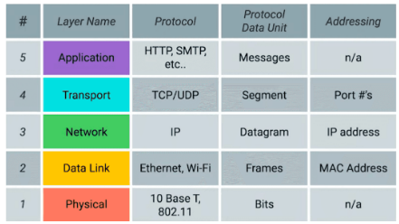

# Network Security Physical Layer

---
In this lecture:
- Introduction to Network Security
- The Physical Layer
  - Guided and unguided media

L.O:
- Understand what network security means and its importance in securing an organisation
- Understand physical layer threats
- Be able to reason about security measures for the physical layer

## Introduction

### Network Security
> Network security is the protection of the underlying network infrastructure from unauthorised access, misuse, or theft. 
> It involves creating a secure infrastructure for devices, users, and applications to work in a secure manner.

Network
- A network consists of two or more computers that are linked to share resources, exchange files, or allow electronic communications.
- The computers on a network may be linked through cables, telephone lines, radio waves, satellites, or IR light beams.

The OSI model
- The OSI (Open Systems Interconnection) Model is a conceptual framework that standardises the functions of a telecommunication or computing system in to seven abstract layers.
- Simplified OSI model:
  - 

## Physical Layer
> Physical security is the first line of defense against unauthorised access, environmental hazards, and theft
> Without adequate physical security, even the most robust cybersecurity measures can be compromised.

### Physical layer threats
- Unauthorised access to the datacentre (C, I, A)
  - Use portable medium such as a USB
- Devices can be stolen or modified (C, I, A)
- Cables can be tapped or cut (C, A)
  - Wiretaps (attaching external cables on phone lines or ethernet cables for eavesdropping purposes)
  - Fiber tap (extracting signal from an optical fiber without breaking the connection, allows diverting signals being transmitted)
    - Detecting taps
      - Physical inspection
      - Signal strength analysis
      - Cable testing
  - Electromagnetic Interference (EMI) (other equipment emitting electromagnetic interference can negatively impact the performance of network cables)
  - Rodent of Pest Damage

### Guided vs Unguided media
- Guided meduim
  - A communication channel where the signals are guided along a physical path
    - Copper cables, fiber cables, etc
    - Physical access is needed to tamper with the data on the cable
- Unguided meduim
  - A communication channel where the signals propagate freely through the air or space
    - Radio waves
    - IR waves

Access control on unguided media is hard

Signal security
- Spread signals over multiple frequencies to counter jamming
- Frequency hopping aims to change frequencies very fast in a pattern that is unknown to an attacker
- Authenticating and encrypting data sent over wireless signals can ensure integrity and confidentiality