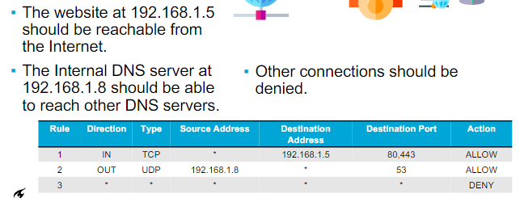
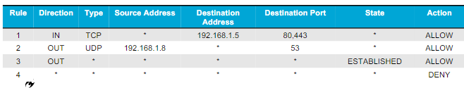
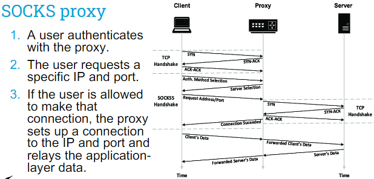
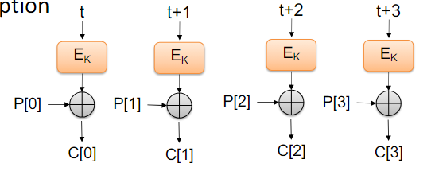
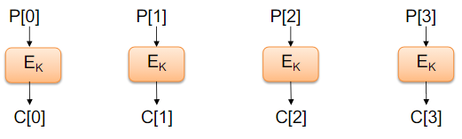

# IDS Firewall

---

Contents
- Firewalls
- Internet scanning
- Intrusion detection

L.O.
- Understand the difference between a firewall and intrusion detection system
- Understand how a solid network topology can help in security
- Know what different measurement locations in the network provide which information to a security team

## 1. Firewall
> A firewall is a network security system that monitors and controls incoming and outgoing network traffic
> based on predetermined security rules. 
> A firewall typically establishes a barrier between a trusted network and an untrusted network, such as the Internet.

### Firewall
- Divides the untrusted outside of a network from a more trusted interior of a network
- Often, they run on dedicated devices

### The importance of firewalls
- It prevents (vulnerable) services to be accessed from outside the network
- It segments networks 
- It reduces the attack surface

### Firewall rules
- These rules allow/deny connections in the network
- A firewall compares network traffic to a set of rules
- To match the rules to the traffic, it must process several packet layers to obtain the needed data
- 

### Types of firewalls
- Firewalls can be implemented in software or hardware:
  - Software - slower, but easier to deploy on single machines
  - Hardware - faster, can be safer, but expensive
- Firewalls can differ in the amount of network layers they process:
  - Packet size (data link layer)
  - MAC filtering (data link layer) 
  - IP filtering (IP layer) 
  - Port filtering (transport layer)
  - Deep packet (application layer)

### Types of firewalls
- Packet filtering firewall
- Stateful inspection firewall
- Application-level gateway
- Circuit-level gateway

#### Packet filtering firewall
- The simplest type
- Compares packet header information to a set of rules
- Very fast - a minimal amount of processing is required

 

- Many rules are needed, making the firewall hard to maintain and prone to human error
- Allows access to services based on network data, does not allow for the blocking of specific application commands

#### Stateful inspection firewall
- Maintains state between packets, allowing for more complex rules
- Similar to packet filtering but remembers past events, allowing for rules that allow traffic from outsie if the connection was started from inside the network
- 

 

- Can be used to keep track of TCP sequence numbers and block connections that are acting suspicious
- Some stateful firewalls can inpect a limited amount of application-layer data for well-known protocols

 

- Keeping state is more expensive that simply packet filtering

#### Application-level gateway
- Also called application proxy
- Relays application layer data between user and application
- Can be used to block specific features of an application that you do not want to be used

 

- Requires a lot of processing and does not scale well as it needs to be able to parse the application context

#### Circuit-level gateway
- Also called circuit-level proxy
- Relays application layer data between user and application
- Does not parse the application layer contents, but determines which connections are allowed
- An example of such a firewall is a SOCKS proxy
  - 

## 2. Internet Scanning
### Internet-wide scanning
- Tools such as ZMap can be used to scan the entire Internet very quickly
- Search engines such as Censys and Shodan provide databases of running services on the Internet

Internet-wide scanning detection
- People are scanning the entire Internet, so every IP address will see these scanning packets
- By looking at network traffic we can identify unsolicited packets. If we monitor on many IP addresses, we get a good overview of who is scanning the Internet

### De-Militarised Zone (DMZ)
- A DMZ is common in network architectures to allow some services to be reached from the Internet
- The Internal network is separated from the DMZ using a second firewall, which can be used for more stringent filtering

### Virtual Private Network (VPN)
- Accessing a (corporate) network from the outside is dangerous and therefore (usually) firewalled
- Sometimes it is required to link multiple facility networks over the Internet or provide employees with a way to work from multiple places securely
- A VPN can be used to encrypt data on lower layers to create a "transparent" tunnel that allows users to connect securely to a LAN network over the Internet

 

- IPSec is a protocol that adds an extra part to the Network layer, allowing to connect through a firewall onto a network

## 3. Intrusion Detection
### Intrusion detection
- Imagine someone breaks through our firewall
- Firewalls aim to prevent attacks by reducing attack surface, but do not often detect attacks
- You cannot block all traffic in a firewall

 

- This is why we need intrusion detection
- Attacks have multiple stages, all allowing for detection

### Intrusion detection system (IDS)
> An intrusion detection system is a device or software application that monitors a network or systems for malicious activity or policy violations

### Types of IDS
An IDS can be either:
- Host-based (HIDS)
  - monitors events on a host, such as system logs
- Network-based (NIDS)
  - monitors network data and can use deep-packet inspection to identify malicios activity

IDS can have different types
- Heuristic
  - matches data to pre-defined rules
- Signature
  - matches data to known indicators (e.g. flagged IP addresses)
- Anomaly
  - determines what is "normal data" and identifies data that deviates from the norm

#### Anomaly detection
- Starts by gathering base-line data to consider as "normal"
- Classifies data using a variety of approaches:
  - Statistical - using various mathematical models
  - Knowledge based - relying on expert knowledge to classify observed behaviour
  - Machine-learning - automatically determine whether the observed data matches the baseline

#### HIDS
- Monitors activity on a system
- A virus scanner is a type of HIDS

- Common data sources for a HIDS include:
  - System call traces
  - Log files
  - Integrity checksums
  - Registry access patterns

Distributed HIDS
- A distributed HIDS collects all data of various systems in the same place to create a more effective IDS
- This requires devices in the network to run programs that collect telemetry and forward it to a central location
- There can be privacy concerns when collecting information about the systems of employees

#### NIDS
- Monitors activity on a network
- Two types of sensors:
  - Inline
  - Passive
- The location of the sensor matters a lot

Sending traffic to a NIDS

### Honeypots
A honeypot is a decoy system that is designed to lure potential attackers away from critical systems

### Location of sensors in a network
Sensors can be placed in may parts of the network:
- Behind the border firewall or at the level of the border firewall
- In the DMZ
- In a specific part of the network, such as the network segment with employee devices

The traffic collected is different at every point, depending on the threat profile of the organisation
