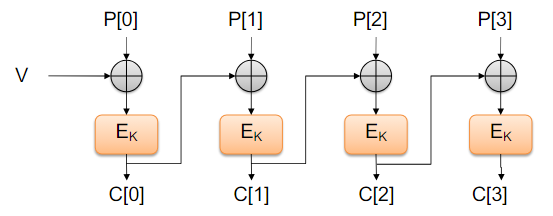

# Internet Security

Contents
- Internet Security and Protocols

L.O.
- Understand the importance of secure standards and protocols
- Be able to explain how SSL/TLS works
- Reason about data security in various standard protocols

## 1. Internet Security
### Internet Protocols
> Set of rules that governs the communication and exchange of data over the Internet

### Role of Secure Protocols and Standards
- Interoperability
    - ensuring systems can communicate securely and effectively
- Baseline security
    - standards establish a minimum level of security that is widely accepted
- Regulatory compliance
    - incorporate them in legal and regulatory framework

### SSL and TLS
> Secure Sockets Layer 
> Transport Layer Security

- Protocols for securing communication over the web
- Layers on top of TCP
- Gives S to HTTPS
- Can encrypt, secure, and authenticate

- HTTP
    - No verification of identity
    - All data is sent in plain-text
- HTTPS
    - Verifies that the IP address indeed belongs to the domain
    - Sets up end-to-end encryption between the client and server

- SSL and TLS relies on cryptographic certificates
    - Certificates are signed by trusted parties
    - Applications specify which Certificate Authority is trusted
    - If a root CA is compromised, the whole system is compromised

### DNSSEC
- DNSSEC does not encrypt DNS but protects the integrity of the DNS information
- DNSSEC creates a chain of trust to a root server

### Email
Email is formatted using the MIME standard

Three common protocols for sending and receiving email traffic:
- POP (Post Office Protocol)
    - One-way
    - Downloads emails from the server
- IMAP (Internet Message Access Protocol)
    - Two-way
    - Synchronises emails between client and server
- SMTP (Simple Mail Transfer Protocol)
    - Responsible for the transfer of emails between client and server

All email protocols are unencrypted by default
- Securing communication on the wire is done by adding SSL/TLS on top of the email protocol:
    - POPS
    - IMAPS
    - SMTPS
- TLS provides end to end encryption between different servers, not between sender and receiver

#### Email Spoofing
SMTP allows users to send mail with any source address
- Adversaries can send spam from any email addr
- Adversaries can forge email addresses to impersonate a trusted sender

Sender Policy Framework
- SPF allows domain owners to specify which servers are authorised to send mail using the domain

DomainKeys Identified Main (DKIM)
- SPF validates whether the sender is legitimate, but it cannot check if the content is authentic
- DKIM is designed to sign the email on a domain-level and distribute the key via DNS
- 
- If an email is modified in transit, we can find out

