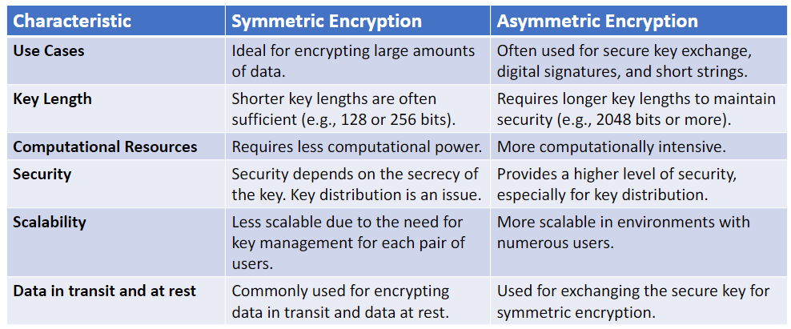
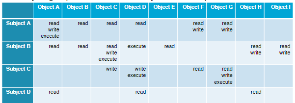
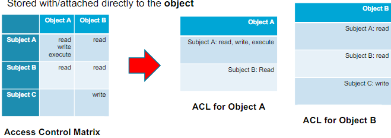
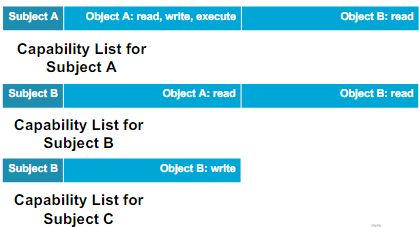
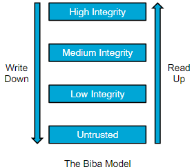

# OS-Level Security

L.O.
- Understand what is access control
- Be able to explain how OSs enforce access control
- Reason about pros/cons of different access control mechanisms and policies

## 1. Operating System

### What is an OS?
An OS provides a useful way to interface with the hardware

Hardware resources are accessed through abstractions provided by the OS
- CPU
- Memory
- Files/folders
- Windows
- Network
- Cursor

### OS-Level Security
An OS manages **resources**

The OS must **control access** to these resources

Every subject must be identified, authenticated, authorised, and approved before it can perform an **action** on an **object**(resource)

The **Orange Book** lists requirements and evaluation criteria for secure computer systems

Superseded by **Common Criteria**

Access control is needed because:
- OS must guarantee the CIA for all resources even/especially when under attack
- Principle of Least Privilege
    - A user or entity should only have access to the specific data, resources, and applications that are needed to complete a required task

### Trusted Computing Base (TCB)
> All components the OS relies upon to provide security guarantees

The TCB must be correct and untampered

Correctness can be threatened by:
- security bugs/vulnerabilities

Untamperedness can be threatened by:
- Modification of OS binaries
- Rootkits
- Backdoors

### Threat Model
Threat model describes:
- What are we protecting?
- Which protection measures do we use?
- What are the threats?

Threat model is needed because: 
we only know if a security measure makes sense if we know the threat model

Summary of the threat model we will look at:
- Assets: software-based entities (objects)
- Threats: software-based entities (subjects)
- Protection: correct/untampered TCB + access control

## 2. Access Control
How does an OS Enforce Access Control?
- Login Process
    - Performs initial identification and authentication
    - Spawns a shell for the user
- Reference Monitors
    - Checks every access to a sensitive resource
    - Authorises or prevents the accesses
- Auditing
    - Registers access control deicisions

### Login Processes
Identification & Authentication
- Login Process
    - Identifies and authenticates users
    - Access control subjects are software entities
    - Users are not subjects
- Identity Propagation
    - Login process starts shell with your user id
    - By default, every object (e.g., a file, a thread, a process) you create inherits your user id
    - User id can be changed
    - There are some exceptions such as setuid binaries (see later)

### Reference Monitors
Invoked whenever a subject attempts to access a resource

*RefMonitor(subject, object, action) => OK or NOT_OK*
- OK gives the subject the access to perform the action on the object
- NOT_OK cancels the action
- Every reference monitor can enforce a different policy:
    - File access checks: Discretionary Access Control (DAC)
    - Process manipulation: Mandatory Access Control (MAC)

#### Discretionary Access Control (DAC)
Owner of an object decides access control policy

Access control decisions based on identity of the subjects

Most common access control policy for **file access checks**

Pros:
- Easy to implement

Cons:
- Some implementations are very coarse-grained (e.g., POSIX file permissions)
- Cannot enforce global policy (e.g., files can never be shared with guest users)

The rights to perform actions of subjects to objects can be stored in different ways:
- Access Control Matrix
    - 
    - Incredibly large/sparse: impractical
- Access Control Lists (ACLs)
    - 
    - POSIX permissions and Windows/Linux/macOS ACLs are all forms of access control lists
- Capability Lists
    - 

#### Mandatory Access Control (MAC)
OS sets the access control policy

Ensures that organisational security policies cannot be (intentionally or accidentally) overridden by users

Traditionally used in Multilevel Security:
- Assign security labels to all objects and subjects at creation time
- Reference Monitor allows or denies actions based on the labels

There are different models to manage the previleges:
- Bell-LaPadula Model
    - 
    - Focuses on confidentiality
    - Information cannot flow to a lower security level
    - Practical use:
        - Prevent company/govt secrets from leaking to unprivileged subjects)
    - Cons:
        - Provileged subjects cannot share information with lesser privileged subjects
        - Cannot enforce integrity
        - Hard to handl changes in security levels(tranquility)

- Biba
    - 
    - Focuses on integrity
    - Subjects at lower integrity level cannot modify objects at higher level
    - Practical use:
        - Protect system processes against malicious user processes
    - Cons:
        - High integrity subjects cannot receive information from lower-integrity subjects
        - Cannot enforce confidentiality
        - Cannot handle changes in integrity levels

Pure implementations Biba, Bell-LaPadula, or other models are impractical, so commercial OSes use MAC in a different way:
- Flexible security servers that can implement many different types of policies
- Support for security/integrity label updates, propagation, and revocation

### Audit
Accountability / Auditability

All mainstream OSes have vast Common Criteria-compliant auditing/logging facilities