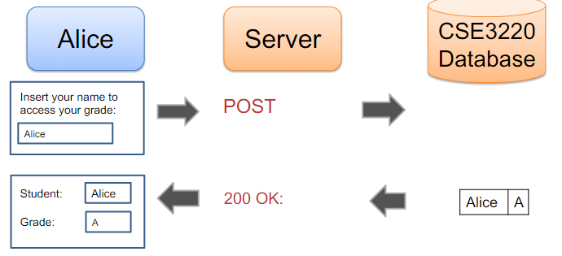

# Database Security

L.O.
- Understand how SQL injection work
- Know how we can defend against such attacks

# RDBMS and SQL
## Data Flow


## Authentication
```
SELECT * FROM CSE3220 WHERE
Name=$username AND Password=hash($passwd)
```
Student sets #=$username and $passwd

Access granted if query returns nonempty table

## SQL Injection
Attacker can bypass protections on database via execution of unauthorised queries by injecting SQL code into the database

### SQL Injection to Bypass Authentication:
Example:
```
SELECT * FROM CSE3220 WHERE
Name=$username AND Password=hash($passwd)
```

$username = A' OR 1=1 --<br>
$passwd = anything

Resulting query:
```
SELECT * FROM CSE2330 WHERE
Name='A' OR 1=1 -- AND...
```

### SQL Injection for Data Corruption
Example:
```
SELECT * FROM CSE3220 WHERE
Name=$username AND Password=hash($passwd)
```

$username = A'; UPDATE CSE3220 SET grade='A' WHERE Name='Lilika' --<br>
$passwd = anything

Resulting query:
```
SELECT * FROM CSE2330 WHERE Name='A'; UPDATE CSE3220 SET grade='A' WHERE Name='Lilika' -- AND...
```

### SQL Injection for Privilege Escalation
Example:
```
SELECT * FROM CSE3220 WHERE
Name=$username AND Password=hash($passwd)
```

$username = A'; UPDATE CSE3220 SET admin=1 WHERE Name='Lilika' --<br>
$passwd = anything

Resulting query:
```
SELECT * FROM CSE2330 WHERE Name='A'; UPDATE CSE3220 SET admin=1 WHERE Name='Lilika' -- AND...
```

## Blind SQL Injection
Performing SQL injection when application code is not available

- Database schema may be learned through returned error messages
- A typical countermeasure is to prohibit the display of error messages
- Your application may stille be vulnerable to blind SQL injection
    - Trial and error
    - Observe the behaviour of the website (becomes slower etc)


## Input Sanitisation
Escape potentially malicious characters
- Malicious characters include: ', ", \\, \<newline>, \<return>, \<null>

Sanitising input is tricky
- Alternate character encodings may bypass default escape functions 
- PHD legac escape function mysql_escape_string ignored encoding
- PHP later developed mysql_real_escape_string


## Second-Order SQL Injection
Sanitised input may be reused in other queries

Example:
- Regular user selects username "admin'--"
- Escapes quote to prevent possible inject attack
- Stores value "admin'--" into user attribute of database
- Later, application retrieves username with clause "WHERE username='admin'--..."
- Could be used to change administrator password to one chosen by attacker


## Prepared Statements
Two-phase SQL command
- Write SQL statements with ? placeholders
- Subsequently provide values that replace placeholders

Best practice for
- Writing new applications
- Modifying existing ones

Generally safe from SQL injections
- Separation of code and data
- Values replacing placeholders always treated as data

Potential vulnerabilities when
- Prepared statement is itself buit from user input
- Prepared statement calls queries from library


## Anomaly Detection
- Observe queries on legitimate inputs
- Determine properties of typeical queries
    - e.g., Result size
- Rejects inputs that yield atypical queries and outputs