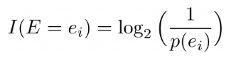
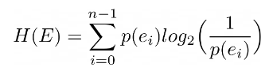
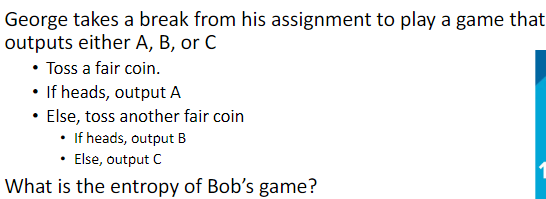

# Cryptography I

Contents
- Classic Symmetric Encryption Protocols
- One-Time Pad Encryption
- Cryptographic hash functions
- Entropy

## 1. Introduction to Cryptography
### Why Cryptography?
Cryptography ensures the confidentiality and integrity of communicated messages (not avaliability)

Cryptography prevents:
- Eavesdropping (3rd party reading)
- Tampering (modifying)
- Blocking (removing)

### Encrypted Communication
Kerkhoff's principle:
- *"The security provided by an encryption system should not depend on the secrecy of the system, but only on the secrecy of the key."*

Plaintext is encrypted to ciphertext using an encryption key on the sender side.

Ciphertext is decrypted to plaintext using a decryption key on the receiver side.

#### Symmetric Encryption
Encryption method that uses the same encryption and decryption key. Decryption is the reverse of encryption.

Each pair of sender/receivers needs a distinct key; a quadratic number of keys for pairwise communication.

## 2. Classic Symmetric Encryption Protocols

### Julius Caesar's Cipher
Encryption: shift letters by 3 
Decryption: reverse shift

### Alphabet Shift Cipher
Generalised Caesar's cipher

Use key k rather than 3 to shift alphabetrs

Evaluation:
- Cons:
    - Insecure
    - Can try all possible values of k

### Substitution Cipher
Permutation of the alphabet characters is used as the key (A -> L, B -> Z, ...)

Evaluation:
- Pros:
    - Impossible to try all possible keys
- Cons:   
    - Can be craked by frequency analysis
        - most frequent letters: e, t, o, a...
        - most frequent digrams: th, in, er...
        - most frequent trigrams: the, and...

## 3. One-Time Pad Encryption
Key: sequence of random bits that has the same length as plaintext

Encryption: C = K XOR P 
Decryption: P = K XOR C

Evaluation:
- Pros:
    - Each bit of the ciphertext is random
    - Fully secure if key used only once
    - All messages are equally possible given a ciphertext
- Cons:
    - Key as large as plaintext (difficulty in generation and sharing)
    - Key cannot be reused

## 4. Cryptographic Hash Functions
Hash functions take a variable-length input and gives a fixed-length output

### Collisions
A collision occurs when two messages have the same hash value

Collisions are inevitable.

For two input a and b,
- if h(a) != h(b), then a != b
- h(a) = h(b) does not imply a = b

### Cryptographic Hash Functions
- Short output
    - The hash value has a small and fixed length (e.g. 256 bits)
- One-way
    - Given a hash value x, it is hard to find p usch that h(p) = x
- Weak Collision resistance
    - Give p, it is hard to find q such that h(p) = h(q)
- 
- Public function
    - No secret key, everyone can compute it
- Only feasible attack is brute force

## 5. Entropy
How surprising is an event?

### Information gain
For some experiment E and output ei,

- I(E = ei): information gained by having E output ei
- p(ei): probability of ei

Higher probability means less information

Measured in bits

### Entropy
Formal measure of uncertainty in the outcome of a process

Average value of information we obtain by learning the result of Experiment E, with outcomes e0, e1, ..., e_(n-1)

Example calculation:

The answer is:
- p(a) = 1/2
- p(b) = 1/4
- p(c) = 1/4
- H(E) = 1/2 * log2(2) + 1/4 * log2(4) + 1/4 * log2(4)
- = 1/2 + 1/2 + 1/2
- = 3/2 = 1.5 (bits)

