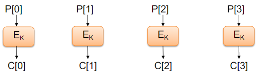
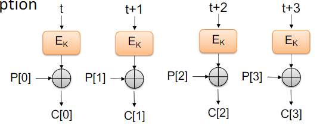
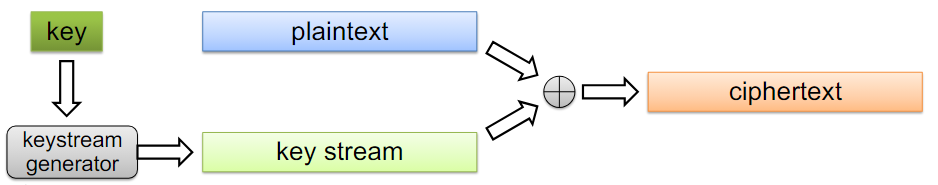

# Cryptography II

Contents
- Symmetric Encryption Protocols
    - Block Ciphers
    - Stream Ciphers
- Public Key Cryptography
- Threat Models

## 1. Symmetric Encryption Protocols
### 1.1. Block Cipher
A symmetric encryption scheme for messages (blocks) of a given fixed length
- The length of the block is independent from the length of the key

Example: AES

- AES is a block cipher that operates on blocks of 128 bits
- Supports keys of length 128, 192, and 256 bits

#### ECB Mode
- When plaintext is longer than block size b
    - partition plaintext P into sequence of m blocks P[0], ..., P[m-1]
    - where n/b ≤ m ≤ n/b + 1

- Electronice Code Book (ECB) Mode
    - Assume n is multiple of b
    - Block P[i] encrypted into ciphertext block **C[i] = E_k(P[i])**
    

- Evaluation
    - Pros
        - ECB works well with random strings
        - Encryption can be done in parallel
    - Cons
        - Documents and images are not suitable for ECB

#### CBC Mode
- Cipher Block Chaining (CBC) Mode
    - Previous ciphertext block combined with current plaintext block
    - **C[i] = E_k(C[i-1] ⊕ P[i])**
    - C[-1] = V is a random block (**initialisation vector**) sent encrypted during setup
    

- Evaluation
    - Pros
        - Works well with any input plaintext
    - Cons
        - Requires the reliable transmission of all blocks
            - Not suitable for applications that allow packet losses
            - E.g., audio and video streaming
        - Can't parallelise like ECB mode

#### Counter Mode
- Reveals patterns and works in parallel
- Keeps counter t
- Encryption: **C[i] = E_k(t+i) ⊕ P[i]**
- No need to implement decryption

#### Padding
- Block ciphers require the length n of the plantext to be a multiple of the block size b
- Padding is required for the last block; how?
- Pad is a sequence of identical bits, each indicating the length (in bytes) of the padding
    - Example for b = 128
        - Plaintext "Bernardo" (7 bytes)
        - Padded plaintext: "Bernardo999999999" (7 + 9 = 16 bytes)

### 1.2. Stream Cipher
Key stream
- Pseudo-random bit sequence generated from a secret key K
- S_K = S_K[0], S_K[1], S_K[2], ...
- Generated on-demand, one bit (or block) at the time 

Stream cipher
- XOR the plantext with the key stream
- **C[i] = S_K[i] ⊕ P[i]**

Evaluations
- Pros
    - Fixed-length secret key
    - Plaintext can have arbitrary length (e.g., media stream)
    - Incremental encryption and decryption
    - Works for packets sent over an unreliable channel
- Cons
    - Key stream cannot be reused

#### Key Stream Generation
- Block cipher in counter mode
    - Use a block cipher E_K with block size b
    - The secret key is a pair (K,t) where K is a key and t is a counter with b bits
    - The key stream is the concatenation of ciphertexts
        - E_K(t), E_K(t+1), E_K(t+2), ...
- Evaluations
    - Pros
        - Simplicity
        - Speed
    - Cons
        - Very long key streams can be distinguished from random

#### Initialisation Vector
- Goal
    - Avoiding sharing a new secret key for each stream encryption
- Solution
    - Use a two-part key (U, V)
    - Part U is fixed
    - Part V is transmitted together with the ciphertext
    - V is called initialisation vector
- Setup
    - Alex and Harm share secret U
- Encryption   
    - Alex picks V and creates key K = (U,V)
    - Alex creates stream ciphertext C and sends (V,C)
- Decryption
    - Harm reconstructs key K = (U,V)
    - Harm decrypts the message

#### Attacks on Stream Ciphers
- Repetition attack
    - Stream reuse yields XOR of plaintexts
    - Cryptanalysis can recover the original plaintext
- Replacement attack
    - P = A B C, where the attacker knows B
    - Enc(P) = K L M
    - By computing B ⊕ L, part of the key stream is revealed
    - The attacker can derive the ciphertext of Q = A D C

## 2. Public Key Cryptography
Key pair
- Public key: shared with everyone
- Secret key: kept secret, hard to derive from the public key

Protocol
- Sender encrypts using recipient's public key
- Recipient decrypts using his secret key

Evaluation
- Pros
    - A single public-secret key pair allows receiving confidential messages from multiple parties
- Cons
    - Conceptually complex
    - Slower performance than symmetric cryptography

Example: RSA
- Most widely used public key cryptosystem today
- Factoring is hard
- Much slower than AES
- Typically used to encrypt an AES symmetric key

 

## 3. Threat Models
> Who is the adversary?  
> What capabilities does the adversary have to attack our encryption scheme?

### Weaker Adversary Models
- Ciphertext-only
    - Adversary sees all ciphertexts, but has no/vague information about the underlying plaintext
- Known plaintext
    - Adversary also knows part of/format of plaintext messages
    - How could this happen?
        - All of your internet requests start with the same header
        - Sending a CSV in the same format every week
        - You text "hi" to people when you first start texting them
    - Open design principle

### Stronger Adversary Models
- Chosen plaintext
    - Adversary is able to encrypt plaintexts of their choosing and see the resulting ciphertexts
    - How can this happen?
        - Harm sends Alex an email saying "Please securely forward this to George"
        - Public key cryptography
- Chosen ciphertext
    - Adversary chooses ciphertexts and some info is revealed about the decryption

### IND-CPA
"Indistinguishability under Chosen Plaintext Attack"
- A property of encryption algorithms
- Considered a standard security measure against specific types of cryptanalytic attack

An encryption scheme is considered to be IND-CPA secure if, under the chosen plaintext attack scenario, the attacker cannot distinguish two encrypted mesages from each other.

In a Chosen Plaintext attack:
- the attacker can choose arbitrary plaintexts to be encrypted and then analyse the resulting ciphertexts
- if an attacker chooses two different plaintexts and only sees the ciphertexts, they should not be able to ascertain which C corresponts to which M for an IND-CPA cryptosystem

Which cryptosystems are IND-CPA secure?
- Caesar cipher: No
- One-time Pad: Yes
- Deterministic encryption scheme: No
- Enc_k(m) = 1: No

### IND-CCA
"Indistinguishability under Adaptive Chosen Ciphertext Attack"
- A property of encryption algorithms
- Considered to be a stronger notion of security compared to others (including IND-CPA)

Even if an attacker can choose different ciphertexts to decrypt and receives the corresponding decrypted plaintext results, they should still not be able to determine any information about the decrypted plaintext from some other encrypted ciphertext.