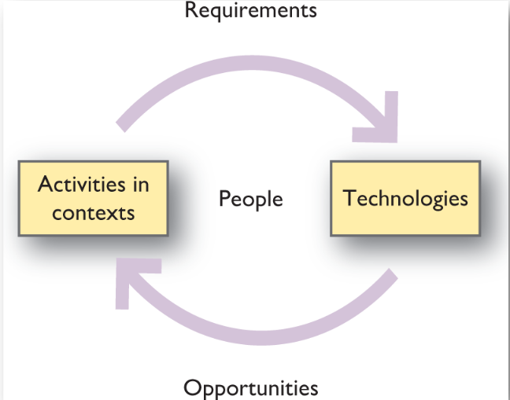

This week
- What is "Human-Computer Interaction" and why should we care?
- PACT framework
- How this connects to prototypes and evaluation

# 1. Goals of HCI
> Produce **usable, safe,** and **functional** systems

- Understand how people use technology
- Develop tools and techniques to enable building suitable systems
- Achieve efficient, effective, and safe interaction
- People come first (this belief underlies the whole theme of HCI)

# 2. Usability
A usable system is:
- easy to learn
- easy to remember how to use
- effective to use (it works)
- efficient to use (it's fast)
- safe to use
- enjoyable to use

Guidelines in HCI and usability
- Shneiderman's Eight Golden Rules
- Normal's Seven Principles
- Nielsen's Ten Heuristic Principles

# 3. PACT framework
- People
- Activities
- Contexts
- Technologies

# 4. HCI Tasks and Prototyping
1. What needs to be done?
   - Requirement elicitation
     - ethnography, contextual inquiry, user interviews, surveys
   - Requirement analysis
     - scenarios, task analysis, card sorting
   - Prototyping
     1. Early design
     2. Low fidelity prototypes
     3. High fidelity/restricted system
     4. Working system
   - Participatory and incremental system design
     - c.f. agile methods
2. Have we done it correctly?
   - Expert evaluation
     - heuristic evaluation, cognitive walkthrough
   - User testing
     - formative and summative methods
     - e.g., focus groups, think aloud, co-discovery, structured interview
   - Experimental design
     - e.g., user experiments, A/B testing
3. Can we make it even better?
   - Accessibility
     - e.g., W3C standards, systems for people with visual and motor impairments
   - Interactive, Multi-modal systems
     - e.g., conversational agents, augmented reality and tangible user interfaces