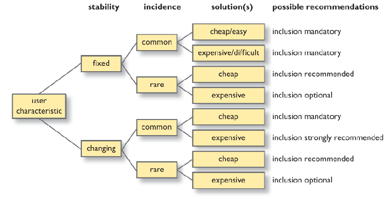
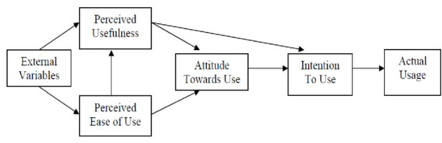

## 1. Human Research Ethics
### HREC
Human research ethics Committee

All research involving human participants should be approved by the HREC

### Risks
- Risk of harm
    - Bodily, mentally, reputation, legal etc
- Informed
    - Understanding what the risks are
- Consent
    - Truly free choice to participate
- Privacy
    - (re-)Identifiable data?

### Informed Consent (IC)
- The responsible researcher come to an agreement with their participants about
    - what they will do for their research and
    - what the researcher will do, both legally and ethically, to ensure their physical, emotional, and reputational security
- Includes:
    - opening statement or participant information including:
        - purpose of the research
        - what participants will do
        - what kind of risks - including of identification - are involved
        - what steps you will be taking to mitigate against those risks
- A good practice determines that IC forms should be granular, providing separate consent points as separate tick boxes

## 2. Usability
> How easy is it to use?

Access, Learn & Remember
- Visibility
- Consistency
- Familiarity
- Affordnace

Control
- Navigation
- Control
- Feedback

Safety & Security
- Recovery
- Constraints

Suitability
- Flexibility
- Style
- Conviviality

## 3. Accessibility
> Is it easy to use for many people with different characteristics?

### Exclusion
- Physically
    - ATM too high for wheelchair
- Conceptually
    - Instructions which are too difficult
- Economically
    - App only works on latest phone
- Culturally
    - Metaphor about cricket
- Socially
    - Only available during working hours

### Principles of Universal Design
- Equitable use
- Flexibility in use
- Simple, intuitive use
- Perceptible information
- Tolerance for error
- Low physical effort
- Size and space for approach and use

### Inclusivity analysis

## 4. Acceptability
> Does it fit to people's lives?

- Political
- Convenience
- Cultural & social habits
- Usefulness
- Economic

Technoology Acceptance Model
